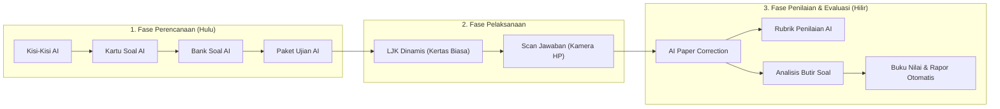
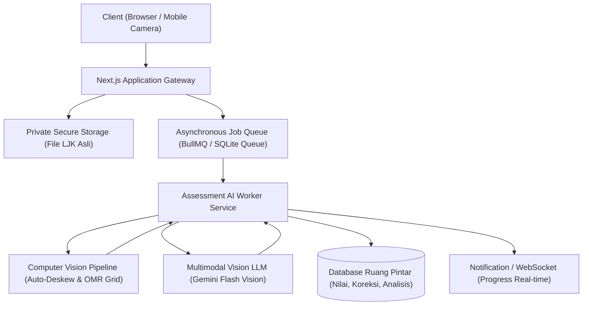

# AI ASSESSMENT SUITE — PRODUCT & ARCHITECTURAL PROPOSAL
## Ruang Pintar — Premium Institutional Assessment Platform

**Dokumen:** Analisis Produk, Alur Bisnis, dan Dampak Arsitektur  
**Status:** PROPOSED — READY FOR HUMAN REVIEW  
**Tanggal:** 22 September 2026  
**Target Monetisasi:** Lisensi Tahunan Sekolah (Annual Institutional SaaS / Tier PRO & ENTERPRISE)  
**Tujuan Utama:** Menghadirkan solusi hulu-ke-hilir persiapan ujian, pelaksanaan tes fisik/digital, dan evaluasi hasil belajar berbasis kecerdasan artifisial tanpa memerlukan mesin scanner mahal.

---

# 1. Executive Summary & Value Proposition

Beban administratif terbesar bagi guru dan sekolah di Indonesia terkonsentrasi pada **siklus ujian semester (STS/SAS/PAT)**:
1. Penyusunan kisi-kisi dan kartu soal format resmi kurikulum yang memakan waktu berminggu-minggu;
2. Pencetakan naskah dan Lembar Jawab Komputer (LJK) yang rumit;
3. Biaya tinggi mesin scanner OMR (*Optical Mark Recognition*) serta ketergantungan pada kertas tebal khusus scanner (100–120 gsm);
4. Lamanya proses koreksi lembar jawaban ratusan siswa, terutama untuk soal uraian/esai;
5. Sulitnya melakukan analisis butir soal secara manual (daya pembeda, tingkat kesukaran, dan efektivitas distraktor).

**AI Assessment Suite** hadir sebagai *Flagship Monetization Driver* untuk mendorong sekolah berlangganan tahunan (didukung alokasi Dana BOS). Platform ini mendigitalisasi seluruh siklus tersebut menggunakan **kamera smartphone biasa / mesin fotokopi standar** dan teknologi **Multimodal Vision AI**.

---

# 2. Sembilan Modul Unggulan AI Assessment Suite



---

## 2.1 Kisi-Kisi AI
- **Fungsi:** Menghasilkan dokumen kisi-kisi ujian otomatis yang selaras dengan Kurikulum Merdeka (Capaian Pembelajaran / CP, Tujuan Pembelajaran / TP, dan Lingkup Materi).
- **Output:** Matriks standar Kemdikbud/Kemenag:
  - Nomor Urut & Capaian Pembelajaran;
  - Materi / Pokok Bahasan;
  - Indikator Soal;
  - Level Kognitif (L1: Mengingat/Memahami, L2: Menerapkan, L3: HOTS / Menganalisis);
  - Bentuk Soal (Pilihan Ganda, Uraian, Menjodohkan);
  - Bobot Skor.
- **Nilai Bisnis:** Memangkas waktu penyusunan kisi-kisi dari 3 hari menjadi 3 menit per mata pelajaran.

---

## 2.2 Kartu Soal AI
- **Fungsi:** Menjabarkan setiap butir soal menjadi lembaran **Kartu Soal Resmi** untuk keperluan bank soal sekolah dan akreditasi.
- **Struktur Kartu:**
  - Identitas (Mata Pelajaran, Kelas/Fase, Penyusun);
  - Kompetensi yang diuji & Indikator Butir;
  - Stimulus bacaan/tabel/studi kasus kontekstual;
  - Naskah butir soal dan opsi jawaban;
  - Kunci jawaban dan pedoman penskoran;
  - Alasan penentuan kunci (*pedagogical rationale*).

---

## 2.3 Bank Soal AI
- **Fungsi:** Generator dan repositori bank soal kolaboratif institusi.
- **Kapabilitas:**
  - *Mass Generation:* Menghasilkan 50–100 variasi soal dengan tingkat kesukaran berjenjang (Mudah, Sedang, Sulit).
  - *Anti-Leak Rephrasing:* Mengubah struktur kalimat dan angka stimulus matematika/sains tanpa mengubah konsep kompetensi yang diuji.
  - *Tagging Cerdas:* Klasifikasi otomatis berdasarkan mata pelajaran, fase/tingkat, bab, dan level kognitif.

---

## 2.4 Paket Ujian AI
- **Fungsi:** Menyusun (*assembling*) naskah ujian resmi menjadi beberapa varian paket (Paket A, Paket B, dst.) secara seimbang.
- **Kapabilitas:**
  - Menjaga kesetaraan bobot dan tingkat kesulitan antar-paket (bukan sekadar acak butir buta).
  - Ekspor multi-target:
    - **Target Digital:** Langsung terhubung ke modul CBT Player Ruang Pintar.
    - **Target Fisik:** Dokumen cetak siap print (PDF / Microsoft Word A4 layout dua kolom standar ujian).

---

## 2.5 Lembar Jawab Komputer (LJK) Dinamis & Hemat Biaya
- **Terobosan Utama:** **MENGHILANGKAN KEBUTUHAN KERTAS SCANNER KHUSUS.**
- **Spesifikasi Teknis LJK:**
  - Dicetak di atas **kertas HVS A4 standar fotokopian (70–80 gsm)**.
  - Dilengkapi *Fiducial Anchor Markers* (ArUco / corner markers) di keempat sudut untuk koreksi perspektif otomatis (*auto-deskew & auto-alignment*).
  - *Dynamic QR Code:* Memuat metadata terenkripsi (ID Sekolah, ID Ujian, Paket Soal, dan opsi cetak nama/nomor siswa *pre-printed*).
  - Opsi format: 25 soal, 40 soal, 50 soal pilihan ganda, ditambah area khusus jawaban uraian singkat.

---

## 2.6 Scan Jawaban (Mobile Camera & Web Scanner)
- **Fungsi:** Guru atau operator memindai tumpukan LJK siswa tanpa perangkat keras khusus.
- **Metode Pemindaian:**
  1. **Mobile Live Camera (HP Guru):** Menggunakan kamera smartphone dengan deteksi sudut otomatis (*real-time document edge detection*).
  2. **Batch Upload:** Memotret / memindai puluhan lembar sekaligus via mesin fotokopi / scanner ADF kantor, lalu mengunggah file PDF/ZIP ke dashboard.
- **Koreksi Gambar:** Sistem otomatis memperbaiki distorsi perspektif, kemiringan (*deskew*), bayangan, dan kontras sebelum dievaluasi.

---

## 2.7 AI Paper Correction (Koreksi Pilihan Ganda & Uraian)
- **Koreksi Pilihan Ganda (OMR Vision):**
  Mendeteksi bulatan pensil atau pulpen hitam/biru dengan akurasi $\ge 99.8\%$. Mampu menangani arsiran silang, arsiran penuh, dan coretan koreksi siswa.
- **Koreksi Uraian/Esai (Handwriting AI Recognition):**
  - Menggunakan *Multimodal Handwriting Recognition* untuk membaca tulisan tangan siswa pada kolom uraian.
  - Membandingkan esai siswa dengan **Kunci Jawaban & Rubrik Penskoran** yang telah disiapkan guru.
  - Menyarankan skor proporsional (misal: 8 dari 10) beserta anotasi bagian mana dari jawaban siswa yang sudah tepat atau kurang lengkap.
  - Guru memegang kendali akhir (*Human-in-the-Loop*) untuk menyetujui atau menyesuaikan skor sebelum disimpan.

---

## 2.8 Rubrik Penilaian AI
- **Fungsi:** Menghasilkan rubrik penskoran objektif untuk asesmen subjektif, proyek P5, portofolio, dan soal uraian.
- **Format:** Rubrik Analitik (kriteria skor 4, 3, 2, 1 dengan deskripsi kinerja terukur) dan Rubrik Holistik.

---

## 2.9 Analisis Butir Soal Komprehensif
- **Fungsi:** Melakukan komputasi psikometrik otomatis setelah seluruh lembar jawaban terkoreksi.
- **Indikator Analisis:**
  1. **Tingkat Kesukaran ($P$):** Menentukan butir soal kategori Terlalu Mudah ($P > 0.7$), Sedang ($0.3 \le P \le 0.7$), atau Sukar ($P < 0.3$).
  2. **Daya Pembeda ($D$):** Mengukur kemampuan butir membedakan kelompok siswa unggul dan kelompok lemah.
  3. **Efektivitas Distraktor (Pengecoh):** Mengetahui apakah seluruh opsi pengecoh (A, B, C, D, E) dipilih oleh siswa atau terdapat opsi mati.
  4. **Uji Validitas & Reliabilitas Tes:** Menghitung skor reliabilitas tes instan (metode Cronbach's Alpha / Kuder-Richardson KR-20).
- **Output:** Laporan cetak PDF resmi untuk bukti fisik evaluasi pembelajaran dalam akreditasi sekolah.

---

# 3. Alur Bisnis Sekolah (Customer Journey)

```text
1. PERSIAPAN UJIAN (H-14):
   Kurikulum menetapkan jadwal -> Guru generate Kisi-Kisi & Kartu Soal via AI ->
   Sistem assemble Paket Ujian -> Operator cetak LJK A4 fotokopi + Naskah soal.

2. PELAKSANAAN UJIAN (HARI H):
   Siswa mengerjakan ujian fisik menggunakan LJK kertas biasa / ujian online via CBT.

3. KOREKSI & SKORING INSTAN (HARI H + 1 Jam):
   Guru/Operator foto tumpukan LJK menggunakan HP ->
   AI memproses seluruh lembar -> Skor Pilihan Ganda keluar seketika ->
   AI memberikan rekomendasi skor uraian -> Guru konfirmasi 1-klik.

4. PELAPORAN & AKREDITASI (HARI H + 2 Jam):
   Sistem otomatis menerbitkan Dokumen Analisis Butir Soal ->
   Nilai langsung masuk ke Matriks Gradebook & e-Rapor Kurikulum Merdeka.
```

---

# 4. Dampak Arsitektur Sistem

Implementasi suite ini memerlukan fondasi arsitektur komputasi khusus agar tidak membebani core database atau server aplikasi web Next.js:



### 1. Computer Vision & Hybrid AI Pipeline:
- **Deteksi LJK Cepat:** Deteksi anchor point, rotasi, dan pembacaan bulatan pilihan ganda diproses menggunakan algoritma *Computer Vision* deterministik berkecepatan tinggi ($< 200$ ms per lembar).
- **Multimodal Handwriting LLM:** Model visual AI (seperti Gemini 2.5 Flash Multimodal) hanya dipanggil untuk segmen tulisan tangan uraian guna menghemat biaya token API.

### 2. Antrean Asinkron (*Background Job Processing*):
- Pemindaian 500 lembar LJK satu angkatan sekolah wajib dijalankan di antrean latar belakang (*background job queue*) agar server web tidak mengalami *timeout* dan UI tetap responsif.
- Indikator progres ditampilkan secara visual (*Progress Bar: "Koreksi 42 dari 120 lembar..."*).

### 3. Keamanan Data & Privasi (UU PDP):
- Foto LJK siswa memuat data pribadi (nama, tanda tangan, nomor peserta). Foto wajib disimpan di *Private Local/S3 Storage* dengan akses bertandatangan (*Signed URL*) dan memiliki kebijakan masa retensi (*retention lifecycle*).

### 4. Tenant-Level AI Credit & Quota Guard:
- Setiap sekolah yang berlangganan tahunan dialokasikan kuota AI (misal: 10.000 lembar koreksi LJK / tahun dan 500 request generasi paket soal).
- Mencegah pembengkakan biaya API (*Cost Runaway Protection*).

---

# 5. Model Lisensi & Monetisasi

| Tier Paket | Target Pengguna | Fitur Terbuka | Model Biaya |
| :--- | :--- | :--- | :--- |
| **GURU MANDIRI** | Guru Perorangan | Absensi, Jurnal, Penilaian Personal, CBT Dasar | Gratis / Freemium |
| **SEKOLAH BASIC** | Sekolah Kecil / Menengah | Multi-Guru, Jadwal, Wali Kelas, e-Rapor, CBT Standar | Rp 1.500.000 – Rp 3.000.000 / Tahun |
| **SEKOLAH PRO** *(Target Utama)* | Sekolah Standar / Favorit | Seluruh Fitur Basic + **AI Assessment Suite Lengkap** (Kisi-Kisi, Kartu Soal, LJK A4, Koreksi LJK HP, Analisis Butir Soal) | Rp 5.000.000 – Rp 10.000.000 / Tahun (Alokasi Dana BOS) |
| **ENTERPRISE** | Yayasan Multi-Sekolah / Dinas | Multi-Kampus, AI Paper Correction Uraian Hand-writing Unlimited, SLA & Pelatihan Guru | Custom Contract |

---

# 6. Kesimpulan & Rekomendasi Roadmap

1. **Prioritas Desain:** Pisahkan pengembangan menjadi fase tersendiri setelah Multi-Tenant Foundation terkunci.
2. **Tahapan Rilis Bertahap (Phased Rollout):**
   - **Tahap 1:** Kisi-Kisi AI, Kartu Soal AI, dan Bank Soal AI (murni text LLM generation, risiko rendah, dampak adopsi instan).
   - **Tahap 2:** Template LJK Dinamis A4 dan Koreksi Pilihan Ganda via Kamera HP (OMR Computer Vision).
   - **Tahap 3:** AI Paper Correction untuk soal uraian tulisan tangan dan Analisis Butir Soal Psikometrik.
3. **Dokumen Pengadaan:** Sediakan berkas proposal resmi dan rancangan Rencana Kegiatan dan Anggaran Sekolah (RKAS) untuk mempermudah sekolah menganggarkan suite ini dari dana operasional sekolah.
