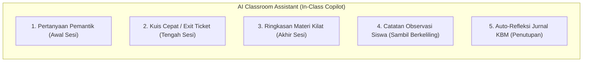

# AI CLASSROOM ASSISTANT — PENDAMPING CERDAS SAAT MENGAJAR DI KELAS
## Ruang Pintar — Kecerdasan Artifisial yang Bekerja Saat KBM Berlangsung

**Dokumen:** Analisis & Desain In-Session AI Classroom Assistant  
**Status:** PROPOSED — READY FOR HUMAN REVIEW  
**Tanggal:** 22 September 2026  
**Fokus:** Bantuan instan di tengah sesi pembelajaran (Bukan hanya sebelum atau sesudah mengajar).  
**Prinsip Desain:**  
> *"AI di dalam kelas tidak boleh mengalihkan perhatian guru dari siswa. AI harus bekerja seperti asisten laboratorium yang berbisik cepat memberikan solusi taktis dalam 3 detik."*

---

# 1. Lima Peran Kunci AI di Tengah Sesi Pembelajaran



---

## 1.1 Peran 1: Pertanyaan Pemantik & Analogi Kontekstual (*Inquiry Triggers*)
* **Momen Penggunaan:** 10 menit pertama sesi (Fase Apersepsi).
* **Masalah Guru:** Siswa mengantuk, pasif, atau materi pelajaran terlalu abstrak (misal: *Konsep Rekursi, Hukum Termodinamika, atau Jurnal Penyesuaian Akuntansi*).
* **Solusi AI:** Guru mengetuk tombol kecil: **[ AI: Pemantik Diskusi ]**.
  * AI menghasilkan **3 pertanyaan provokatif / analogi dunia nyata** yang relevan dengan usia remaja:
    * *"Bayangkan kalian bercermin di antara dua kaca yang saling berhadapan. Apa yang terjadi dengan bayangan kalian? Itulah konsep dasar Rekursi dalam pemrograman."*
* **Dampak:** Membantu guru menghidupkan suasana kelas tanpa persiapan berjam-jam.

---

## 1.2 Peran 2: Kuis Cepat / Cek Pemahaman (*Instant Exit Ticket*)
* **Momen Penggunaan:** 15 menit sebelum kelas berakhir.
* **Masalah Guru:** Guru ingin tahu apakah 36 siswa benar-benar paham atau hanya mengangguk pura-pura paham.
* **Solusi AI:** 1-klik tombol **[ Generate 2 Soal Kuis Cepat ]**.
  * AI menghasilkan 2 soal pilihan ganda atau studi kasus instan berdasarkan topik yang baru saja dibahas.
  * Guru dapat menampilkannya di proyektor atau membacakan secara lisan untuk dijawab siswa serentak.
* **Dampak:** Guru memperoleh umpan balik formatif instan mengenai efektivitas pengajarannya hari itu.

---

## 1.3 Peran 3: Ringkasan Materi 1 Menit (*Closure Recap*)
* **Momen Penggunaan:** 5 menit penutupan kelas.
* **Masalah Guru:** Jam pelajaran habis, guru terburu-buru merangkum materi yang kompleks.
* **Solusi AI:** Tombol **[ Rangkuman Penutup ]**.
  * AI menyajikan 3 poin kesimpulan kristal (*bullet points*) yang lugas untuk dibacakan guru sebagai penutup sesi.

---

## 1.4 Peran 4: Perekam Observasi Siswa Cepat (*Voice-to-Observation*)
* **Momen Penggunaan:** Di tengah praktikum lab atau kerja kelompok siswa.
* **Masalah Guru:** Melihat perilaku siswa yang menonjol (positif maupun negatif), namun tidak sempat mencatat karena tangan sedang sibuk.
* **Solusi AI:** Guru menahan tombol mikrofon di ponsel selama 5 detik:  
  *"Catatan: Ahmad sangat sabar membantu temannya yang error kode di Lab 2"*.
  * AI otomatis mentranskrip suara menjadi teks, mengidentifikasi siswa bernama Ahmad, dan menyimpannya ke **Catatan Sikap / Profil Pelajar Pancasila (P5)** siswa tersebut.

---

## 1.5 Peran 5: Auto-Refleksi Jurnal KBM (*Smart Journal Reflection*)
* **Momen Penggunaan:** Saat menekan tombol [ Selesaikan Sesi ].
* **Masalah Guru:** Lelah mengetik kalimat refleksi mengajar yang diwajibkan dalam supervisi kurikulum.
* **Solusi AI:** Berdasarkan data presensi (misal: 34 hadir, 2 sakit) dan ketercapaian TP, AI menyarankan draf refleksi 1 kalimat:  
  *"Pembelajaran materi Interface tuntas sesuai target. Sebagian besar siswa aktif berpraktik, 4 siswa membutuhkan bimbingan lanjutan pada sintaks implementasi."*  
  Guru cukup menyetujui dengan 1 ketukan.

---

# 2. Matriks Evaluasi & Penilaian Kelayakan AI In-Class

```text
+----------------------------------------------------------------------------------------------------+
|                                    MATRIKS KELAYAKAN AI IN-CLASS                                   |
+----+-------------------------------+---------------+--------------------+---------------+----------+
| No | Kapabilitas AI In-Class       | Frekuensi     | Manfaat bagi Guru  | Kompleksitas  | Status   |
+----+-------------------------------+---------------+--------------------+---------------+----------+
| 1  | Pertanyaan Pemantik Cerdas    | Sangat Sering | TINGGI (8.8/10)    | Rendah        | **FASE 1** |
| 2  | Kuis Cepat / Exit Ticket      | Sering        | SANGAT TINGGI (9.2)| Rendah        | **FASE 1** |
| 3  | Auto-Refleksi Jurnal KBM      | Harian        | SANGAT TINGGI (9.5)| Rendah        | **FASE 1** |
| 4  | Ringkasan Materi Penutup      | Sering        | SEDANG (7.5/10)    | Rendah        | **FASE 2** |
| 5  | Voice-to-Observation Siswa    | Kadang-kadang | TINGGI (8.5/10)    | Sedang (Audio)| **FASE 3** |
+----+-------------------------------+---------------+--------------------+---------------+----------+
```

---

# 3. Interaksi Antarmuka: Tidak Mengganggu (*Non-Intrusive Floating Drawer*)

Di dalam antarmuka ruang kelas (*Classroom Workspace*):
* **Bukan Chatbot Raksasa yang Menutupi Layar:**
  AI hadir sebagai tombol melayang mungil (*Floating Glass Pill*) di sudut kanan bawah:  
  `[ ✨ Bantuan Mengajar ]`.
* **Respon Secepat Kilat:**
  Menggunakan model berkecepatan tinggi (*Gemini Flash Fast Inference*) sehingga hasil pertanyaan pemantik atau kuis cepat muncul dalam waktu **kurang dari 1.5 detik**.
* **One-Tap Actions:**
  Setiap saran AI dilengkapi tombol aksi langsung: `[ Salin ke Proyektor ]`, `[ Masukkan ke Jurnal ]`, atau `[ Simpan ke Nilai ]`. Guru tidak perlu melakukan *copy-paste* manual.
