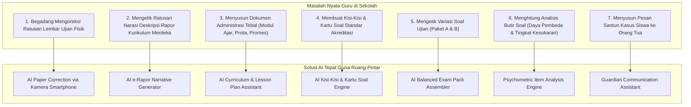

# AI OPPORTUNITY MAP — PROBLEM-FIRST VALUE MATRIX
## Ruang Pintar — Membedah Peluang Kecerdasan Artifisial dari Masalah Nyata Guru

**Dokumen:** Peta Peluang AI & Matriks Evaluasi Solusi Masalah Guru  
**Status:** PROPOSED — READY FOR HUMAN REVIEW  
**Tanggal:** 22 September 2026  
**Prinsip Utama:**  
> *"Jangan mulai dari teknologi AI lalu mencari-cari masalah. Mulailah dari pekerjaan guru yang paling menyiksa dan memakan waktu, lalu gunakan model AI yang paling hemat dan tepat sasaran."*

---

# 1. Peta Peluang AI Berbasis Masalah Nyata (*Problem-First Mapping*)



---

# 2. Matriks Evaluasi & Penilaian Peluang AI

Setiap peluang diukur berdasarkan 4 parameter objektif:
1. **Frekuensi Penggunaan:** Seberapa sering fitur ini dibuka oleh guru (Harian, Mingguan, Musiman Semesteran).
2. **Penghematan Waktu (*Hours Saved*):** Berapa jam kerja yang berhasil dipangkas per guru per periode.
3. **Nilai Bisnis (*Willingness to Pay / WTP*):** Seberapa kuat fitur ini mendorong sekolah membeli lisensi berbayar (BOS-funded).
4. **Kompleksitas Implementasi:** Tingkat kesulitan teknis (rekayasa prompt LLM teks vs Computer Vision & Multimodal OCR).

```text
+-----------------------------------------------------------------------------------------------------------------------------------------+
|                                                  MATRIKS EVALUASI PELUANG AI RUANG PINTAR                                               |
+----+-------------------------------+---------------+-----------------------+---------------------+-------------------+------------------+
| No | Peluang Solusi AI             | Frekuensi     | Penghematan Waktu     | Nilai Bisnis (WTP)  | Kompleksitas      | Prioritas        |
+----+-------------------------------+---------------+-----------------------+---------------------+-------------------+------------------+
| 1  | AI e-Rapor Narrative Gen      | Musiman (2x/th)| 20–30 Jam / Semester  | SANGAT TINGGI (9.5) | Rendah (Prompt LLM| **PRIORITAS 1**  |
| 2  | AI Kisi-Kisi & Kartu Soal     | Musiman (4x/th)| 15–20 Jam / Semester  | SANGAT TINGGI (9.0) | Rendah (Prompt LLM| **PRIORITAS 1**  |
| 3  | AI Soal & Paket Ujian         | Bulanan       | 8–12 Jam / Bulan      | TINGGI (8.5)        | Sedang            | **PRIORITAS 2**  |
| 4  | AI Paper Correction (OMR HP)  | Musiman (4x/th)| 30–40 Jam / Semester  | SANGAT TINGGI (9.8) | Tinggi (Vision CV)| **PRIORITAS 2**  |
| 5  | AI Modul Ajar / RPP           | Awal Semester | 10–15 Jam / Semester  | TINGGI (8.0)        | Rendah (Prompt LLM| **PRIORITAS 3**  |
| 6  | Analisis Butir Soal           | Musiman (4x/th)| 5–8 Jam / Semester    | SEDANG (7.5)        | Rendah (Kalkulasi)| **PRIORITAS 3**  |
| 7  | Guardian Communication Copilot| Mingguan      | 1–2 Jam / Minggu      | SEDANG (7.0)        | Rendah (Prompt LLM| **PRIORITAS 4**  |
| 8  | Koreksi Esai Tulisan Tangan   | Musiman (2x/th)| 15–25 Jam / Semester  | SANGAT TINGGI (9.0) | Sangat Tinggi     | **JANGKA PANJANG**|
+----+-------------------------------+---------------+-----------------------+---------------------+-------------------+------------------+
```

---

# 3. Kuadran Prioritas Pengembangan (*Action Quadrant*)

```mermaid
quadrantChart
    title Kuadran Nilai Bisnis vs Kompleksitas Teknis
    x-axis Rendah Kompleksitas --> Tinggi Kompleksitas
    y-axis Rendah Nilai Bisnis --> Tinggi Nilai Bisnis
    quadrant-1 Strategic Bets (Investasi Besar)
    quadrant-2 Quick Wins (Segera Bangun)
    quadrant-3 Nice to Have (Prioritas Rendah)
    quadrant-4 Over-Engineered (Hindari Dulu)
    "AI e-Rapor Narrative Generator": [0.25, 0.95]
    "AI Kisi-Kisi & Kartu Soal": [0.28, 0.90]
    "AI Modul Ajar & RPP": [0.20, 0.80]
    "Analisis Butir Soal": [0.15, 0.75]
    "AI Soal & Paket Ujian": [0.45, 0.85]
    "AI Paper Correction (OMR HP)": [0.75, 0.98]
    "Koreksi Esai Tulisan Tangan": [0.92, 0.90]
    "Guardian Communication Copilot": [0.22, 0.68]
```

---

## 3.1 Kuadran 2: Quick Wins (*Dampak Raksasa, Risiko Rendah — Segera Dikerjakan*)
Fitur-fitur ini murni berbasis penalaran teks LLM (*Prompt Engineering + Zod Schema Validation*) dengan input data terstruktur yang sudah dimiliki Ruang Pintar:

1. **AI e-Rapor Narrative Generator:**
   * **Masalah:** Guru menghabiskan berminggu-minggu mengetik kalimat narasi capaian rapor untuk 180 siswa.
   * **Solusi AI:** Mengambil data nilai tertinggi & terendah siswa per Tujuan Pembelajaran (TP) $\rightarrow$ LLM menyusun narasi baku Kurikulum Merdeka yang humanis dan siap cetak.
   * **Waktu Pengerjaan:** Sangat cepat, tanpa biaya infrastruktur tinggi.
2. **AI Kisi-Kisi & Kartu Soal:**
   * **Masalah:** Syarat akreditasi mengharuskan lembar kisi-kisi dan kartu soal lengkap sebelum naskah ujian dicetak.
   * **Solusi AI:** Guru memilih CP, TP, dan materi $\rightarrow$ AI menyusun tabel matriks kisi-kisi dan kartu soal siap print dalam format Word/PDF standar Kemdikbud.

---

## 3.2 Kuadran 1: Strategic Bets (*Kunci Kemenangan Pasar & Monetisasi Sekolah*)
Fitur yang membutuhkan rekayasa teknis lebih dalam, namun menjadi **faktor penentu Kepala Sekolah membeli lisensi tahunan**:

1. **AI Paper Correction via Kamera Smartphone (LJK Kertas Biasa):**
   * **Mengapa Menang:** Menghemat jutaan rupiah biaya mesin scanner OMR dan kertas scanner mahal sekolah.
   * **Teknologi:** Computer Vision deterministik (OpenCV/ArUco anchor detection di browser/server) untuk meluruskan gambar foto HP, membaca bulatan pensil/pulpen, dan menyinkronkan nilai langsung ke buku nilai.

---

## 3.3 Target Jangka Panjang (*Long-Term Frontier*)
* **Koreksi Esai Tulisan Tangan Siswa (Handwriting AI):**
  Menggunakan model Multimodal Vision untuk membaca tulisan tangan pada lembar uraian dan menyarankan skor berdasarkan rubrik penskoran. Karena membutuhkan token multimodal yang relatif lebih mahal dan variasi tulisan tangan siswa sangat tinggi, fitur ini diposisikan sebagai *add-on premium eksklusif* di masa depan.
