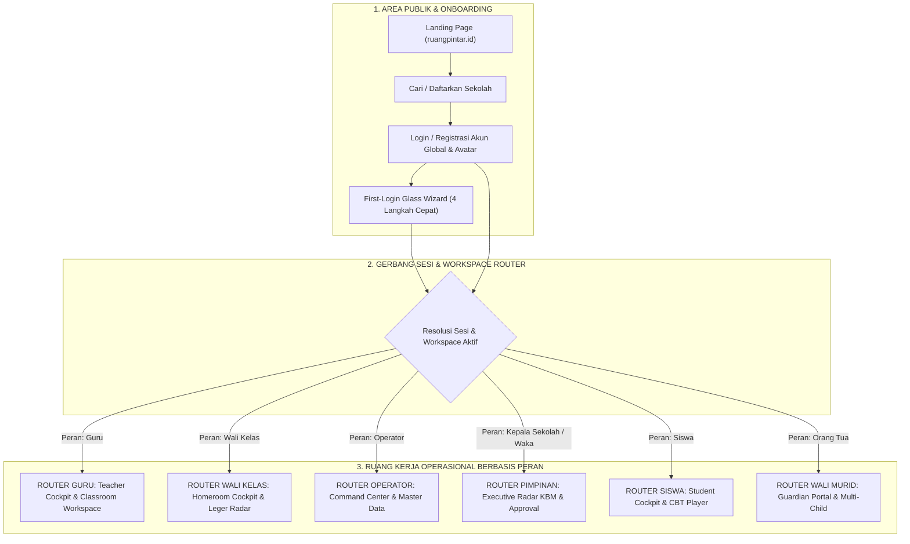
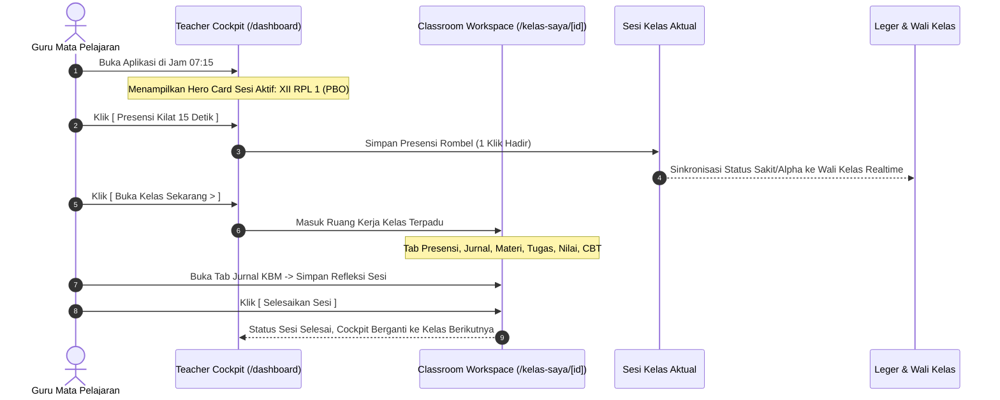

# APPLICATION BLUEPRINT — CETAK BIRU APLIKASI FINAL
## Ruang Pintar — Struktur Aplikasi, Alur Navigasi, dan Titik Masuk Peran

**Dokumen:** Cetak Biru Arsitektur Aplikasi Tingkat Tinggi  
**Status:** PROPOSED — READY FOR HUMAN REVIEW  
**Tanggal:** 22 September 2026  
**Target:** Referensi Tunggal Sebelum Desain Antarmuka High-Fidelity  
**Tujuan:** Memvisualisasikan peta navigasi menyeluruh, interkoneksi antar-area, dan alur perjalanan pengguna dari login hingga eksekusi operasional.

---

# 1. Peta Struktur Aplikasi Global (*Global Application Map*)



---

# 2. Titik Masuk Setiap Peran (*Role Entry Points*)

```text
+----+-------------------+-----------------------+-----------------------------+-------------------------------+
| No | Peran Pengguna    | Rute Masuk Utama      | Titik Pendaratan Awal       | Misi Utama 30 Detik Pertama   |
+----+-------------------+-----------------------+-----------------------------+-------------------------------+
| 1  | GURU MAPEL        | `/dashboard`          | Teacher Cockpit             | Lihat kelas jam ke-1 &        |
|    |                   |                       | (Hero Card Sesi Aktif)      | tombol Presensi Kilat 15 Detik|
+----+-------------------+-----------------------+-----------------------------+-------------------------------+
| 2  | WALI KELAS        | `/wali-kelas`         | Homeroom Radar              | Cek absensi rombel hari ini & |
|    |                   |                       | (Kesehatan 36 Siswa)        | progres nilai guru mapel      |
+----+-------------------+-----------------------+-----------------------------+-------------------------------+
| 3  | OPERATOR SEKOLAH  | `/sekolah/master`     | Operator Command Center     | Cek validitas rombel, jadwal, |
|    |                   |                       | (Status Data Akademik)      | dan antrean perbaikan NISN    |
+----+-------------------+-----------------------+-----------------------------+-------------------------------+
| 4  | WAKA KURIKULUM    | `/kurikulum/radar`    | Academic Radar              | Pantau KBM berjalan & guru    |
|    |                   |                       | (Denyut KBM Hari Ini)       | yang belum isi jurnal hari ini|
+----+-------------------+-----------------------+-----------------------------+-------------------------------+
| 5  | KEPALA SEKOLAH    | `/eksekutif`          | Executive Leadership Radar  | Pastikan sekolah tertib &     |
|    |                   |                       | (Ringkasan 30 Detik)        | tanda tangan persetujuan SPK  |
+----+-------------------+-----------------------+-----------------------------+-------------------------------+
| 6  | SISWA             | `/siswa`              | Student Cockpit             | Cek jadwal pelajaran & hitung |
|    |                   |                       | (Jadwal & Tugas)            | mundur batas akhir tugas      |
+----+-------------------+-----------------------+-----------------------------+-------------------------------+
| 7  | WALI MURID        | `/orang-tua`          | Guardian Portal             | Dapatkan kepastian kehadiran  |
|    |                   |                       | (Live Kehadiran Anak)       | anak & pengawasan tugas rumah |
+----+-------------------+-----------------------+-----------------------------+-------------------------------+
```

---

# 3. Alur Navigasi Utama: Dari Cockpit Menuju Aksi



---

# 4. Standar Transisi Navigasi & Keamanan Konteks

1. **Prinsip Zero-Data-Leakage:**
   Setiap perpindahan antar-menu atau antar-workspace selalu diverifikasi server-side melalui `TenantContext` & `ActiveWorkspaceId`. Tidak ada URL yang dapat dimanipulasi klien untuk mengintip data sekolah atau kelas lain.
2. **Kesesuaian dengan Academic Glass UI v1.2:**
   Seluruh halaman menggunakan palet warna semantik yang konsisten (Cobalt untuk aksi utama, Emerald untuk kehadiran/tuntas, Amber untuk perhatian khusus, dan Rose untuk status kritis/alpha).
3. **Penyederhanaan Total:**
   Menghilangkan menu-menu birokrasi yang membebani guru, mengunci fokus aplikasi pada satu filosofi tunggal: **Membantu guru mengajar dengan cepat, tertib, dan menyenangkan.**
