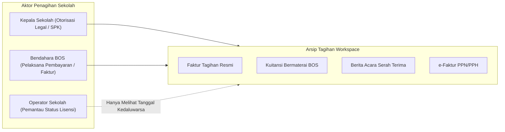
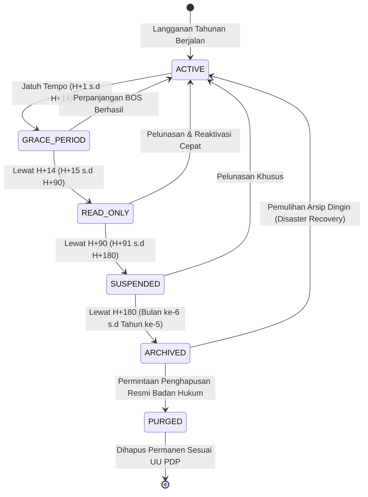

# BILLING OWNERSHIP & WORKSPACE RETENTION POLICY
## Ruang Pintar — Institutional Billing, Grace Management & Data Retention Lifecycle

**Dokumen:** Kepemilikan Tagihan & Kebijakan Retensi Data Workspace  
**Status:** PROPOSED — READY FOR HUMAN REVIEW  
**Tanggal:** 22 September 2026  
**Target:** SaaS Phase SAAS-05 / Milestone K  
**Tujuan:** Mengunci kebijakan hukum kepemilikan tagihan sekolah, perlakuan saat lisensi kedaluwarsa, dan batasan retensi data untuk menjamin keamanan arsip akademik nasional.

---

# 1. Kepemilikan Kontrak & Penagihan (*Billing Ownership*)

Dalam model B2B SaaS Sekolah, penagihan harus dirancang agar kebal terhadap rotasi personalia internal sekolah:

### 1.1 Entitas Pemilik Tagihan (*Contract Owner*)
* **Pemilik Sah:** **Nama Resmi Sekolah / Yayasan Pendidikan**, bukan nama pribadi guru atau kepala sekolah.
* **Dasar Dokumen:** Surat Perjanjian Kerjasama (SPK), Surat Pesanan Resmi, atau Faktur Pajak yang diterbitkan atas nama NPSN dan NPWP resmi sekolah.

### 1.2 Hak & Visibilitas Tagihan (*Billing Role Scoping*)

* **Keamanan Finansial:**
  * Guru, siswa, dan orang tua **sama sekali tidak melihat informasi nominal biaya, nomor rekening bank, atau invoice tagihan sekolah**.
  * Hanya pengguna dengan peran `ORGANIZATIONAL_OWNER` (Kepala Sekolah) dan `BILLING_ADMIN` (Bendahara BOS) yang dapat mengunduh berkas kuitansi, e-faktur pajak, dan Berita Acara Serah Terima (BAST).

---

# 2. Siklus Hidup Workspace & Kebijakan Retensi (*Retention Lifecycle*)

Ketika sekolah terlambat memperpanjang lisensi tahunannya, Ruang Pintar menerapkan tahapan gradual yang dirancang untuk melindungi kegiatan belajar mengajar (*Zero Sudden Disruption*):

---

## 2.1 Rincian Matriks Status & Jangka Waktu Retensi

| Status Workspace | Rentang Waktu | Kondisi Operasional KBM | Akses Pengguna | Kebijakan Data |
| :--- | :--- | :--- | :--- | :--- |
| **`ACTIVE`** | Selama masa kontrak (12 Bulan). | Seluruh sistem beroperasi penuh. | Semua guru, siswa, wali, dan staf dapat login normal. | Database aktif & backup harian (*Hot Storage*). |
| **`GRACE_PERIOD`** | **H+1 s.d. H+14** (Masa Tenggang 14 Hari). | **KBM TIDAK TERGANGGU.** Presensi harian dan input nilai tetap berjalan. | Semua pengguna tetap dapat login. Topbar menampilkan pengingat sopan kepada bendahara. | Tidak ada pembatasan data. |
| **`READ_ONLY`** | **H+15 s.d. H+90** (Bulan ke-1 s.d Bulan ke-3). | Mutasi baru dinonaktifkan. Guru tidak dapat membuat tugas/absen baru. | Semua pengguna dapat login, melihat materi, dan **mencetak dokumen/rapor lama**. | Data dibekukan (*Write-Locked*). Pencadangan mingguan. |
| **`SUSPENDED`** | **H+91 s.d. H+180** (Bulan ke-4 s.d Bulan ke-6). | Operasional dihentikan total. | Hanya Kepala Sekolah & Bendahara yang dapat login untuk melakukan pembayaran. | Data aman, namun API publik & akses siswa diputus. |
| **`ARCHIVED`** | **Bulan ke-7 s.d. Tahun ke-5** (Sesuai Permendikbud). | Workspace dinonaktifkan dari cluster aktif. | Tidak ada pengguna yang dapat login secara langsung. | Data dipadatkan ke *Encrypted Cold Storage* sebagai arsip historis. |
| **`PURGED`** *(Deleted)* | **Setelah 5 Tahun** atau atas Permohonan Resmi. | Seluruh data dihapus permanen. | Akses musnah selamanya. | Dihapus dari seluruh database dan cadangan sekunder (*Cryptographic Erasure*). |

---

# 3. Kapan dan Bagaimana Data Benar-Benar Dihapus (*Hard Delete Policy*)?

Sebagai penyedia sistem informasi akademik, Ruang Pintar terikat pada dua regulasi nasional:
1. **Regulasi Retensi Arsip Akademik (Permendikbudristek No. 49 Tahun 2022):** Dokumen hasil belajar siswa, ijazah, dan buku induk register sekolah wajib diarsipkan minimal **5 (lima) tahun** sejak siswa lulus.
2. **Undang-Undang Perlindungan Data Pribadi (UU PDP No. 27 Tahun 2022):** Pengguna dan pemilik data berhak meminta pemusnahan data pribadi apabila tujuan pemrosesan telah berakhir.

### Syarat Ketat Pemusnahan Data (*Hard Delete Protocol*):
Penghapusan data (*Hard Delete*) **TIDAK PERNAH DIJALANKAN SECARA OTOMATIS** hanya karena telat membayar tagihan. Pemusnahan data hanya terjadi jika:
1. Telah melewati masa simpan wajib 5 tahun pada status `ARCHIVED`; **ATAU**
2. Ada **Permohonan Tertulis Resmi Bermaterai** dari Kepala Sekolah dan Yayasan Pendidikan / Dinas Pendidikan yang menyatakan pengunduran diri resmi dan meminta pemusnahan arsip digital.
3. Dilakukan pembuatan **Berita Acara Pemusnahan Data Digital (BAPDD)** yang ditandatangani bersama oleh pihak sekolah dan perwakilan hukum Ruang Pintar.

---

# 4. Prosedur Reaktivasi Instan (*Instant Disaster Restoration*)

Jika sekolah menyelesaikan pembayaran pada tahap `READ_ONLY` atau `SUSPENDED`:
1. **Verifikasi Pembayaran Otomatis:**
   * Jika membayar via Virtual Account / QRIS: Gateway webhook memverifikasi transaksi dalam hitungan detik.
   * Jika membayar via Surat Perintah Pencairan Dana (SP2D) BOS: Operator mengunggah bukti transfer $\rightarrow$ Tim Keuangan Ruang Pintar memverifikasi via panel admin.
2. **Restorasi Satu-Klik (*Zero Friction Recovery*):**
   * Status workspace langsung kembali menjadi **`ACTIVE`**.
   * Seluruh hak mutasi guru, wali kelas, dan akses siswa seketika pulih tanpa ada satu pun baris data nilai atau absensi yang hilang atau berubah.
   * Muncul notifikasi di dashboard seluruh guru: *"Lisensi sekolah Anda telah diperpanjang hingga [Tanggal Baru]. Selamat bertugas kembali!"*
