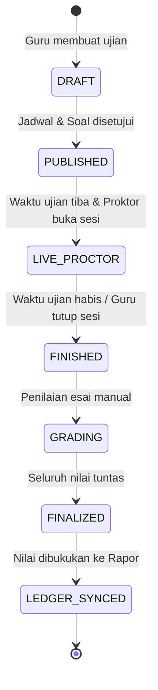

# CBT REDESIGN BLUEPRINT — SCHOOL OPERATIONAL ENGINE
## STAGE 10.7: Cetak Biru Transformasi CBT dari CRUD Database Menjadi Sistem Ujian Sekolah Nyata

| Atribut | Nilai Faktual |
| --- | --- |
| **Produk / Sub-sistem** | Ruang Pintar — Computer Based Test (CBT) Engine (M14) |
| **Fokus Transformasi** | Dari *Passive Database CRUD* ke *Live School Operational Exam Workflow* |
| **Aktor Terlibat** | Guru Pengampu, Pengawas/Proktor Ujian, Siswa Peserta, Kurikulum Sekolah |
| **Tanggal Terbit** | 24 September 2026 |
| **Status Dokumen** | **ARCHITECTURAL BLUEPRINT & OPERATIONAL CONTRACT** |

---

## 1. Mengapa CBT Saat Ini Belum Siap untuk Ujian Sekolah Riil?

Evaluasi terhadap modul CBT saat ini (`/cbt-ujian`, `/cbt/[attemptId]`, `cbt-service.ts`) membuktikan bahwa sistem saat ini baru sebatas **prototipe CRUD penyimpanan soal dan form pengerjaan siswa**. 

Kelemahan fatal untuk operasional sekolah nyata antara lain:

1. **Ketiadaan Proctoring / Live Monitoring:**
   Guru atau pengawas ruang tidak memiliki cara untuk melihat siswa mana yang sudah login, siswa mana yang sedang mengerjakan di soal nomor berapa, siswa mana yang mengalami koneksi putus, dan siswa mana yang curang (berpindah tab / keluar mode fullscreen).
2. **Token Ujian Statis & Rentan Bocor:**
   Token ujian saat ini disimpan sebagai teks statis di database. Dalam ujian sekolah sesungguhnya, token harus bersifat dinamis (dapat di-generate ulang setiap 15–30 menit oleh proktor) untuk mencegah kebocoran soal ke kelas lain.
3. **Ketiadaan Kontrol Perangkat & Multi-Device Login:**
   Tidak ada mekanisme *device binding* atau sesi tunggal aktif yang memaksa siswa keluar dari perangkat lain jika mencoba membuka soal bersamaan.
4. **Alur Ujian Campuran Belum Tuntas (Esai Belum Bisa Dinilai):**
   Generator AI menghasilkan soal campuran (PG, Menjodohkan, Esai), namun antarmuka penilaian esai manual per siswa belum tersedia di gradebook.
5. **Ketiadaan Analitik Butir Soal (Item Analysis):**
   Sekolah membutuhkan parameter reliabilitas instrumen evaluasi: Tingkat Kesukaran ($P$), Daya Pembeda ($D$), dan Analisis Sebaran Jawaban Pengecoh (Distractor Analysis). Saat ini sistem hanya menghasilkan skor mentah.
6. **Ketiadaan Ekspor Nilai Resmi:**
   Guru harus mencatat manual nilai satu per satu karena belum ada fitur ekspor rekap nilai berformat Excel/PDF sesuai template Dapodik/Kurikulum Merdeka.

---

## 2. Alur Kerja Operasional Ujian Sekolah Riil (6-Stage Workflow)

Cetak biru CBT baru merancang ulang seluruh alur menjadi 6 fase operasional yang mencerminkan proses Penilaian Harian (PH), Sumatif Tengah Semester (STS), dan Sumatif Akhir Semester (SAS):

```text
┌─────────────────┐     ┌─────────────────┐     ┌─────────────────┐
│ FASE 1:         │     │ FASE 2:         │     │ FASE 3:         │
│ Blueprint Soal  │ ──> │ Penjadwalan &   │ ──> │ Rilis Token &   │
│ & Bank Soal     │     │ Konfigurasi     │     │ Sesi Proktor    │
└─────────────────┘     └─────────────────┘     └─────────────────┘
                                                         │
                                                         ▼
┌─────────────────┐     ┌─────────────────┐     ┌─────────────────┐
│ FASE 6:         │     │ FASE 5:         │     │ FASE 4:         │
│ Rekap, Analitik │ <── │ Evaluasi &      │ <── │ Live Monitoring │
│ & Buku Nilai    │     │ Penilaian Esai  │     │ & Proctoring    │
└─────────────────┘     └─────────────────┘     └─────────────────┘
```

---

### Fase 1: Perencanaan & Blueprint Soal
- **Struktur Bank Soal Terverifikasi:** Guru menyusun butir soal berdasarkan Capaian Pembelajaran (CP) dan Tujuan Pembelajaran (TP).
- **Format Soal Lengkap:**
  - Pilihan Ganda Tunggal (Single Choice)
  - Pilihan Ganda Kompleks (Multi Choice / Checkbox)
  - Benar / Salah (True / False)
  - Menjodohkan (Matching Pair)
  - Esai / Jawaban Singkat (Uraian)
- **Bobot Skor per Soal:** Setiap butir soal memiliki bobot skor independen (misal: PG bobot 2, Esai bobot 10).
- **Stimulus Soal:** Dukungan penuh untuk teks stimulus cerita, tabel data, kode program, dan gambar diagram.

---

### Fase 2: Penjadwalan & Konfigurasi Sesi Ujian
- **Waktu Akses:** Tanggal mulai, tanggal selesai, batas toleransi keterlambatan (misal: maksimal 15 menit setelah ujian dimulai).
- **Alokasi Rombel:** Ujian dapat ditugaskan ke satu rombel spesifik (misal: X TO 3) atau lintas rombel satu tingkat.
- **Kebijakan Integritas:**
  - *Acak Soal:* Urutan nomor soal berbeda antar siswa.
  - *Acak Opsi:* Urutan pilihan jawaban (A, B, C, D, E) teracak otomatis.
  - *Kunci Navigasi (Fullscreen Lock):* Memaksa browser ke mode layar penuh.
  - *Deteksi Pindah Tab:* Maksimal 3x peringatan sebelum ujian terkunci otomatis.
  - *Kalkulator / Bantuan:* Diaktifkan atau dinonaktifkan sesuai mata pelajaran.

---

### Fase 3: Rilis Token Dinamis & Sesi Pengawas
- **State Machine Ujian:**
  $$\text{DRAFT} \longrightarrow \text{DITERBITKAN} \longrightarrow \text{SIAP\_UJIAN} \longrightarrow \text{BERLANGSUNG} \longrightarrow \text{SELESAI}$$
- **Token Dinamis Proktor:**
  - Token terdiri dari 6 karakter huruf kapital acak (misal: `XK9PLM`).
  - Guru/Pengawas ruang dapat meng-generate token baru langsung dari Proctor Cockpit.
  - Opsi auto-refresh token setiap 15 menit untuk ruang ujian terpadu.

---

### Fase 4: Pelaksanaan & Live Monitoring (Proctor Cockpit)
Guru/Pengawas memiliki antarmuka khusus **Live Proctoring Grid** dengan status realtime setiap siswa:

```text
┌────────────────────────────────────────────────────────────────────────┐
│ PROCTOR COCKPIT: PENILAIAN SUMATIF KKA — KELAS X TO 3                  │
│ Token Aktif: [ B K 8 W T 2 ] • Sisa Waktu Ujian: 01:14:22             │
│ Total Peserta: 38 • Mengerjakan: 35 • Belum Login: 2 • Terkunci: 1     │
├────────────────────────────────────────────────────────────────────────┤
│ [1. Ahmad Fatoni]      │ [2. Alif Adhitya]      │ [3. Andika Rizky]    │
│ Status: MENGERJAKAN    │ Status: MENGERJAKAN    │ Status: TERKUNCI (!) │
│ Posisi: Soal 18 / 25   │ Posisi: Soal 22 / 25   │ Pelanggaran: Tab Switch│
│ Pelanggaran: 0         │ Pelanggaran: 1x (Warn) │ [ Buka Kunci Siswa ] │
├────────────────────────────────────────────────────────────────────────┤
│ [4. Ayzicho Aulia]     │ [5. Bayu Adji]         │ [6. David Rama]      │
│ Status: SELESAI (100%) │ Status: MENGERJAKAN    │ Status: BELUM LOGIN  │
│ Nilai PG: 84.0         │ Posisi: Soal 12 / 25   │ Sesi Belum Dimulai   │
└────────────────────────────────────────────────────────────────────────┘
```

**Fitur Proktor Utama:**
1. **Reset Sesi Siswa:** Jika laptop/HP siswa mati lampu atau baterai habis, proktor dapat mereset sesi tanpa menghapus jawaban yang telah tersimpan.
2. **Buka Kunci Pelanggaran (Unlock):** Memberikan izin kembali kepada siswa yang terkunci akibat perpindahan aplikasi secara tidak sengaja.
3. **Paksa Kumpul (Force Submit):** Mengakhiri sesi seluruh siswa secara serentak ketika bel ujian berbunyi.

---

### Fase 5: Evaluasi & Skoring Campuran
1. **Autograding Instan:**
   Seluruh butir soal objektif (PG, Menjodohkan, Benar/Salah) dinilai otomatis dalam tempo < 1 detik setelah siswa mengumpulkan ujian.
2. **Workspace Penilaian Esai Guru:**
   Antarmuka khusus bagi guru untuk mengoreksi jawaban esai siswa butir per butir (blind grading per nomor soal) dilengkapi rubrik skor dan kunci jawaban panduan.
3. **Kalkulasi Nilai Akhir:**
   Nilai akhir dihitung secara proporsional berdasarkan bobot:
   $$\text{Nilai Akhir} = \left( \frac{\text{Skor Objektif Diperoleh}}{\text{Total Bobot Objektif}} \times W_{\text{obj}} \right) + \left( \frac{\text{Skor Esai Diperoleh}}{\text{Total Bobot Esai}} \times W_{\text{esai}} \right)$$

---

### Fase 6: Rekapitulasi, Analitik Butir Soal, & Integrasi Rapor
1. **Statistik Distribusi Nilai:**
   - Nilai Tertinggi, Terendah, Rata-rata ($\mu$), Standar Deviasi ($\sigma$), Median, Modus.
   - Ketuntasan Belajar Rombel (% siswa mencapai kriteria ketuntasan tujuan pembelajaran / KKTP).
2. **Analisis Butir Soal Ilmiah (Psychometric Item Analysis):**
   - **Tingkat Kesukaran ($P$):**
     $$P = \frac{B}{N}$$
     *(Kategori: Mudah > 0.70, Sedang 0.30 - 0.70, Sukar < 0.30)*
   - **Daya Pembeda ($D$):**
     $$D = \frac{B_A - B_B}{n}$$
     *(Membedakan kelompok atas vs kelompok bawah; mengidentifikasi soal yang cacat/membingungkan)*
   - **Efektivitas Pengecoh (Distractor Efficiency):**
     Memeriksa apakah pilihan jawaban pengecoh (A, B, C, D) dipilih minimal oleh 5% peserta ujian.
3. **Ekspor & Sinkronisasi:**
   - Tombol satu klik: *"Bukukan ke Buku Nilai"* (otomatis mengimpor nilai CBT ke kolom Sumatif pada Ledger Pembelajaran).
   - Ekspor lembar rekap format Excel (.xlsx) dan PDF resmi ber-kop surat sekolah.

---

## 3. Desain State Machine CBT



### State Sesi Peserta Didik:
- `BELUM_MULAI`: Siswa terdaftar, belum memasukkan token.
- `SEDANG_MENGERJAKAN`: Siswa sedang berada di dalam antarmuka ujian.
- `TERKUNCI_PELANGGARAN`: Siswa melanggar batas perpindahan tab / keluar fullscreen; menunggu tindakan proktor.
- `TERPUTUS`: Jaringan siswa offline / heartbeat terhenti lebih dari 60 detik.
- `DIKUMPULKAN`: Siswa telah menekan tombol selesai secara sadar.
- `WAKTU_HABIS`: Sistem mengunci dan mengumpulkan otomatis saat timer berakhir.
