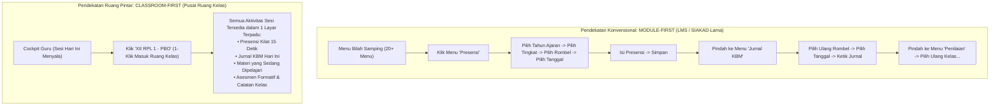

# CLASSROOM FIRST DESIGN PHILOSOPHY
## Ruang Pintar — Merancang dari Ruang Kelas, Bukan dari Struktur Menu

**Dokumen:** Filosofi Desain Classroom-First vs Module-First  
**Status:** PROPOSED — READY FOR HUMAN REVIEW  
**Tanggal:** 22 September 2026  
**Target:** Teacher Experience Core & Classroom UI Architecture  
**Prinsip Fundamental:**  
> *"Guru tidak berpikir dalam kategori modul database: 'Sekarang saya buka Modul Presensi, lalu Modul Jurnal, lalu Modul Nilai'. Guru berpikir: 'Sekarang saya sedang bersama anak-anak X RPL 1, apa yang harus saya tuntaskan di kelas ini?'"*

---

# 1. Perbandingan Dua Pendekatan: Module-First vs Classroom-First

---

## 1.1 Tabel Perbandingan Pengalaman Pengguna (*User Experience*)

| Parameter | Pendekatan **Module-First** (Tradisional) | Pendekatan **Classroom-First** (Ruang Pintar) |
| :--- | :--- | :--- |
| **Pola Pikir Antarmuka** | Berorientasi pada struktur tabel database (*Database-Centric*). | Berorientasi pada ruang fisik dan interaksi manusia di kelas (*Classroom-Centric*). |
| **Beban Pindah Konteks (*Context Switching*)** | **Sangat Tinggi.** Guru harus mengulang-ulang memilih kelas, semester, dan tanggal setiap kali berpindah menu. | **Nol (*Zero Context Switching*).** Sekali guru berada di ruang kelas, semua data relevan terkunci pada kelas tersebut. |
| **Jumlah Klik untuk Administrasi Sesi** | Rata-rata 18–25 klik di berbagai menu terpisah. | **Hanya 3–5 klik** dalam satu tampilan terpadu. |
| **Kecepatan di Depan Siswa** | Lambat dan membingungkan; guru terpaku mencari-cari menu di depan kelas. | Cepat dan taktis; guru menyelesaikan administrasi dalam hitungan detik. |
| **Tampilan Mobile di Smartphone** | Rumit; dropdown bertingkat yang sulit ditekan jempol tangan. | Kartu sesi mengalir alami; tombol presensi dan aksi utama mudah dijangkau satu tangan. |

---

# 2. Dampak Desain Classroom-First terhadap Produk

Penerapan filosofi *Classroom-First* secara fundamental mengubah seluruh komponen produk Ruang Pintar:

### 2.1 Dampak terhadap Dashboard Utama
* **Bukan Lembar Statistik Kering:** Dashboard guru tidak lagi dipenuhi grafik persentase atau KPI makro yang tidak dapat ditindaklanjuti.
* **Menjadi "Classroom Launchpad" / Cockpit:** Dashboard bertindak sebagai landasan peluncuran sesi kelas:
  * Menampilkan **Kartu Sesi Aktif Hari Ini** berdasarkan jam dan jadwal mengajar riil.
  * Kartu kelas yang sedang berlangsung menyala terang dengan tombol aksi cepat: **[ Buka Kelas Sekarang ]**.

### 2.2 Dampak terhadap Navigasi Bilah Samping (*Sidebar*)
* **Radikalisasi Pembersihan Menu:** Menghilangkan menu yang tercecer seperti *"Input Nilai"*, *"Input Jurnal"*, *"Input Presensi"*.
* **Menu yang Disederhanakan:**
  * Fokus navigasi dewan guru diringkas menjadi:
    1. **Cockpit Mengajar** (Beranda jadwal harian & tugas mendesak);
    2. **Kelas Saya** (Pintu masuk seluruh ruang kerja kelas);
    3. **Jadwal Saya** (Kalender jadwal mengajar mingguan);
    4. **Bank Soal & Asesmen** (Alat bantu evaluasi).
  * Seluruh administrasi operasional dilakukan di dalam ruang kelas yang bersangkutan.

### 2.3 Dampak terhadap Aplikasi Mobile Smartphone
* **Fokus Layar Kelas Berjalan (*Live Classroom Screen*):**
  Saat guru membuka aplikasi di smartphone pada jam 07:30, aplikasi tidak menampilkan daftar menu yang panjang, melainkan langsung menyajikan antarmuka:  
  **"Sesi XII RPL 1 sedang berjalan"** dengan tombol presensi kilat yang dirancang ramah jempol (*thumb zone*).

### 2.4 Dampak terhadap Notifikasi
* **Notifikasi Berbasis Kelas (*Class-Scoped Alerts*):**
  Pemberitahuan tidak bersifat abstrak, melainkan kontekstual kelas:
  * *"3 siswa di XII RPL 1 belum mengumpulkan tugas batas waktu sore ini."*
  * *"Nilai Asesmen Sumatif BAB 2 di X RPL 2 belum difinalisasi."*

### 2.5 Dampak terhadap AI Assistant
* **AI Sadar Konteks (*Context-Aware Classroom Copilot*):**
  AI tidak bertindak sebagai chatbot generik. Ketika guru membuka AI di dalam ruang kelas XII RPL 1, asisten AI secara otomatis mengetahui:
  * Mata pelajaran: *Pemrograman Berbasis Objek*;
  * Capaian Pembelajaran & TP yang sedang berjalan;
  * Materi yang diajarkan pada pertemuan sebelumnya;
  * Histori ketuntasan siswa di kelas tersebut.

---

# 3. Rekomendasi: Kelas sebagai Workspace Operasional

Ruang Pintar secara resmi menetapkan: **Pola `Kelas → Aktivitas` adalah kontrak desain superior untuk sekolah di Indonesia**.

Setiap ruang kelas (contoh: *XII RPL 1 - Pemrograman Berbasis Objek*) adalah **Workspace Operasional Mandiri** yang mengintegrasikan:
1. **Daftar Siswa & Profil Ringkas;**
2. **Sesi Presensi Harian;**
3. **Materi & Modul Pembelajaran;**
4. **Tugas & Lembar Kerja;**
5. **Matriks Buku Nilai & Capaian TP;**
6. **Jurnal Mengajar & Catatan Refleksi Guru.**

Dengan pendekatan ini, guru merasa memiliki "meja kerja digital" yang rapi untuk setiap kelas yang diampunya, tanpa takut data antar-kelas saling tertukar.
