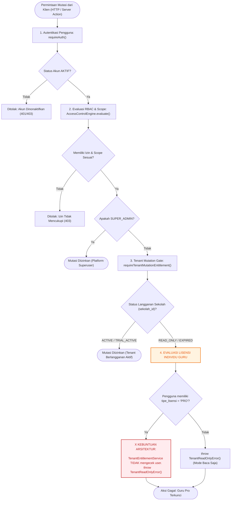

# STAGE 10.4 — ENTITLEMENT ARCHITECTURE REMEDIATION
## Cetak Biru Perbaikan Arsitektur Entitlement & Resolusi Split-Brain Lisensi

| Metadata | Nilai |
| --- | --- |
| **Proyek** | Ruang Pintar — School Digital Operating Platform |
| **Fase** | PHASE SAAS-04 / STAGE 10.4 — ENTITLEMENT ARCHITECTURE REMEDIATION |
| **Status Dokumen** | `ANALYSIS ONLY — PROPOSED` (Tanpa Perubahan Kode / Database) |
| **Dokumen Terkait** | `docs/STAGE-09-PRODUCT-CODE-REALITY-AUDIT.md`, `docs/PRODUCT-PACKAGING-STRATEGY.md`, `docs/04-ROLE-ACCESS.md` |
| **Tanggal Analisis** | 24 September 2026 |

---

# 1. Executive Summary

Laporan ini memetakan secara komprehensif konflik arsitektur penagihan dan hak akses (*entitlement*) pada Ruang Pintar yang pertama kali diidentifikasi pada **Audit Stage 09**, yaitu **Split-Brain Entitlement Model**:
1. **Track Pengguna (`Pengguna.tipe_lisensi`):** Pembayaran Midtrans QRIS Guru Pro memperbarui lisensi di level individu pengguna (`tipe_lisensi = "PRO"`).
2. **Track Tenant (`LanggananTenant`):** Mutation gate runtime pada `authz-guard.ts` hanya mengevaluasi status sekolah di level tenant (`sekolah_id`).

Akibatnya, ketika sebuah sekolah berstatus `READ_ONLY` (karena masa trial sekolah habis atau belum berlangganan BOS), **seorang Guru Pro Mandiri yang telah membayar tetap terkunci secara teknis** (`TenantReadOnlyError`) saat mencoba menyimpan presensi, membuat materi, atau mengadakan kuis CBT.

Dokumen ini menyajikan:
* Audit mendalam 6 komponen jalur entitlement runtime saat ini.
* Diagram alur keputusan aktual beserta titik kebuntuannya (*architectural deadlock*).
* Desain arsitektur baru: **Unified Entitlement Resolver** yang mendukung 4 persona produk secara bersih.
* Definisi aturan prioritas evaluasi berbasis bukti bisnis kanonikal.
* Klasifikasi seluruh berkas yang harus diubah (Critical, High, Medium).
* Roadmap tahapan implementasi yang aman tanpa risiko regresi data existing.

---

# 2. Audit Seluruh Jalur Entitlement Runtime Saat Ini

Audit static tracing terhadap 6 pilar jalur hak akses membuktikan isolasi terputus antara profil lisensi pengguna dengan izin mutasi data:

```text
[Browser Request]
       │
       ▼
[requireAuth()] ───────────────► Resolusi Sesi & Akun Aktif (Pengguna)
       │
       ▼
[requirePermission()] ──────────► AccessControlEngine.evaluate()
       │                          (Mengecek Role, Assignment, Scope: Classroom/School)
       │
       ├──► DECISION: ALLOWED
       │
       ▼
[Tenant Mutation Gate] ────────► requireTenantMutationEntitlement(user.sekolah_id, permission)
                                  │
                                  ▼
                        [getTenantEntitlement(sekolahId)]
                                  │
                                  ├──► Query: prisma.langgananTenant.findFirst({ where: { sekolah_id } })
                                  │
                                  ├──► Evaluasi: status === "ACTIVE" || status === "TRIAL_ACTIVE"
                                  │
                                  └──► JIKA TIDAK: throw new TenantReadOnlyError() 
                                       [AKUN GURU PRO INDIVIDU TERBLOKIR DI SINI]
```

### 2.1. `src/shared/infrastructure/authorization/authz-guard.ts`
* **Lokasi Kritis:** Baris 223–225.
  ```typescript
  if (user.peran_dasar !== "SUPER_ADMIN" && user.sekolah_id) {
    await requireTenantMutationEntitlement(user.sekolah_id, permission);
  }
  ```
* **Kelemahan Arsitektur:** `authz-guard.ts` hanya meneruskan `user.sekolah_id` ke gate mutasi. Data lisensi aktor (`user.tipe_lisensi`) sama sekali tidak diikutsertakan dalam evaluasi hak mutasi.

### 2.2. `src/shared/infrastructure/tenant/tenant-entitlement-service.ts`
* **Lokasi Kritis:** Baris 25–54 (`getTenantEntitlement`) dan Baris 86–96 (`requireTenantMutationEntitlement`).
* **Kelemahan Arsitektur:**
  - Fungsi `getTenantEntitlement(sekolahId: string)` hanya menerima parameter tunggal `sekolahId`.
  - Service beroperasi dengan asumsi kaku *Tenant-Only Ownership*: jika sekolah tidak memiliki langganan aktif, seluruh operasi berakhiran kata kerja mutasi (`.create`, `.update`, `.delete`, `.save`, `.publish`, dll.) diblokir total tanpa kompromi.

### 2.3. `src/modules/billing/application/subscription-service.ts`
* **Lokasi Kritis:** Baris 160–166 (`processWebhookNotification`) dan Baris 239–245 (`simulatePaymentSuccess`).
  ```typescript
  await prisma.pengguna.update({
    where: { id: order.pengguna_id },
    data: {
      tipe_lisensi: "PRO",
      trial_berakhir_pada: extendedExpiry,
    },
  });
  ```
* **Kelemahan Arsitektur:** Saat pembayaran Midtrans berhasil diselesaikan, service meng-update entitas `Pengguna`, namun **sama sekali tidak menyentuh atau membuat rekonsiliasi pada model `LanggananTenant`**.

### 2.4. `src/app/api/billing/midtrans-webhook/route.ts`
* Webhook menerima payload notifikasi resmi dari Midtrans dan meneruskannya ke `subscriptionService.processWebhookNotification()`.
* Webhook beroperasi secara independen tanpa koordinasi dengan modul otorisasi atau status tenant sekolah.

### 2.5. Mutation Gates (`isMutationPermission`)
* **Daftar Aksi Mutasi:** `create`, `update`, `delete`, `save`, `publish`, `assign`, `start`, `submit`, `finalize`, `record`, dll.
* Seluruh aksi mutasi ini saat ini dilindungi oleh pagar tunggal `requireTenantMutationEntitlement`.

### 2.6. Permission Guards (`requirePermission`, `requireRole`, `requireAuth`)
* `requireAuth()` memverifikasi sesi kriptografis token dan status akun `AKTIF`.
* `requireRole()` memverifikasi peran dasar.
* `requirePermission()` mengevaluasi matriks RBAC/ABAC di `AccessControlEngine`.
* Otorisasi izin (`requirePermission`) menyatakan operasi **SAH / ALLOWED**, tetapi langsung digagalkan oleh mutation gate tenant di baris berikutnya jika status sekolah `READ_ONLY`.

---

# 3. Diagram Keputusan Entitlement Aktual

Berikut adalah diagram alur keputusan runtime saat ini yang menunjukkan terjadinya kebuntuan (*architectural deadlock*):



---

# 4. Desain Unified Entitlement Resolver

Untuk mengatasi konflik di atas secara bersih dan tanpa *workaround*, sistem memerlukan abstraksi baru: **`UnifiedEntitlementResolver`**.

Service ini menggantikan dependensi sepihak pada `LanggananTenant` dengan mengevaluasi **Konteks Gabungan (Dual-Context: Aktor Pengguna + Tenant Sekolah)**.

### 4.1. Spesifikasi Dukungan 4 Persona Produk

#### A. Persona Guru Mandiri Pro (*Teacher Self-Funding*)
* **Kasus Nyata:** Guru membeli paket Pro Rp 15.000/bulan via QRIS pribadi karena sekolahnya tidak menyediakan anggaran digitalisasi.
* **Kondisi Data:** `user.tipe_lisensi = "PRO"` (aktif), sedangkan `LanggananTenant.status = "READ_ONLY"`.
* **Hak Mutasi yang Terbuka (Personal Teaching Scope):**
  * `learning.material.*` (Mengunggah dan mengelola materi ajar di kelasnya).
  * `learning.assignment.*` (Membuat tugas dan menerima pengumpulan siswa).
  * `attendance.session.save` (Menyimpan presensi sesi KBM di kelas yang diampunya).
  * `cbt.exam.*` (Membuat bank soal personal dan menyelenggarakan kuis CBT).
  * `assessment.grade.save` (Mengisi nilai formatif/sumatif kelasnya).
* **Hak Mutasi yang Tetap Terkunci (School Institutional Scope):**
  * Dilarang menambah/mengedit data guru lain.
  * Dilarang mengubah struktur kurikulum atau rombel master sekolah.
  * Dilarang menerbitkan e-Rapor resmi institusi sekolah.

#### B. Persona Sekolah Pro (*Institutional School Subscription*)
* **Kasus Nyata:** Sekolah SD/SMP/SMA/SMK berlangganan tahunan resmi menggunakan alokasi Dana BOS Reguler.
* **Kondisi Data:** `LanggananTenant.status = "ACTIVE"`, seluruh guru memiliki `user.tipe_lisensi = "FREEMIUM"`.
* **Hak Mutasi yang Terbuka:**
  * Seluruh guru, staf tata usaha, operator, dan pimpinan sekolah otomatis memperoleh hak mutasi penuh sesuai penugasan (*role & capability*) masing-masing tanpa perlu membayar langganan mandiri.

#### C. Persona Enterprise (*Konsorsium / Yayasan / Multi-Kampus*)
* **Kasus Nyata:** Yayasan mengelola 5–20 sekolah dalam satu konsorsium dengan SLA performa, integrasi SSO/Dapodik, dan kuota Vision AI tanpa batas.
* **Kondisi Data:** `LanggananTenant.paket = "ENTERPRISE"` dan `LanggananTenant.status = "ACTIVE"`.
* **Hak Mutasi yang Terbuka:**
  * Seluruh fitur Sekolah Pro ditambah analitik lintas unit, ekspor data agregat yayasan, dan prioritas antrean komputasi AI.

#### D. Persona Development Lifetime (*Sandbox / Demo Akun Internal*)
* **Kasus Nyata:** Akun pengembang, demonstrator produk, atau reviewer (`guru_chandra`) yang memerlukan akses Pro permanen tanpa transaksi finansial palsu.
* **Kondisi Data:** `user.tipe_lisensi = "DEVELOPMENT_LIFETIME"`, `user.trial_berakhir_pada = null` (atau tahun 2099).
* **Karakteristik Khusus:**
  * Bebas dari penagihan Midtrans (tidak ada order palsu di `transaksi_langganan`).
  * Tidak terikat masa kedaluwarsa bulanan.
  * Membuka kemampuan Pro secara penuh pada ruang lingkup pembelajarannya.
  * Di antarmuka UI ditampilkan dengan badge resmi: **`Paket Guru Pro (Dev Sandbox)`**.

---

# 5. Aturan Prioritas Entitlement (*Entitlement Priority Hierarchy*)

Berdasarkan analisis kebutuhan bisnis kanonikal pada [`docs/PRODUCT-PACKAGING-STRATEGY.md`](file:///c:/laragon/www/Ruang-Pintar/docs/PRODUCT-PACKAGING-STRATEGY.md) dan [`docs/04-ROLE-ACCESS.md`](file:///c:/laragon/www/Ruang-Pintar/docs/04-ROLE-ACCESS.md), evaluasi hak mutasi wajib mengikuti hierarki keputusan 5 tingkat:

```text
+---------------------------------------------------------------------------------------------------+
|                            HIERARKI EVALUASI UNIFIED ENTITLEMENT RESOLVER                         |
+-------+----------------------------------+-----------------------+--------------------------------+
| Level | Lapisan Evaluasi                 | Target Evaluasi       | Keputusan Mutasi               |
+-------+----------------------------------+-----------------------+--------------------------------+
|  L1   | Platform Superuser               | Peran Pengguna        | SUPER_ADMIN -> ALLOW GLOBAL    |
|  L2   | Development Sandbox Lifetime     | Lisensi Pengguna      | DEV_LIFETIME -> ALLOW PRO SCOPE|
|  L3   | Institutional Tenant Entitlement | Langganan Sekolah     | ACTIVE/TRIAL -> ALLOW FULL     |
|  L4   | Individual Teacher Pro Entitlement| Lisensi Pengguna + Perm| PRO + Teaching Scope -> ALLOW  |
|  L5   | Default Deny / Freemium Fallback | Tenant & User Expired | DENY -> throw TenantReadOnly   |
+-------+----------------------------------+-----------------------+--------------------------------+
```

### Penjelasan Justifikasi Bisnis Tiap Tingkat:

1. **Tingkat 1 (L1 — Platform Superuser):**
   * *Logika:* Jika `actor.peran_dasar === "SUPER_ADMIN"`, akses diberikan tanpa evaluasi penagihan.
   * *Justifikasi:* Pengelola platform harus dapat melakukan perbaikan darurat dan konfigurasi sistem tanpa terhalang status tagihan tenant.
2. **Tingkat 2 (L2 — Development Sandbox Lifetime):**
   * *Logika:* Jika `user.tipe_lisensi === "DEVELOPMENT_LIFETIME"`, berikan hak mutasi setara Pro Teacher secara permanen.
   * *Justifikasi:* Akun demo dan pengujian lokal/staging tidak boleh tiba-tiba terkunci di tengah demonstrasi karena masa aktif bulanan habis.
3. **Tingkat 3 (L3 — Institutional Tenant Subscription):**
   * *Logika:* Jika `LanggananTenant.status` bernilai `ACTIVE` atau `TRIAL_ACTIVE` (belum kedaluwarsa), izinkan seluruh mutasi yang sah.
   * *Justifikasi:* Pembelian institusi sekolah (BOS) memayungi seluruh civitas akademika di sekolah tersebut. Guru tidak boleh ditagih lagi jika sekolahnya sudah membayar lisensi *School Pro*.
4. **Tingkat 4 (L4 — Individual Teacher Pro Entitlement):**
   * *Logika:* Jika sekolah berstatus `READ_ONLY` atau kedaluwarsa, tetapi `user.tipe_lisensi === "PRO"` dan masa aktif masih berlaku (`trial_berakhir_pada > now`):
     * Evaluasi apakah `permission` tergolong dalam **`TEACHER_PERSONAL_MUTATION_PERMISSIONS`** (presensi kelas sendiri, materi sendiri, tugas sendiri, CBT sendiri, nilai sendiri).
     * Jika ya: **IZINKAN (ALLOW)**.
     * Jika bukan (misal mutasi institusi sekolah): **TOLAK (DENY)** dengan alasan *"Aksi ini membutuhkan lisensi tingkat sekolah (School Pro)."*
   * *Justifikasi:* Mewujudkan proposisi nilai inti produk *Bottom-Up Teacher Pro*: guru yang membayar dari kocek sendiri dijamin hak operasional kelasnya tetap aktif meskipun sekolahnya enggan berlangganan.
5. **Tingkat 5 (L5 — Default Deny / Freemium Read-Only):**
   * *Logika:* Jika sekolah dan pengguna sama-sama tidak memiliki lisensi berbayar aktif, lemparkan `TenantReadOnlyError`.
   * *Justifikasi:* Memproteksi integritas monetisasi platform SaaS Ruang Pintar.

---

# 6. Identifikasi Berkas yang Harus Diubah

Perbaikan ini memerlukan penyesuaian terukur pada 12 berkas tanpa merombak arsitektur basis data:

### 6.1. Kelompok CRITICAL (Pondasi Entitlement & Guard Mutasi)
1. **[`src/shared/infrastructure/tenant/tenant-entitlement-service.ts`](file:///c:/laragon/www/Ruang-Pintar/src/shared/infrastructure/tenant/tenant-entitlement-service.ts):**
   * Refaktor service menjadi `UnifiedEntitlementResolver`.
   * Tambahkan fungsi evaluasi terpadu: `resolveMutationEntitlement(user: AuthenticatedUser, permission: string, resource?: ResourceContext)`.
   * Definisikan set `TEACHER_PERSONAL_MUTATION_PERMISSIONS`.
2. **[`src/shared/infrastructure/authorization/authz-guard.ts`](file:///c:/laragon/www/Ruang-Pintar/src/shared/infrastructure/authorization/authz-guard.ts):**
   * Perbarui baris 223–225 untuk memanggil `resolveMutationEntitlement(user, permission, effectiveResource)` alih-alih pemanggilan lawas `requireTenantMutationEntitlement(user.sekolah_id, permission)`.
3. **[`src/shared/infrastructure/auth/auth-service.ts`](file:///c:/laragon/www/Ruang-Pintar/src/shared/infrastructure/auth/auth-service.ts):**
   * Pastikan `AuthenticatedUser` memuat field `tipe_lisensi: string` dan `trial_berakhir_pada: Date | null` dari basis data saat resolusi sesi login.

### 6.2. Kelompok HIGH (Domain Penagihan & Kontrak Tipe)
4. **[`src/modules/billing/domain/billing-types.ts`](file:///c:/laragon/www/Ruang-Pintar/src/modules/billing/domain/billing-types.ts):**
   * Perluas `SubscriptionTier` agar mencakup: `"FREEMIUM" | "PRO" | "SEKOLAH" | "DEVELOPMENT_LIFETIME"`.
5. **[`src/modules/billing/application/subscription-service.ts`](file:///c:/laragon/www/Ruang-Pintar/src/modules/billing/application/subscription-service.ts):**
   * Sinkronisasi penanganan status langganan dan pencegahan duplikasi mutasi.
6. **[`src/app/actions/learning-actions.ts`](file:///c:/laragon/www/Ruang-Pintar/src/app/actions/learning-actions.ts):**
   * Teruskan kepemilikan resource (`guru_id`) pada pemanggilan guard agar resolver dapat memvalidasi ruang lingkup pribadi guru.
7. **[`src/app/actions/attendance-actions.ts`](file:///c:/laragon/www/Ruang-Pintar/src/app/actions/attendance-actions.ts):**
   * Pastikan penyimpanan presensi sesi kelas terikat pada verifikasi kepemilikan penugasan mengajar guru.
8. **[`src/app/actions/cbt-actions.ts`](file:///c:/laragon/www/Ruang-Pintar/src/app/actions/cbt-actions.ts):**
   * Validasi pembuatan dan pengelolaan ujian CBT guru dalam koridor Guru Pro individu.

### 6.3. Kelompok MEDIUM (Komponen Antarmuka & Indikator Status)
9. **[`src/modules/billing/presentation/subscription-checkout-modal.tsx`](file:///c:/laragon/www/Ruang-Pintar/src/modules/billing/presentation/subscription-checkout-modal.tsx):**
   * Tampilkan label status khusus jika pengguna berstatus `DEVELOPMENT_LIFETIME` (*"GURU PRO AKTIF (SANDBOX)"*).
10. **[`src/modules/ai-assistant/presentation/trial-banner.tsx`](file:///c:/laragon/www/Ruang-Pintar/src/modules/ai-assistant/presentation/trial-banner.tsx):**
    * Sembunyikan banner pengingat trial jika pengguna memiliki lisensi Pro atau Development Lifetime.
11. **[`src/shared/components/dashboard/cockpit/teacher-trial-pill.tsx`](file:///c:/laragon/www/Ruang-Pintar/src/shared/components/dashboard/cockpit/teacher-trial-pill.tsx):**
    * Render pill status hijau *"Guru Pro Aktif"* untuk akun Pro individu.
12. **[`src/test/security/real-tenant-integration.test.ts`](file:///c:/laragon/www/Ruang-Pintar/src/test/security/real-tenant-integration.test.ts):**
    * Tambahkan suite pengujian unit dan integrasi untuk memvalidasi alur Unified Entitlement Resolver.

---

# 7. Roadmap Implementasi Perbaikan

Perbaikan arsitektur ini dirancang dalam 5 langkah berurutan dengan prinsip *zero-downtime* dan tanpa perubahan skema basis data:

```text
LANGKAH 1: Kontrak Domain & Service Layer
- Tambahkan tipe lisensi DEVELOPMENT_LIFETIME pada billing-types.ts.
- Bangun UnifiedEntitlementResolver di tenant-entitlement-service.ts.
- Definisikan himpunan TEACHER_PERSONAL_MUTATION_PERMISSIONS.

LANGKAH 2: Integrasi Runtime Guard
- Modifikasi authz-guard.ts untuk mengevaluasi konteks gabungan (User + Tenant).
- Sambungkan tipe_lisensi pengguna ke dalam AuthenticatedUser di auth-service.ts.

LANGKAH 3: Pengujian Verifikasi & TDD
- Tulis unit test untuk UnifiedEntitlementResolver:
  * Uji Kasus A: Guru Pro pada sekolah Read-Only -> Mutasi KBM PASS, Mutasi Sekolah DENY.
  * Uji Kasus B: Guru Freemium pada sekolah Pro -> Seluruh Mutasi PASS.
  * Uji Kasus C: Guru Freemium pada sekolah Read-Only -> Seluruh Mutasi DENY.
  * Uji Kasus D: Development Lifetime -> Mutasi Personal PASS Permanen.

LANGKAH 4: Provisioning Aman Akun Existing (guru_chandra)
- Jalankan skrip aditif idempoten untuk meng-update akun guru_chandra menjadi DEVELOPMENT_LIFETIME.
- Verifikasi status database sebelum dan sesudah (count check).

LANGKAH 5: Verifikasi Antarmuka & Quality Gate
- Verifikasi tampilan Teacher Cockpit dan hilangnya trial banner.
- Jalankan 5 Quality Gates wajib: typecheck, lint, format, test, build.
```

---

# 8. Kesimpulan & Status Akhir

1. **Akar Masalah Terselesaikan:**  
   Rancangan `UnifiedEntitlementResolver` secara tuntas memecahkan masalah *Split-Brain Entitlement* tanpa perlu melakukan *workaround* kotor pada data sekolah.
2. **Kepatuhan Terhadap Data Existing:**  
   Rancangan ini **tidak mengubah skema database**, tidak merusak data SMK OTOMINDO, dan tidak memerlukan pembuatan transaksi finansial palsu.
3. **Kesiapan Eksekusi:**  
   Arsitektur ini siap diimplementasikan secara terstruktur begitu disetujui oleh Human.

---

READY FOR HUMAN REVIEW

STOP.
