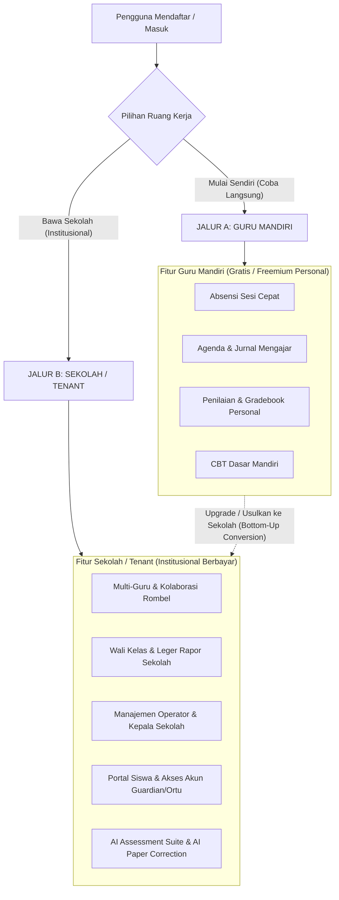

# FIRST LOGIN EXPERIENCE & ONBOARDING DUAL-PATH REVIEW
## Ruang Pintar — Product & UX Architecture Specification

**Dokumen:** Review & Rekomendasi Produk Onboarding  
**Status:** PROPOSED — READY FOR HUMAN REVIEW  
**Tanggal:** 22 September 2026  
**Target Rilis:** SaaS Phase SAAS-05 / Milestone K  
**Filosofi Inti:**  
> *"Guru tidak datang untuk mengisi biodata profil, guru datang untuk mulai mengajar."*

---

# 1. Latar Belakang & Evaluasi Onboarding

Dalam implementasi awal, proses orientasi pengguna berfokus pada alur:
1. Registrasi institusi/sekolah;
2. Setup profil pengguna;
3. Konfigurasi rombel kelas secara kaku (*"Siapkan rombel pertama Anda"*);
4. Penekanan awal pada impor data menggunakan format berkas Excel.

### Temuan Masalah & Friction Pengguna:
1. **Hambatan Adopsi Mandiri (*Bottom-Up Friction*):**
   Banyak guru ingin mengevaluasi Ruang Pintar secara mandiri untuk kebutuhan kelas pribadinya sebelum membawa usulan formal ke Kepala Sekolah atau kurikulum. Mewajibkan registrasi atau klaim sekolah di awal menghambat adopsi *Product-Led Growth (PLG)*.
2. **Kelelahan Formulir (*Form Fatigue*):**
   Ketika guru baru mendaftar lalu langsung disajikan form setup panjang bertingkat, timbul kesan bahwa aplikasi ini rumit dan membebani secara administratif.
3. **Ketiadaan Template Excel di Tangan Guru:**
   Mayoritas guru baru yang mencoba aplikasi di ponsel atau laptop pribadi **tidak memiliki file template Excel yang siap diunggah** saat itu juga. Menjadikan *Import Excel* sebagai langkah prioritas pertama menyebabkan *drop-off* registrasi yang sangat tinggi.

Dokumen ini merevisi total pengalaman masuk pertama (*First Login Experience*) dan memecah alur menjadi **Dua Jalur Penggunaan Terpisah**.

---

# 2. Analisis Dual-Path: Guru Mandiri vs Sekolah / Tenant

Ruang Pintar mengadopsi model adopsi ganda: **Jalur Guru Mandiri (Bottom-Up Individual)** dan **Jalur Sekolah / Tenant (Top-Down Institutional)**.



---

## 2.1 Jalur A: Guru Mandiri (*Personal Teacher Workspace*)

### Tujuan:
Memberikan ruang kerja pribadi bagi guru untuk langsung merasakan manfaat Ruang Pintar dalam hitungan detik tanpa izin institusi, tanpa konfigurasi operator, dan tanpa perlu mendaftarkan sekolah.

### Karakteristik & Fitur:
- **Tanpa Tenant Sekolah:** Akun beroperasi dalam ruang personal (*Personal Workspace Sandbox*). Di level database, tidak memerlukan pembuatan entitas `Sekolah` formal baru.
- **Fitur Tersedia:**
  1. **Absensi Sesi Cepat:** Presensi harian kelas tatap muka (Hadir, Sakit, Izin, Alpha) dengan rekap instan.
  2. **Agenda & Jurnal Mengajar:** Catatan materi KBM, refleksi kelas, dan histori pertemuan.
  3. **Penilaian:** Input nilai formatif/sumatif, perhitungan rata-rata, dan pemantauan ketercapaian KKTP.
  4. **CBT Dasar Mandiri:** Pembuatan kuis/ujian pilihan ganda sederhana untuk siswa di kelasnya.
- **Batasan Jalur Mandiri:**
  - Tidak ada penerbitan e-Rapor resmi kurikulum sekolah.
  - Tidak ada portal login wali murid atau akun siswa massal yang terverifikasi sekolah.
  - Tidak ada kolaborasi antar-guru atau rekapitulasi level sekolah.
  - Tidak mencakup fitur *AI Assessment Suite* tingkat lanjut.
- **Strategi Konversi Bisnis:**
  Guru yang merasakan kemudahan pencatatan nilai dan absensi diberikan tombol strategis: **"Undang Rekan Guru / Ajukan Lisensi Sekolah"** yang otomatis mengenerate proposal PDF resmi ke Kepala Sekolah.

---

## 2.2 Jalur B: Sekolah / Tenant (*Institutional Operating Platform*)

### Tujuan:
Platform operasi digital terpusat untuk satu institusi pendidikan formal (SD, SMP, SMA, SMK).

### Karakteristik & Fitur:
- **Tenant Sekolah Resmi:** Dikelola oleh *School Owner*, Operator, dan Kepala Sekolah.
- **Fitur Tersedia:**
  1. **Multi-Guru & Kolaborasi:** Pembagian jadwal master pelajaran, plotting rombel terpadu, dan co-teaching.
  2. **Wali Kelas & BK:** Rekap komprehensif ketidakhadiran, rekap nilai lintas mapel, dan catatan pembinaan.
  3. **Kepala Sekolah & Operator:** Dashboard monitoring kehadiran guru/siswa real-time, audit trail, dan data Dapodik.
  4. **e-Rapor Kurikulum Merdeka:** Leger nilai terpadu, cetak rapor resmi A4 siap tanda tangan, dan arsip transkrip.
  5. **Portal Siswa & Guardian/Ortu:** Akses transparansi nilai terpublikasi dan presensi realtime untuk wali murid.
  6. **AI Assessment Suite:** Paket Ujian AI, Kisi-kisi AI, Kartu Soal AI, cetak LJK kertas murah, dan koreksi otomatis (*AI Paper Correction*).
- **Model Komersial:**
  Berlangganan tahunan institusi (BOS-ready, invoice resmi, dan dukungan implementasi).

---

# 3. First Login Experience: Konsep & UX Blueprint

Sesuai arahan Review Item 02, alur orientasi awal diubah dari form pendaftaran kaku menjadi **Sensasi Langsung Masuk Aplikasi**:

### Prinsip Visual & Interaksi:
1. **Dashboard Tampil di Awal (Background Blur):**
   Saat pengguna berhasil mendaftar, mereka tidak melihat layar formulir statis. Sistem langsung me-render halaman utama (*Dashboard Guru*) di latar belakang dengan filter efek `backdrop-blur-md` dan lapisan transparan (*Academic Glass Overlay*). Pengguna secara psikologis merasa: *"Saya sudah berada di dalam aplikasi."*
2. **Glass Modal Wizard di Bagian Depan:**
   Muncul kotak dialog elegan (*Glass Modal Card*) di tengah layar dengan maksimal **4 langkah ringkas** tanpa *friction*.

```text
+-------------------------------------------------------------------------+
| [Background Dashboard Guru Tampil Penuh - Efek Blur Transparan]         |
|                                                                         |
|                +---------------------------------------+                |
|                |         RUANG PINTAR WIZARD           |                |
|                |       Langkah 1 dari 4: Peran         |                |
|                +---------------------------------------+                |
|                | Halo, Ibu Siti Nurhaliza!             |                |
|                | Pilih peran aktif Anda di sekolah:    |                |
|                |                                       |                |
|                | [ v ] GURU               (Aktif)      |                |
|                | [   ] WALI KELAS                      |                |
|                | [   ] OPERATOR SEKOLAH                |                |
|                | [   ] KEPALA SEKOLAH                  |                |
|                |                                       |                |
|                |               [ Lanjut: Mata Pelajaran > ]             |
|                +---------------------------------------+                |
+-------------------------------------------------------------------------+
```

---

## Rincian 4 Langkah Glass Modal Wizard

### Langkah 1: Pilih Peran (*Multi-Role Selection*)
- **Komponen:** *Glass Toggle Card* (interaktif, warna semantik Cobalt/Navy).
- **Opsi:**
  - `[x] Guru Mata Pelajaran` (default aktif)
  - `[ ] Wali Kelas`
  - `[ ] Operator Sekolah`
  - `[ ] Kepala Sekolah`
- **Aturan:** Pengguna dapat memilih lebih dari satu peran secara simultan sesuai realitas penugasan guru di Indonesia.

### Langkah 2: Pilih Mata Pelajaran
- **Komponen:** Quick-Select Chips + Input Teks Bebas.
- **Contoh Preset Cepat:** Matematika, Bahasa Indonesia, Bahasa Inggris, Pemrograman Web, IPAS, PAI, PJOK, dll.
- **Tindakan:** Cukup 1 klik pada chip mata pelajaran yang sesuai, atau ketik nama mapel kustom.

### Langkah 3: Pilih Cara Menambahkan Kelas & Data Siswa (*Prioritas Baru*)
Menjawab secara langsung **Review Item 03**, urutan prioritas dirombak total untuk menghilangkan *onboarding barrier*:

| Peringkat | Metode Input | Alasan & Karakteristik |
| :---: | :--- | :--- |
| **1 (Utama)** | **Isi Manual Cepat** | **Nol Hambatan.** Guru cukup mengetik nama rombel (misal: *X RPL 1*) dan menempel (*paste*) daftar nama siswa (1 baris 1 nama). Tidak membutuhkan format tertentu. |
| **2** | **Import Excel** | Bagi guru/operator yang sudah memiliki rekap file spreadsheet data siswa lengkap dengan NISN/Gender. |
| **3** | **Foto Daftar Hadir AI** | Guru memotret lembar absensi fisik kertas yang ada di meja guru, AI mengekstrak nama-nama siswa menjadi data digital. |
| **Opsi Cadangan** | **Lewati Dulu** | Bagi guru yang hanya ingin melihat tampilan dashboard terlebih dahulu tanpa mengisi data apa pun (*Explore First*). |

### Langkah 4: Siap Mengajar (*Instant Launch*)
- **Pesan:** *"Ruang kelas digital Anda siap digunakan. Selamat mengajar!"*
- **Tombol Utama:** `[ Buka Ruang Mengajar ]`
- **Transisi:** Modal menutup dengan animasi *fade-scale*, efek blur latar belakang memudar halus, dan dashboard aktif langsung siap dipakai.

---

# 4. Arsitektur Data: Transisi Guru Mandiri Menuju Tenant Sekolah

Untuk mendukung Jalur Guru Mandiri tanpa merusak integritas relasional multi-tenant yang sudah disepakati di [ADR-001](file:///C:/laragon/www/Ruang-Pintar/docs/adr/ADR-001-SAAS-MULTI-TENANT-FOUNDATION.md), dirancang arsitektur transisi:

### 1. Model Ruang Kerja Personal (*Personal Sandbox*):
- Pada mode Guru Mandiri, sistem mengaitkan aktivitas guru ke `sekolah_id` bertipe *Personal Workspace* (atau tenant berflag `is_personal: true` yang terisolasi khusus untuk identitas pengguna tersebut).
- Semua data penugasan, rombel, presensi sesi, dan nilai tetap menggunakan model database first-party yang ada (`mata_pelajaran`, `penugasan_mengajar`, `presensi_sesi_kelas`, `nilai_siswa`).

### 2. Alur Migrasi Data Saat Bergabung ke Sekolah Resmi (*Claim & Merge*):
Ketika sekolah guru tersebut akhirnya bergabung atau membeli lisensi resmi:
1. Guru menerima undangan atau disetujui bergabung ke tenant resmi sekolah.
2. Muncul dialog migrasi cerdas:
   - **Opsi A (Pindahkan Data):** Mengimpor rombel dan riwayat nilai mandiri yang sudah dibuat guru ke dalam tenant sekolah resmi.
   - **Opsi B (Mulai Baru):** Menggunakan alokasi rombel dan master data resmi yang disediakan operator sekolah, sementara data mandiri tetap tersimpan sebagai arsip pribadi.

---

# 5. Rekomendasi Keputusan Produk

1. **Kunci Spesifikasi Wizard 4-Langkah:**
   Hapus istilah lama *"Siapkan rombel pertama Anda"* dan terapkan *Glass Modal Wizard 4 Langkah* dengan urutan: Peran $\rightarrow$ Mapel $\rightarrow$ Metode Input Kelas $\rightarrow$ Siap Mengajar.
2. **Kunci Urutan Input Data Siswa:**
   Terapkan urutan: **1. Isi Manual $\rightarrow$ 2. Import Excel $\rightarrow$ 3. Foto Daftar Hadir AI $\rightarrow$ 4. Lewati Dulu**.
3. **Pemisahan Jalur Komersial:**
   Posisikan Guru Mandiri sebagai corong akuisisi utama (*Free Acquisition Funnel*), dan Tenant Sekolah sebagai target konversi pendapatan tahunan (*Monetization Core*).
