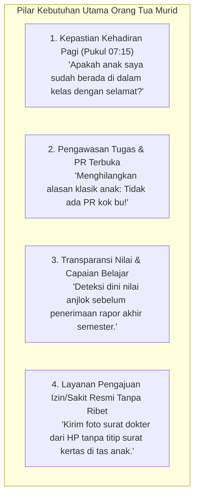

# GUARDIAN EXPERIENCE (ORANG TUA / WALI MURID)
## Ruang Pintar — Jembatan Ketenangan Hati & Transparansi Perkembangan Anak

**Dokumen:** Analisis Pengalaman Pengguna Orang Tua (*Guardian Experience*)  
**Status:** PROPOSED — READY FOR HUMAN REVIEW  
**Tanggal:** 22 September 2026  
**Target:** Portal Wali Murid & Notifikasi Ramah Keluarga  
**Kenyataan Orang Tua di Indonesia:**  
> *"Orang tua murid (terutama yang bekerja) selalu dibayangi kekhawatiran: Apakah anak saya benar-benar sampai di sekolah atau membolos nongkrong? Mengapa tiba-tiba di akhir semester anak saya terancam tidak naik kelas karena tugas menumpuk? Orang tua tidak butuh notifikasi spam setiap 5 menit, orang tua butuh kepastian keselamatan anak dan transparansi kejujuran tugas."*

---

# 1. Empat Informasi Paling Kritis yang Dicari Orang Tua



---

# 2. Kurasi Notifikasi: Pesan Kritis vs Notifikasi Spam (*Notification Hygiene*)

Sistem notifikasi Ruang Pintar dirancang dengan **etika ramah keluarga (*Anti-Spam Discipline*)**:

```text
+----------------------------------------------------------------------------------------------------+
|                                      ETIKA NOTIFIKASI WALI MURID                                   |
+-------------------------------------------------+--------------------------------------------------+
|           NOTIFIKASI RESMI YANG WAJIB           |             NOTIFIKASI SPAM YANG DILARANG        |
|           (PENTING, URGEN, & BERMAKNA)          |              (MEMBUAT ORANG TUA KESAL)           |
+-------------------------------------------------+--------------------------------------------------+
| 1. Peringatan Ketidakhadiran Pagi (07:30):      | 1. Setiap Guru Membuka/Menutup Jam Pelajaran     |
|    "Ananda Doni tercatat ALPHA di jam ke-1."    |    (Orang tua bekerja terganggu notifikasi 8x/hr)|
|                                                 |                                                  |
| 2. Peringatan Tugas Terlewat (H-1 Deadline):   | 2. Setiap Guru Mengunggah Slide Bahan Bacaan     |
|    "Ananda Doni belum mengumpulkan tugas PBO."  |    (Bukan ranah orang tua untuk memeriksa modul) |
|                                                 |                                                  |
| 3. Status Pengajuan Surat Izin/Sakit Disetujui  | 3. Notifikasi Ucapan Selamat Ulang Tahun Bot     |
|                                                 |    (Artificial / AI Slop tanpa makna).           |
| 4. Pengumuman Darurat Sekolah (Libur/Bencana)   |                                                  |
|                                                 | 4. Notifikasi Chat Percakapan Siswa Lain         |
| 5. Publikasi Resmi e-Rapor Semester             |    (Pelanggaran privasi kelas).                  |
+-------------------------------------------------+--------------------------------------------------+
```

---

# 3. Fitur Utama Pengalaman Wali Murid

### 3.1 Dropdown Pemilih Konteks Anak (*Multi-Child Switcher*)
* **Realita:** Banyak orang tua memiliki 2 atau 3 anak yang bersekolah di sekolah yang sama (misal: anak pertama kelas XII, anak kedua kelas X).
* **Solusi Ruang Pintar:** Orang tua cukup menggunakan **1 akun login global**. Di sudut atas layar terdapat pemilih anak:  
  `[ Anak Aktif: Arya Pratama (XII RPL 1) ▼ ]` $\rightarrow$ ganti ke `[ Salsaabila (X PPLG 2) ]` dalam 1 sentuhan instan.

### 3.2 Pengajuan Izin Sakit / Dispensasi Mandiri (*One-Tap Leave Request*)
* **Masalah:** Surat izin kertas yang dititipkan ke teman sering kali basah, hilang, atau lupa diserahkan ke meja piket guru.
* **Solusi Ruang Pintar:**
  1. Orang tua membuka aplikasi $\rightarrow$ pilih menu *[ Ajukan Izin / Sakit ]*.
  2. Pilih tanggal dan alasan.
  3. Foto surat dokter / surat keterangan dari kamera ponsel $\rightarrow$ kirim.
  4. Wali kelas menerima notifikasi, meninjau foto surat dokter, dan mengklik **[ Setujui ]**.
  5. Status kehadiran anak di presensi seluruh guru mapel hari itu otomatis berubah menjadi `Sakit` atau `Izin`.

### 3.3 Zero Draft Grade Leakage (Perlindungan Kerahasiaan Nilai Draf)
* Nilai yang belum selesai diperiksa atau masih berupa draf kasar guru **secara ketat disembunyikan dari portal wali murid**.
* Orang tua hanya melihat nilai yang telah diverifikasi dan berstatus `PUBLISHED` resmi oleh guru pengampu, menghindari kepanikan yang tidak perlu.
