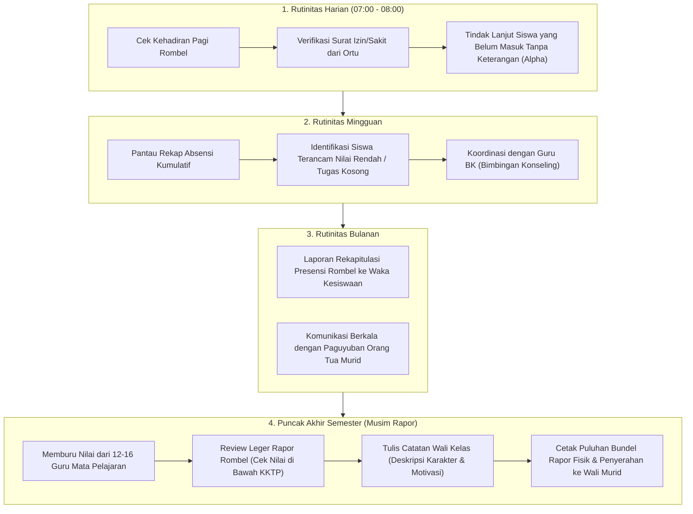

# HOMEROOM TEACHER EXPERIENCE (WALI KELAS)
## Ruang Pintar — Pengalaman "Orang Tua Kedua" di Sekolah

**Dokumen:** Analisis Pengalaman Pengguna & Desain Peran Wali Kelas  
**Status:** PROPOSED — READY FOR HUMAN REVIEW  
**Tanggal:** 22 September 2026  
**Target:** Homeroom Dashboard & Workflow Kurikulum Merdeka  
**Kenyataan Lapangan:**  
> *"Wali Kelas di Indonesia bukan sekadar guru pengampu mata pelajaran. Wali Kelas adalah pembina moral, penengah konflik siswa, penghubung dengan 36 pasang orang tua murid, dan 'korban' yang paling stres saat pembagian rapor ketika ada guru mapel yang telat menginput nilai."*

---

# 1. Siklus Aktivitas Nyata Wali Kelas

Wali kelas bertanggung jawab secara holistik terhadap 1 rombel tertentu (32–36 siswa) sepanjang tahun ajaran:



---

# 2. Pain Points & Titik Frustrasi Utama Wali Kelas

1. **Memburu Nilai dari Guru Mata Pelajaran (*The Teacher Chaser Stress*):**
   * *Masalah:* Rapor 1 rombel tidak dapat dicetak jika ada **1 saja guru mapel yang belum selesai menginput nilai**. Wali kelas terpaksa menagih, menelepon, dan memohon secara manual kepada rekan guru pengampu.
   * *Solusi Ruang Pintar:* **Leger Readiness Radar**. Wali kelas melihat indikator progres real-time per mata pelajaran (misal: *Matematika 100%, Bahasa Inggris 100%, Fisika 40%*). Tersedia tombol 1-klik: **[ Kirim Pengingat Santun via WhatsApp ]** langsung ke guru mapel yang bersangkutan.
2. **Rekap Absensi yang Tercecer Lintas Sesi:**
   * *Masalah:* Setiap hari ada 8 jam pelajaran dengan guru yang berbeda. Mengetahui apakah seorang siswa membolos di jam ke-5 atau hadir seharian sangat merepotkan jika harus memeriksa lembar kertas guru satu per satu.
   * *Solusi Ruang Pintar:* **Matriks Kehadiran Terpadu**. Wali kelas langsung melihat status kehadiran siswa hari ini dalam 1 tabel terpadu lintas jam pelajaran secara real-time.
3. **Mengetik Catatan Wali Kelas (*Homeroom Narrative Fatigue*):**
   * *Masalah:* Di akhir semester, wali kelas harus mengetik catatan perkembangan pribadi untuk 36 siswa satu per satu (*"Ananda Budi memiliki kepemimpinan yang baik namun perlu meningkatkan ketertiban kehadiran..."*).
   * *Solusi Ruang Pintar:* **AI Homeroom Remarks Copilot**. AI membaca data kehadiran, keaktifan ekskul, dan tren nilai siswa untuk menyarankan draf kalimat motivasi yang personal dan humanis. Wali kelas cukup menyetujui atau menyesuaikan.

---

# 3. Rekomendasi Dashboard Ideal Wali Kelas (*Homeroom Cockpit*)

```text
+----------------------------------------------------------------------------------------------------+
|  RUANG PINTAR     [ SMK Otomindo (Wali Kelas) ▼ ]                (🔔) [ Foto Avatar Pak Hendra ]    |
+----------------------------------------------------------------------------------------------------+
|                                                                                                    |
|  Panel Wali Kelas: XII RPL 1                                    Tahun Ajaran 2026/2027 (Ganjil)    |
|  Jumlah Siswa: 36 Orang (24 Laki-laki, 12 Perempuan)            Ruang Kelas: Teori 204             |
|                                                                                                    |
|  +-----------------------------------------------------------------------------------------------+ |
|  | RADAR KESEHATAN KELAS HARI INI                                          Senin, 22 Sep 2026    | |
|  |                                                                                               | |
|  |   [ 34 Hadir (94.4%) ]      [ 1 Sakit (Doni) ]      [ 1 Izin (Fajar) ]      [ 0 Alpha ]       | |
|  |                                                                                               | |
|  |   Catatan Pagi: Surat dokter Doni Pratama telah diterima & diverifikasi.                      | |
|  +-----------------------------------------------------------------------------------------------+ |
|                                                                                                    |
|  +---------------------------------------------+  +----------------------------------------------+ |
|  | SISWA PERLU PERHATIAN (AT-RISK STUDENTS)    |  | KESIAPAN LEGER RAPOR SEMESTER (PROGRESS)     | |
|  +---------------------------------------------+  +----------------------------------------------+ |
|  | [ ! ] Rizky Ramadhan                        |  | Progres Nilai Mapel: 11 dari 14 Guru Selesai | |
|  |       3x Alpha di mapel Bahasa Inggris.     |  |                                              | |
|  |       Tugas PBO belum tuntas 2 pertemuan.   |  | [====================.......] 78%            | |
|  |       [ Panggil Siswa ]  [ Hubungi Ortu ]   |  |                                              | |
|  |                                             |  | Guru Belum Finalisasi:                       | |
|  | [ ! ] Amanda Putri                          |  | • Fisika (Pak Joko) - Kurang 1 Sumatif       | |
|  |       Penurunan drastis nilai Matematika.   |  | • Sejarah (Bu Rina) - Draf Belum Publish     | |
|  |       [ Buka Profil Siswa ]                 |  | [ Ingatkan Semua Guru Belum Selesai (WA) ]   | |
|  +---------------------------------------------+  +----------------------------------------------+ |
|                                                                                                    |
|  +-----------------------------------------------------------------------------------------------+ |
|  | AKSI CEPAT WALI KELAS                                                                         | |
|  +-----------------------------------------------------------------------------------------------+ |
|  | [ Buku Induk Siswa ]    [ Leger Rapor Kelas ]    [ Cetak Rapor Massal ]    [ Hubungi Paguyuban]| |
|  +-----------------------------------------------------------------------------------------------+ |
+----------------------------------------------------------------------------------------------------+
```

### Karakteristik Desain:
* **Fokus pada Manusia, Bukan Angka:** Menyorot siswa-siswa yang sedang mengalami kesulitan akademis atau presensi agar wali kelas dapat melakukan intervensi dini sebelum terlambat.
* **Transparansi Kesiapan Rapor:** Menghilangkan ketidakpastian menjelang pembagian rapor dengan indikator progres guru mapel yang jelas.
