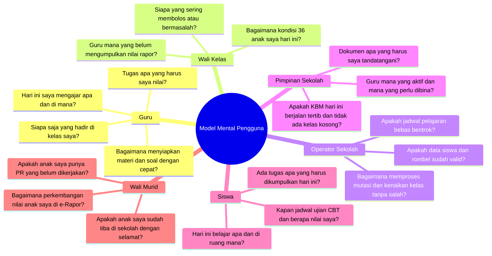

# INFORMATION ARCHITECTURE — MODEL MENTAL PENGGUNA
## Ruang Pintar — Arsitektur Informasi Berbasis Kebutuhan Nyata Sekolah

**Dokumen:** Spesifikasi Arsitektur Informasi Menyeluruh  
**Status:** PROPOSED — READY FOR HUMAN REVIEW  
**Tanggal:** 22 September 2026  
**Prinsip Desain Utama:**  
> *"Arsitektur informasi tidak dirancang mengikuti tabel database atau struktur birokrasi software, melainkan mengikuti cara berpikir (mental model) manusia yang menggunakannya setiap hari."*

---

# 1. Analisis Model Mental Antar-Aktor Sekolah

Setiap pengguna membuka Ruang Pintar dengan sudut pandang psikologis dan tujuan yang sangat berbeda:



---

# 2. Taksonomi Informasi Global Ruang Pintar

Seluruh kapabilitas aplikasi dikelompokkan ke dalam **5 Lapisan Informasi Hierarkis**:

```text
+----------------------------------------------------------------------------------------------------+
| 1. LAPISAN WORKSPACE & TENANT (Wadah Institusi / Ruang Kerja)                                      |
|    • Ruang Kerja Pribadi Guru (Personal Workspace) vs Sekolah Resmi (School Workspace)            |
|    • Pemilih Konteks Aktif (Active Workspace Switcher)                                             |
+----------------------------------------------------------------------------------------------------+
                                                  ↓
+----------------------------------------------------------------------------------------------------+
| 2. LAPISAN IDENTITAS & ROLE SPACE (Peran Aktif Pengguna)                                           |
|    • Ruang Guru • Ruang Wali Kelas • Ruang Operator • Ruang Pimpinan • Ruang Siswa • Ruang Ortu   |
+----------------------------------------------------------------------------------------------------+
                                                  ↓
+----------------------------------------------------------------------------------------------------+
| 3. LAPISAN COCKPIT & LAUNCHPAD (Pusat Kendali Harian Kontekstual Waktu)                            |
|    • Sesi Aktif Hari Ini • Antrean Tindakan Mendesak • Ringkasan Status • Pintasan Cepat          |
+----------------------------------------------------------------------------------------------------+
                                                  ↓
+----------------------------------------------------------------------------------------------------+
| 4. LAPISAN RUANG KERJA OPERASIONAL (Classroom / Administrative Workspace)                          |
|    • Ruang Kelas Tertentu (XII RPL 1 - PBO) • Manajemen Master Data • Leger Nilai Terpadu         |
+----------------------------------------------------------------------------------------------------+
                                                  ↓
+----------------------------------------------------------------------------------------------------+
| 5. LAPISAN AKTIVITAS DETAIL & DOKUMEN (Actionable Leaf Nodes)                                      |
|    • Lembar Presensi Sesi • Kartu Soal / Ujian CBT • Jurnal Refleksi KBM • Cetak Rapor Resmi A4    |
+----------------------------------------------------------------------------------------------------+
```

---

# 3. Pengelompokan Fitur Berbasis Tujuan Pengguna (*Goal-Oriented Grouping*)

Menghilangkan pemecahan fitur yang kaku; fitur dikelompokkan berdasarkan **tujuan operasional**:

### 1. Gugus Kesiapan & Pelaksanaan Mengajar (*Teaching & Delivery*)
* **Untuk:** Guru Mata Pelajaran.
* **Fitur Terpadu:** Jadwal Mengajar Harian, Ruang Kerja Kelas Terpadu (*Classroom Workspace*), Presensi Kilat 15 Detik, Jurnal KBM, Modul Materi, dan Asisten AI Kelas.

### 2. Gugus Evaluasi Belajar & Rapor (*Assessment & Grading*)
* **Untuk:** Guru Mapel, Wali Kelas, Siswa, dan Orang Tua.
* **Fitur Terpadu:** Asesmen Formatif/Sumatif, Mesin CBT Siswa, Bank Soal Kolaboratif, Koreksi LJK Kamera HP (*AI Paper Correction*), Leger Rapor Kurikulum Merdeka, dan Catatan Wali Kelas.

### 3. Gugus Pengawasan & Kedisiplinan (*Care & Monitoring*)
* **Untuk:** Wali Kelas, Guru BK, Waka Kesiswaan, dan Orang Tua.
* **Fitur Terpadu:** Radar Kesehatan Rombel, Log Ketidakhadiran Kumulatif, Deteksi Dini Siswa Berisiko (*At-Risk Detection*), Pengajuan Surat Izin/Sakit Mandiri, dan Notifikasi Kehadiran Pagi.

### 4. Gugus Tata Kelola & Struktur Sekolah (*Governance & Master Data*)
* **Untuk:** Operator Sekolah, Waka Kurikulum, dan Kepala Sekolah.
* **Fitur Terpadu:** Konfigurasi Tahun Ajaran & Semester, Plotting Rombel, SK Penugasan Guru, Penyusun Jadwal Pelajaran Anti-Bentrok, Manajemen Mutasi/Kenaikan Kelas, dan Pengadaan Lisensi BOS.
