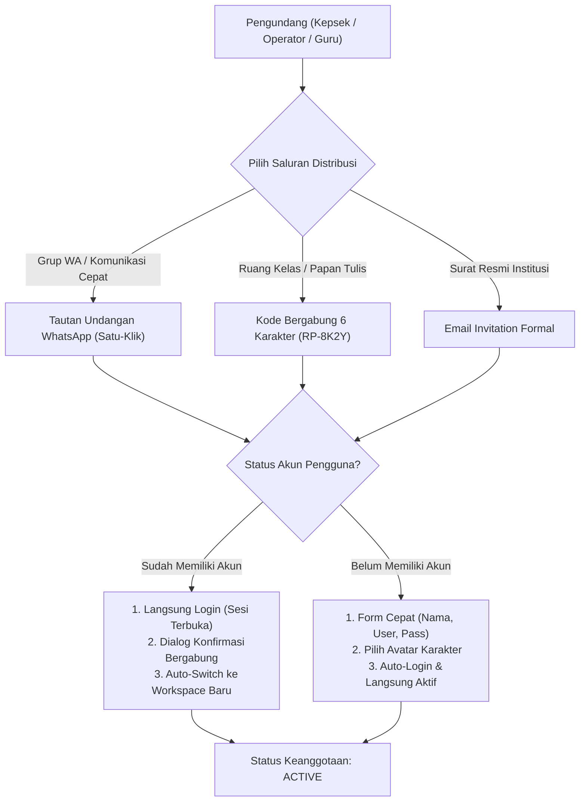

# INVITATION & MEMBERSHIP LIFECYCLE MANAGEMENT
## Ruang Pintar — Multi-Channel Onboarding & Zero-Loss Member Lifecycle

**Dokumen:** Spesifikasi Alur Undangan & Siklus Hidup Keanggotaan  
**Status:** PROPOSED — READY FOR HUMAN REVIEW  
**Tanggal:** 22 September 2026  
**Target:** SaaS Phase SAAS-05 / Milestone K  
**Tujuan:** Memberikan pengalaman orientasi anggota sekolah semudah mungkin dengan tingkat adopsi maksimal di Indonesia, sambil memastikan riwayat data akademik masa lalu tidak pernah rusak ketika anggota keluar.

---

# 1. Analisis Metode Undangan untuk Kondisi Sekolah di Indonesia

Kondisi lapangan sekolah di Indonesia memiliki karakteristik spesifik:
* **Email Jarang Dibuka:** Banyak guru dan hampir seluruh orang tua murid jarang memeriksa kotak masuk email mereka secara rutin, atau sering lupa kata sandi akun emailnya.
* **Dominasi WhatsApp:** 98% koordinasi resmi dewan guru, wali kelas, dan paguyuban orang tua murid berlangsung di **Grup WhatsApp**.
* **Kebutuhan Masuk Cepat di Kelas:** Siswa dan guru di ruang kelas membutuhkan metode instan tanpa harus mengetik tautan panjang di browser.

### Perbandingan 4 Pendekatan Undangan:

| Metode | Karakteristik Teknis | Kecocokan di Indonesia | Rekomendasi Ruang Pintar |
| :--- | :--- | :---: | :--- |
| **1. WhatsApp Direct Link** | Tautan aman terenkripsi satu-klik (`ruangpintar.id/join?t=token`) yang disalin dan disebarkan ke grup WA sekolah/kelas. | **SANGAT TINGGI (Pilihan Utama Guru & Ortu)** | **Metode Primer untuk Guru & Wali Murid.** |
| **2. Kode Bergabung (6 Karakter)** | Kode singkat (contoh: `RP-8K2Y`) yang dapat ditulis di papan tulis atau dibagikan secara lisan. Pengguna cukup memasukkan kode di aplikasi. | **SANGAT TINGGI (Pilihan Utama Siswa & Kelas)** | **Metode Primer untuk Siswa & Bergabung di Tempat.** |
| **3. Email Invitation** | Pengiriman surat elektronik formal dengan tombol CTA *"Terima Undangan"*. | Sedang (Cocok untuk level Kepsek, Yayasan, dan Staf TU resmi). | **Metode Sekunder untuk Administrasi Formal.** |
| **4. Nomor HP / SMS Broadcast** | Pengiriman SMS OTP / tautan via SMS masking telco. | Rendah (Biaya SMS broadcast per nomor mahal dan rawan diblokir filter spam telco). | **Dihindari untuk efisiensi biaya (Digantikan WA Link).** |

---

# 2. Desain Alur Undangan & Bergabung (*Join Flows*)

---

## 2.1 Skenario Operasional Spesifik

### Skenario A: Kepala Sekolah Mengundang Operator / Waka
* **Alur:** Kepala Sekolah membuka *Pengaturan Workspace $\rightarrow$ Anggota $\rightarrow$ [ Undang Staf ]*.
* **Aksi:** Memasukkan nama, email dinas/pribadi, dan menetapkan peran `OPERATOR_AKADEMIK` atau `TECHNICAL_OWNER`.
* **Output:** Sistem mengirimkan tautan undangan resmi via WhatsApp dan Email.

### Skenario B: Operator Mengundang Dewan Guru (Massal)
* **Tantangan:** Mengundang 40–80 guru satu per satu sangat melelahkan.
* **Solusi Ruang Pintar:** Operator mengaktifkan **"Tautan Undangan Dewan Guru"** dengan masa berlaku 7 hari. Tautan disalin dengan satu klik tombol *"Bagikan ke Grup WA Guru"*.
* Saat guru-guru mengklik tautan tersebut, mereka otomatis terdaftar dan masuk ke daftar dewan guru sekolah.

### Skenario C: Guru / Wali Kelas Mengundang Orang Tua Murid
* **Alur:** Wali Kelas membuka kelasnya $\rightarrow$ klik *[ Bagikan Tautan Akses Orang Tua ]*.
* **Keamanan Relasi:** Tautan dilengkapi pengaman verifikasi: saat orang tua bergabung, orang tua diminta memilih nama putera/puterinya dan memasukkan tanggal lahir anak / NISN sebagai verifikasi hubungan kekeluargaan (*Guardian Verification Guard*).

### Skenario D: Guru Mandiri Bergabung ke Sekolah yang Sudah Terdaftar
* Guru mencari sekolahnya di pencarian awal $\rightarrow$ klik *[ Gabung Sekolah ]*.
* Status masuk ke antrean **`PENDING` (Menunggu Persetujuan)**. Operator sekolah menerima notifikasi pop-up di dashboard untuk meng-approve atau me-reject guru tersebut.

---

## 2.2 Keamanan & Jejak Audit Undangan (*Invitation Audit Trail*)

Setiap pembuatan dan penggunaan undangan diawasi oleh sistem audit logging:
1. **Token Kriptografis Sekali Pakai (*Single-Use / Time-Bound*):** Tautan privat menggunakan token acak 32-karakter dengan masa kedaluwarsa default 7 hari.
2. **Audit Trail Komprehensif:**
   * ID pembuat undangan (`created_by`);
   * Tanggal pembuatan dan tanggal kedaluwarsa;
   * Saluran pengiriman (WhatsApp link / Email);
   * ID pengguna penerima dan IP address saat undangan diklaim;
   * Status token: `ISSUED` $\rightarrow$ `CLAIMED` / `EXPIRED` / `REVOKED`.

---

# 3. Siklus Hidup Anggota (*Membership Lifecycle*)

Salah satu kelemahan fatal software akademik tradisional adalah jika seorang guru keluar dari sekolah lalu akunnya dihapus, **seluruh nilai siswa masa lalu yang pernah dibuat guru tersebut ikut terhapus atau berubah menjadi error (*Database Integrity Violation*)**.

Ruang Pintar menegakkan prinsip: **TIDAK ADA HARD DELETE UNTUK KEANGGOTAAN SEKOLAH**.

```mermaid
stateDiagram-v2
    [*] --> PENDING : Mendaftar / Mengajukan Join
    PENDING --> ACTIVE : Disetujui Operator / Terima Undangan
    PENDING --> REJECTED : Ditolak Operator
    
    ACTIVE --> ON_LEAVE : Guru Cuti Hamil / Sakit Panjang
    ON_LEAVE --> ACTIVE : Kembali Mengajar
    
    ACTIVE --> TRANSFERRED : Pindah Tugas / Mutasi ke Sekolah Lain
    ACTIVE --> SUSPENDED : Pelanggaran Disiplin / Akun Ditangguhkan
    
    SUSPENDED --> ACTIVE : Reaktivasi Resmi
    SUSPENDED --> ARCHIVED : Pemutusan Kerja / Pensiun
    TRANSFERRED --> ARCHIVED : Serah Terima Penugasan Selesai
    
    ARCHIVED --> [*] : Histori Terkunci Permanen
```

---

## 3.1 Status Anggota & Perlakuan Sistem

| Status Keanggotaan | Makna & Kondisi Lapangan | Hak Akses Saat Ini | Pengaruh terhadap Histori Masa Lalu |
| :--- | :--- | :--- | :--- |
| **`PENDING`** | Menunggu konfirmasi persetujuan operator. | Tidak dapat melihat data sekolah. | Belum ada data. |
| **`ACTIVE`** | Guru aktif bertugas di semester berjalan. | Akses penuh sesuai penugasan mengajar. | Menghasilkan data presensi & nilai harian. |
| **`ON_LEAVE` (Cuti)** | Guru cuti melahirkan, ibadah, atau tugas belajar (1–6 bulan). | Akses baca saja (*view-only*), kelas dialihkan ke Guru Pengganti (*Co-Teacher*). | Data lama utuh; guru pengganti mengisi presensi atas nama rombel tersebut. |
| **`TRANSFERRED` (Mutasi)** | Guru berpindah tugas ke sekolah lain (ASN mutasi). | Akses mutasi dicabut dari sekolah ini. Workspace sekolah ini beralih ke arsip. | **100% UTUH.** Guru dapat bergabung ke sekolah barunya tanpa kehilangan akun global. |
| **`SUSPENDED`** | Penonaktifan sementara oleh Kepala Sekolah karena investigasi / pelanggaran. | Seluruh sesi login langsung dicabut seketika. | Data tersimpan aman dan dibekukan. |
| **`ARCHIVED`** | Guru telah pensiun, mengundurkan diri, atau wafat. | Akun tidak dapat lagi membuka workspace sekolah ini. | **DIABADIKAN SELAMANYA.** |

---

## 3.2 Perlindungan Integritas Data Historis (*Preserving History*)

Bagaimana Ruang Pintar menjaga dokumen resmi sekolah tetap valid setelah guru keluar?

1. **Prinsip Immutability Nilai & Rapor:**
   * Buku Nilai, Absensi, dan e-Rapor yang telah diterbitkan adalah **fakta sejarah sekolah**.
   * Di dalam tabel `nilai_siswa` dan `presensi_sesi_kelas`, relasi ke `guru_id` tetap utuh.
2. **Tampilan Visual yang Elegan di Antarmuka:**
   * Ketika rapor siswa tahun lalu dibuka kembali:
     * Nama guru pengampu tetap tampil: *"Drs. H. Bambang Subroto"*.
     * Di samping nama guru disematkan badge penanda sejarah yang santun: `[Alumni Guru / Purnatugas]`.
     * Tidak ada pesan error, tidak ada tanda tanya `[User Terhapus]`, dan tidak ada data yang hilang.
3. **Pelepasan Penugasan Mengajar Berjalan:**
   * Saat guru berstatus `TRANSFERRED` atau `ARCHIVED`, sistem hanya menonaktifkan penugasan mengajar di **semester aktif berjalan**.
   * Sistem otomatis membuka modal serah terima: *"Siapa guru pengganti yang akan melanjutkan kelas X RPL 1 di semester ini?"* $\rightarrow$ Operator memilih guru baru $\rightarrow$ KBM semester berjalan tetap berlanjut tanpa hambatan.
