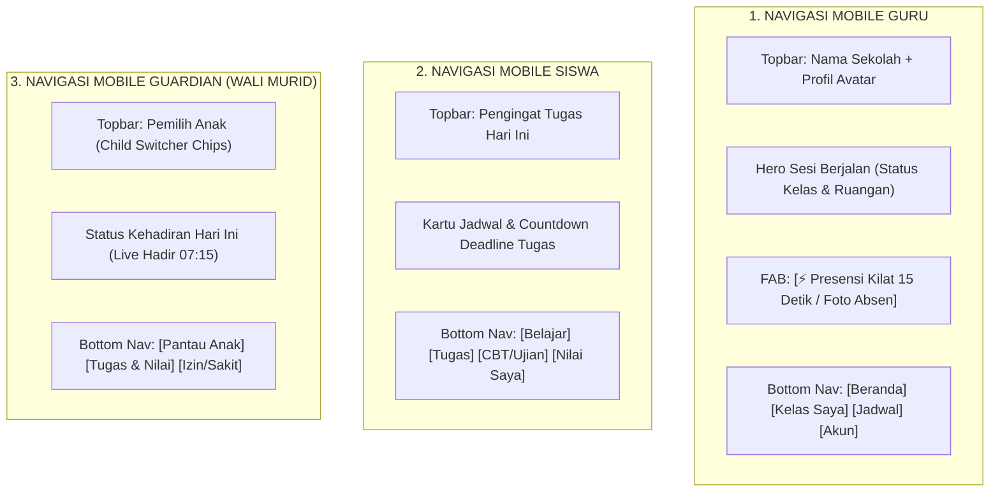

# MOBILE NAVIGATION SYSTEM — ARSITEKTUR NAVIGASI SMARTPHONE
## Ruang Pintar — Antarmuka Layar Sentuh yang Ramah Jempol & Responsif

**Dokumen:** Spesifikasi Sistem Navigasi Mobile  
**Status:** PROPOSED — READY FOR HUMAN REVIEW  
**Tanggal:** 22 September 2026  
**Target:** Smartphone Viewport (360px – 430px) untuk Guru, Siswa, dan Guardian  
**Prinsip Desain:**  
> *"Di layar smartphone, sidebar desktop harus disingkirkan. Navigasi wajib bertumpu pada bilah navigasi bawah (Bottom Navigation) yang terjangkau oleh jempol, dengan tombol aksi melayang (Floating Action Button) untuk eksekusi tercepat."*

---

# 1. Arsitektur Navigasi Mobile Tiga Peran Utama

---

# 2. Rincian Komponen Navigasi Mobile

---

## 2.1 Bilah Navigasi Bawah (*Bottom Navigation Bar*)
* **Posisi:** Terkunci di bagian bawah layar (*sticky fixed bottom*), dengan bantalan area aman (*safe-area-inset-bottom* untuk iPhone/Android modern).
* **Maksimal 4 Tab Utama:** Mencegah elemen berhimpitan dan teks terpotong:
  * **Untuk Guru:**  
    `[ 🏠 Beranda ]` • `[ 📚 Kelas Saya ]` • `[ 📅 Jadwal ]` • `[ 👤 Profil ]`
  * **Untuk Siswa:**  
    `[ 📖 Belajar ]` • `[ 📝 Tugas ]` • `[ 💻 CBT ]` • `[ 📊 e-Rapor ]`
  * **Untuk Orang Tua:**  
    `[ 🛡️ Kehadiran ]` • `[ 📋 Tugas & PR ]` • `[ 📈 Nilai ]` • `[ ✉️ Izin ]`
* **Target Sentuh:** Tinggi bilah minimal **64px**, label teks ringkas, ikon berbasis vektor semantik.

---

## 2.2 Tombol Aksi Melayang (*Floating Action Button / FAB*)
* **Khusus Guru di Jam KBM:**
  Di pojok kanan bawah, tepat di atas Bottom Bar, mengambang tombol aksi dinamis:  
  `[ ⚡ Presensi Kilat ]`.
  * Saat ditekan, sistem langsung meluncurkan **Bottom Sheet Drawer Presensi 15 Detik** tanpa berpindah halaman.
  * Opsi sekunder pada FAB: Tombol ekspansi kecil `[ 📷 Foto Absen AI ]`.

---

## 2.3 Pusat Notifikasi Mobile (*Mobile Notification Sheet*)
* **Pemicu:** Ikon lonceng di pojok kanan atas topbar dengan badge merah angka belum dibaca.
* **Tampilan:** Meluncur halus dari sisi bawah layar (*Bottom Slide-Up Sheet*):
  * Dikelompokkan menjadi:
    * **Urgen / Tindakan Mendesak:** Siswa alpha, tugas terlewat, izin menunggu persetujuan.
    * **Informasional:** Pengumuman libur, materi baru.
  * Tombol 1-klik: `[ Tandai Semua Dibaca ]`.

---

## 2.4 Mode Khusus: CBT Player Bebas Gangguan (*Distraction-Free CBT Mode*)
* Saat siswa membuka ujian CBT di ponsel:
  * **Bilah Navigasi Bawah (Bottom Bar) DITUTUP TOTAL.**
  * Topbar mengecil hanya menampilkan sisa waktu server (*Timer Countdown*) dan tombol nomor soal.
  * Seluruh layar diperuntukkan bagi naskah soal dan tombol opsi pilihan ganda A, B, C, D, E berukuran besar agar siswa dapat fokus penuh menjawab ujian tanpa tersentuh menu keluar yang tidak disengaja.
