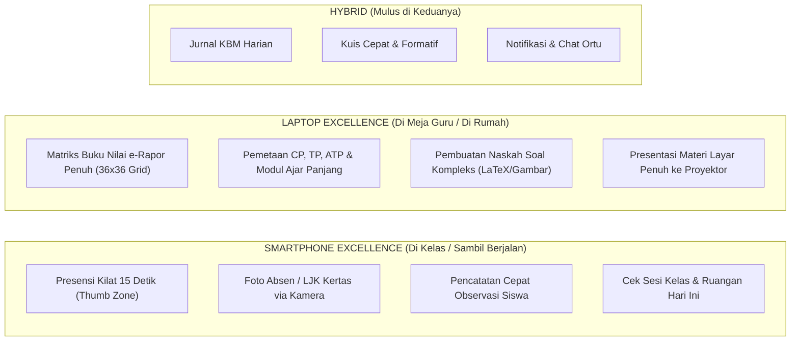

# MOBILE TEACHING EXPERIENCE — DESAIN MENGGUNAKAN SMARTPHONE DI KELAS
## Ruang Pintar — Mengajar Leluasa dari Genggaman Satu Tangan

**Dokumen:** Desain Pengalaman Mengajar Mobile (Smartphone)  
**Status:** PROPOSED — READY FOR HUMAN REVIEW  
**Tanggal:** 22 September 2026  
**Target:** Antarmuka Layar Ponsel (Viewport 360px – 430px)  
**Kenyataan Sekolah:**  
> *"Guru Indonesia tidak mengajar sambil duduk diam di belakang laptop. Guru berkeliling di antara lorong meja siswa, memeriksa buku anak-anak, dan smartphone adalah perangkat yang selalu ada di saku baju atau tangan guru."*

---

# 1. Partisi Aktivitas: Smartphone vs Laptop di Sekolah Indonesia

Memaksa seluruh fitur desktop masuk ke layar kecil ponsel adalah kesalahan fatal. Ruang Pintar membagi tugas mengajar berdasarkan kenyamanan perangkat:



---

## 1.1 Tabel Klasifikasi Perangkat

| Kategori Aktivitas | Paling Nyaman di **Smartphone (HP)** | Paling Nyaman di **Laptop / Desktop** | Catatan Lapangan Sekolah |
| :--- | :---: | :---: | :--- |
| **Presensi Kehadiran Siswa** | **JUARA 1** | Bisa | Di HP cukup ketukan jempol sambil guru menatap mata siswa di kelas. |
| **Foto Absen Kertas AI** | **JUARA 1** | Tidak Praktis | Menggunakan kamera HP guru untuk memotret kertas di meja. |
| **Catat Jurnal KBM Ringkas** | Ya | Ya | Di HP cukup ketik 1–2 kalimat selesai sesi. |
| **Input Nilai Formatif Cepat** | Ya (Toggle Tuntas) | Ya | Nilai checklist formatif sangat cepat via HP. |
| **Olah Buku Nilai e-Rapor Lengkap**| Sulit (Layar Sempit) | **JUARA 1** | Membutuhkan layar lebar untuk melihat puluhan kolom nilai siswa. |
| **Menyusun Kisi-Kisi & Soal Ujian**| Kurang Nyaman | **JUARA 1** | Mengetik stimulus soal panjang dan opsi A-E lebih nyaman dengan keyboard fisik. |
| **Presentasi Materi di Kelas** | Remote Kontrol | **JUARA 1** | Laptop tersambung kabel HDMI/VGA proyektor. |

---

# 2. Aturan Ergonomi Layar Sentuh (*Thumb-Zone Ergonomics*)

Di dalam ruang kelas, guru sering mengoperasikan ponsel hanya dengan **satu tangan** (tangan kanan memegang spidol/berkas, tangan kiri memegang HP, atau sebaliknya).

```text
+-----------------------------------+
| [ Header Sesi: XII RPL 1        ] | <- Area Sulit Dijangkau (Status Saja)
| Pertemuan 8 • Lab Komputer 2      |
|-----------------------------------|
|                                   |
|   DAFTAR SISWA (SCROLL ALAMI)     | <- Area Pandang Utama
|                                   |
|   [ Foto ] Ahmad Fauzan           |
|            ( v ) Hadir            |
|                                   |
|   [ Foto ] Doni Pratama           |
|            ( ! ) Sakit            |
|                                   |
|-----------------------------------|
|  [ TANDAI SEMUA HADIR (1-KLIK) ]  | <- THUMB ZONE ALAMI (Paling Mudah)
|  [ SIMPAN PRESENSI KELAS       ]  |    Target sentuh besar: min 48px
+-----------------------------------+
```

### Prinsip Ergonomi Mobile Ruang Pintar:
1. **Aturan Zona Jempol (*Bottom Thumb Zone*):**
   Tombol aksi utama (*Call to Action*), seperti tombol *"Tandai Semua Hadir"* dan *"Simpan Presensi"*, ditempatkan di bagian bawah layar agar dapat dijangkau jempol tanpa meregangkan jari.
2. **Ukuran Target Sentuh (*Minimum Touch Target*):**
   Seluruh tombol dan chip status memiliki tinggi minimal **48px** dengan jarak antar-elemen memadai, mencegah salah sentuh (*mis-click*) saat guru bergerak.
3. **No Clunky Dropdowns:**
   Dropdown bertingkat digantikan dengan **Bottom Sheet Drawer** yang meluncur halus dari bawah layar.
4. **Anti-Potong Teks (No Truncated Badges):**
   Sesuai aturan kanonikal, seluruh badge status (Hadir, Sakit, Izin, Alpha) wajib `whitespace-nowrap` dengan kontras tinggi semantik.

---

# 3. Ketahanan Jaringan Sekolah Lemah (*Offline & Low-Bandwidth Resilience*)

Kenyataan di banyak sekolah Indonesia: sinyal Wi-Fi di laboratorium atau gedung lantai 3 sering kali lemah atau mati listrik tiba-tiba.

* **Penyimpanan Lokal Cepat (*Optimistic UI Updates*):**
  Saat guru menekan tombol presensi di HP, status langsung berubah hijau seketika tanpa menunggu respons jaringan (*zero waiting time*). Data diantrekan di memori lokal (*IndexedDB/Local Queue*) dan disinkronkan ke server secara otomatis begitu sinyal internet kembali stabil.
* **Ukuran Aset Ringan:**
  Antarmuka mobile tidak memuat pustaka gambar yang berat; ikon berbasis SVG vektor ringan dengan render instan.
