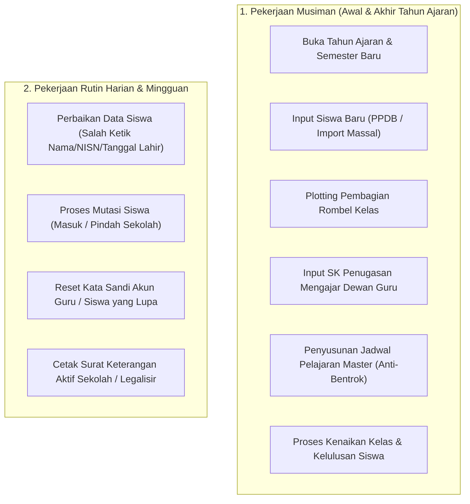

# SCHOOL OPERATOR EXPERIENCE (OPERATOR SEKOLAH)
## Ruang Pintar — Pengalaman "Jantung Teknis & Penjaga Master Data"

**Dokumen:** Analisis Pengalaman Pengguna & Desain Peran Operator Sekolah  
**Status:** PROPOSED — READY FOR HUMAN REVIEW  
**Tanggal:** 22 September 2026  
**Target:** Tata Kelola Data Akademik, Penugasan, dan Integrasi Sistem  
**Kenyataan Lapangan:**  
> *"Operator Sekolah adalah pahlawan tanpa tanda jasa yang memegang beban kepatuhan data. Jika operator salah satu klik dalam memetakan rombel atau jadwal, puluhan guru akan komplain dan ratusan siswa terancam salah data di Dapodik. Operator butuh alat yang cepat, aman dari salah ketik, dan memiliki jaring pengaman (safety net)."*

---

# 1. Peta Aktivitas Operator Sekolah

Pekerjaan operator terbagi antara **pekerjaan rutin harian** dan **pekerjaan musiman berisiko tinggi**:



---

# 2. Aktivitas Paling Sering vs Pekerjaan Paling Berisiko Salah

```text
+----------------------------------------------------------------------------------------------------+
|                                    MATRIKS BEBAN KERJA OPERATOR                                    |
+----+-------------------------------+---------------+---------------------+-------------------------+
| No | Aktivitas Operator            | Frekuensi     | Risiko Kesalahan    | Dampak Kerusakan        |
+----+-------------------------------+---------------+---------------------+-------------------------+
| 1  | Reset Password Guru/Siswa     | Harian (Tinggi)| Sangat Rendah       | Gangguan login sesaat   |
| 2  | Perbaikan Salah Ketik NISN    | Sering        | Sedang              | Ketidakcocokan Dapodik  |
| 3  | Input Mutasi Siswa Masuk      | Bulanan       | Sedang              | Rombel tidak seimbang   |
| 4  | Penugasan Mengajar (SK Guru)  | Awal Semester | TINGGI (8.5/10)     | Guru tidak bisa isi KBM |
| 5  | Penyusunan Jadwal Pelajaran   | Awal Semester | SANGAT TINGGI (9.5) | Guru & Ruangan Bentrok  |
| 6  | Kenaikan Kelas & Kelulusan    | Akhir Tahun   | KRITIS (9.9/10)     | Riwayat Akademik Rusak  |
+----+-------------------------------+---------------+---------------------+-------------------------+
```

---

## 2.1 Analisis Tiga Pekerjaan Paling Berisiko Salah (*High-Risk Operations*):

### Risiko 1: Jadwal Mengajar Bentrok (*Schedule Collision Disaster*)
* **Bahaya:** Seorang guru dijadwalkan mengajar di dua kelas berbeda pada hari dan jam yang sama, atau satu laboratorium komputer dipakai oleh dua kelas sekaligus.
* **Solusi Ruang Pintar:** **Real-Time Conflict Guard**. Saat operator menarik alokasi jadwal pelajaran, sistem secara server-side menolak penyimpanan jika terjadi tumpang-tindih waktu guru, ruangan, atau rombel.

### Risiko 2: Kenaikan Kelas & Mutasi Siswa yang Salah Peta (*Mapping Anomaly*)
* **Bahaya:** Siswa kelas X RPL 1 secara tidak sengaja dipromosikan ke XI TKJ 2 karena kesalahan memilih dropdown massal.
* **Solusi Ruang Pintar:** **Two-Step Promotion Wizard & Staging Preview**. Operator melihat tabel pratinjau sebelum eksekusi final, lengkap dengan tombol **[ Undo Kenaikan Kelas (Batas 24 Jam) ]** jika terjadi ketidaksengajaan.

### Risiko 3: Penghapusan Data Berantai (*Cascade Deletion Catastrophe*)
* **Bahaya:** Operator berniat menghapus akun guru yang sudah pensiun, namun sistem menghapus seluruh data nilai dan absensi siswa yang pernah diajar guru tersebut selama 3 tahun terakhir.
* **Solusi Ruang Pintar:** **Immutable Audit & Archive Shield**. Tombol hapus permanen dinonaktifkan jika entitas memiliki keterkaitan data historis; sistem otomatis mengarahkannya ke opsi *Arsipkan* secara aman tanpa merusak integritas relasional.

---

# 3. Rekomendasi Desain Antarmuka Operator (*Operator Command Center*)

Operator sekolah bekerja di komputer desktop dengan layar monitor besar. Mereka membutuhkan **kepadatan informasi yang tinggi (*high information density*)**, filter data cepat, dan fungsi impor/ekspor massal:

1. **Mass Actions Toolbar:**
   Dukungan multi-select checkbox baris (`[x] Pilih Semua`) dengan aksi massal: *Pindahkan Rombel, Generate Akun Massal, Ekspor CSV, dan Nonaktifkan*.
2. **Import Preview with Error Highlighting:**
   Saat mengunggah file Excel berisi 300 siswa baru, sistem tidak langsung menyimpan ke database. Sistem menampilkan layar pratinjau dengan penanda merah pada baris yang memiliki NISN ganda atau format tanggal lahir keliru sebelum konfirmasi simpan.
3. **Pusat Bantuan Reset Kredensial 1-Klik:**
   Widget pencarian instan nama guru/siswa dengan tombol: **[ Salin Tautan Reset Password via WhatsApp ]** untuk mempermudah melayani guru senior yang lupa kata sandi.
