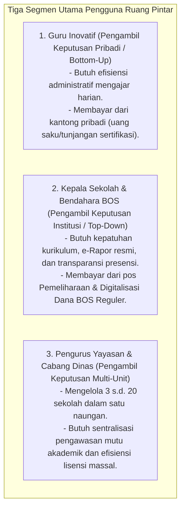

# PRODUCT PACKAGING & VALUE PROPOSITION STRATEGY
## Ruang Pintar — Product Tiering for the Indonesian Education Ecosystem

**Dokumen:** Strategi Packaging & Proposisi Nilai Produk  
**Status:** PROPOSED — READY FOR HUMAN REVIEW  
**Tanggal:** 22 September 2026  
**Target Pasar:** Guru Mandiri, Sekolah Jenjang SD/SMP/SMA/SMK (Negeri & Swasta), serta Yayasan Pendidikan di Indonesia.  
**Prinsip Utama:** Menawarkan proposisi nilai yang nyata (*real tangible value*) pada setiap segmen, menghindari fitur gimmick, dan selaras dengan regulasi pembiayaan pendidikan nasional (Dana BOS).

---

# 1. Analisis Lanskap & Segmen Pasar Pendidikan Indonesia

Pasar software pendidikan di Indonesia memiliki karakteristik unik yang terbagi menjadi 3 tingkat keputusan belanja:



---

# 2. Matriks Empat Tingkat Kemasan Produk (*Four-Tier Packaging*)

```text
+----------------------------------------------------------------------------------------------------+
|                                    RUANG PINTAR PRODUCT TIERS                                      |
+-------------------+-----------------------+-----------------------------+--------------------------+
|       FREE        |      PRO TEACHER      |         SCHOOL PRO          |        ENTERPRISE        |
|  (Guru Mandiri)   |  (Guru Profesional)   |  (Institusi Sekolah Penuh)  |    (Yayasan / Dinas)     |
+-------------------+-----------------------+-----------------------------+--------------------------+
| Sasaran:          | Sasaran:              | Sasaran:                    | Sasaran:                 |
| Guru coba-coba    | Guru aktif soliter    | Sekolah SD/SMP/SMA/SMK      | Yayasan Multi-Kampus     |
|                   |                       |                             |                          |
| Unit:             | Unit:                 | Unit:                       | Unit:                    |
| Personal Wksp     | Personal Wksp         | School Workspace            | Multi-Tenant / Konsorsium|
|                   |                       |                             |                          |
| Model:            | Model:                | Model:                      | Model:                   |
| Gratis Selamanya  | Langganan Mandiri     | Kontrak Tahunan Sekolah     | Custom Annual Contract   |
|                   | (Bulanan / Tahunan)   | (Didukung Dana BOS)         | (Multi-School SLA)       |
+-------------------+-----------------------+-----------------------------+--------------------------+
```

---

## 2.1 Tier 1: FREE — "Ruang Guru Mandiri"

### Sasaran Pengguna:
Guru honorer atau guru ASN baru yang ingin merapikan administrasi mengajarnya sendiri tanpa repot meminta persetujuan pihak sekolah.

### Paket Fitur:
* **Presensi Sesi Kilat:** Catat hadir, sakit, izin, alpha per pertemuan tatap muka.
* **Agenda & Jurnal Mengajar:** Catatan KBM digital dan refleksi mengajar harian.
* **Gradebook Dasar:** Rekap nilai tugas dan ulangan harian (formatif/sumatif).
* **Batasan Paket:** Maksimal 2 rombel/kelas mandiri, kuota 80 siswa.

### Proposisi Nilai (*Value Proposition*):
> *"Tinggalkan buku absensi kertas yang mudah hilang dan tabel Excel yang berantakan. Rapikan administrasi kelas Anda dalam 60 detik dari genggaman ponsel."*

---

## 2.2 Tier 2: PRO TEACHER — "Guru Digital Profesional"

### Sasaran Pengguna:
Guru pengampu mapel dengan jam terbang tinggi (mengajar di 5–10 kelas sekaligus) yang menginginkan otomatisasi evaluasi dan pembuatan bahan ajar.

### Paket Fitur:
* **Seluruh Fitur Tier FREE** tanpa batasan jumlah kelas atau jumlah siswa.
* **CBT Dasar Mandiri:** Pelaksanaan kuis interaktif dengan timer dan auto-grading online.
* **Bank Soal Personal:** Menyimpan ribuan soal pribadi yang dapat digunakan kembali antar tahun ajaran.
* **AI Generator Guru (Standard Quota):**
  * Auto-generasi Modul Ajar / RPP Kurikulum Merdeka.
  * Auto-generasi butir soal latihan dan kunci jawaban.
* **Ekspor Dokumen:** Cetak rekap nilai dan jurnal KBM berformat PDF resmi siap serah ke kurikulum.

### Proposisi Nilai (*Value Proposition*):
> *"Hemat 10 jam kerja setiap minggu. Biarkan AI menyusun naskah latihan soal dan merapikan administrasi mengajar Anda sehingga Anda dapat fokus mendidik siswa."*

---

## 2.3 Tier 3: SCHOOL PRO — "Operating Platform Sekolah Cerdas"

### Sasaran Pengguna:
Institusi formal (Kepala Sekolah, Wakil Kepala Kurikulum, Operator Sekolah, Bendahara BOS).

### Paket Fitur:
* **Seluruh Fitur Pro untuk SELURUH GURU di sekolah tersebut.**
* **Manajemen Rombel & Jadwal Master Terpadu:** Penyusunan jadwal pelajaran otomatis bebas bentrok, plotting rombel siswa, dan integrasi Dapodik.
* **Hak Akses Khusus Institusi:**
  * Panel Wali Kelas (rekap ketidakhadiran siswa dan pembinaan).
  * Panel Kepala Sekolah (pantauan KBM live dan analitik kehadiran guru/siswa).
  * Panel Operator Sekolah (master data siswa dan tata kelola akun).
* **e-Rapor Kurikulum Merdeka Terpadu:**
  * Leger nilai otomatis gabungan seluruh guru pengampu.
  * Cetak lembar rapor resmi format standar Kemdikbud A4 siap tanda tangan.
* **Portal Siswa & Akun Orang Tua (*Guardian*):**
  * Transparansi presensi harian siswa (notifikasi saat anak tiba di sekolah).
  * Buku nilai transparan untuk pemantauan capaian belajar anak dari rumah.
* **FULL AI ASSESSMENT SUITE (Pusat Penilaian Cerdas):**
  * **Kisi-Kisi AI & Kartu Soal AI** standar akreditasi sekolah.
  * **Paket Ujian AI:** Assembling naskah ujian Paket A dan Paket B seimbang.
  * **LJK Dinamis Hemat Biaya:** Dicetak di atas **kertas HVS fotokopian biasa 70–80 gsm** (menghemat jutaan rupiah biaya kertas tebal OMR scanner).
  * **Scan Jawaban Kamera HP:** Koreksi puluhan LJK siswa dalam hitungan detik menggunakan kamera smartphone guru tanpa perlu mesin scanner ratusan juta.
  * **AI Paper Correction:** Koreksi Pilihan Ganda instan dan rekomendasi nilai uraian/esai tulisan tangan siswa berbasis rubrik penskoran.
  * **Analisis Butir Soal Komprehensif:** Indeks daya pembeda ($D$), tingkat kesukaran ($P$), efektivitas distraktor, dan reliabilitas tes siap cetak untuk bukti akreditasi sekolah.

### Proposisi Nilai (*Value Proposition*):
> *"Satu platform untuk seluruh ekosistem sekolah. Menghilangkan biaya mahal mesin scanner OMR, menuntaskan administrasi rapor Merdeka tepat waktu, dan memberikan transparansi penuh kepada orang tua murid."*

---

## 2.4 Tier 4: ENTERPRISE — "Konsorsium Yayasan & Multi-Kampus"

### Sasaran Pengguna:
Yayasan Pendidikan yang menaungi banyak unit sekolah (misal: Yayasan memiliki SD, SMP, SMA, dan SMK di beberapa kota) atau Cabang Dinas Pendidikan.

### Paket Fitur:
* **Seluruh Fitur Tier SCHOOL PRO untuk SELURUH SEKOLAH binaan.**
* **Multi-Campus Central Dashboard:**
  * Eksekutif Yayasan dapat memantau perbandingan performa akademik, rasio kehadiran, dan beban mengajar antar-sekolah dalam satu layar kendali.
* **Single Sign-On (SSO) Terpadu:**
  * Integrasi Google Workspace for Education / Akun Belajar.id kementerian.
* **Kustomisasi & Integrasi Khusus:**
  * Format template rapor kustom yayasan.
  * Sinkronisasi API otomatis dengan sistem keuangan yayasan (SPP / Virtual Account).
* **Pelatihan & Dedicated Account Manager (SLA Prioritas):**
  * Bimbingan teknis (*onboarding workshop*) langsung untuk seluruh dewan guru.

### Proposisi Nilai (*Value Proposition*):
> *"Standardisasi mutu pendidikan dan efisiensi tata kelola di seluruh unit sekolah yayasan Anda dalam satu ekosistem data terpusat dan aman."*

---

# 3. Matriks Perbandingan Fitur Komprehensif

| Kategori Fitur | FREE (Mandiri) | PRO TEACHER | SCHOOL PRO | ENTERPRISE |
| :--- | :---: | :---: | :---: | :---: |
| **Batas Ruang Kelas** | Maks 2 Kelas | Tanpa Batas | Seluruh Sekolah | Seluruh Yayasan |
| **Presensi Sesi Kelas** | Ya | Ya | Ya | Ya |
| **Agenda & Jurnal Mengajar** | Ya | Ya | Ya | Ya |
| **Buku Nilai (Gradebook)** | Dasar | Lanjutan + Ekspor | Terintegrasi Rapor | Terintegrasi Rapor |
| **CBT Interaktif Online** | - | Ya (Dasar) | Ya (Full + Anti-Curang) | Ya (Dedicated Cloud) |
| **Bank Soal Kolaboratif** | - | Personal | Seluruh Guru Sekolah | Lintas Sekolah Yayasan |
| **AI Generator Modul Ajar** | - | Kuota Personal | Kuota Sekolah | Custom Kuota |
| **Jadwal Pelajaran Master** | - | - | Ya (Bebas Bentrok) | Ya (Antar-Kampus) |
| **Panel Wali Kelas & BK** | - | - | Ya | Ya |
| **e-Rapor Kurikulum Merdeka**| - | - | Ya (Resmi Kemdikbud) | Ya (Custom Yayasan) |
| **Portal Orang Tua (Guardian)**| - | - | Ya | Ya |
| **Kisi-Kisi & Kartu Soal AI**| - | Terbatas | Ya (Lengkap) | Ya (Lengkap) |
| **LJK Kertas A4 Fotokopi** | - | - | Ya (Hemat Biaya) | Ya (Hemat Biaya) |
| **Scan Koreksi LJK via HP** | - | - | Ya (Auto-Deskew OMR)| Ya (Auto-Deskew OMR)|
| **Koreksi Esai Tulisan AI** | - | - | Opsional Add-on | Termasuk |
| **Analisis Butir Soal Lengkap**| - | - | Ya (Akreditasi-ready)| Ya (Akreditasi-ready)|
| **Single Sign-On (Belajar.id)**| - | - | - | Ya |
| **Dukungan Pengadaan Dana BOS**| - | - | Ya (Kuitansi/BAST/NPWP)| Ya (Kontrak Yayasan) |

---

# 4. Keselarasan dengan Pola Anggaran Pendidikan di Indonesia

Model kemasan produk ini secara sadar dirancang agar **mudah diserap oleh anggaran operasional sekolah (Dana BOS)**:

1. **Komponen Penggunaan Dana BOS:**
   Kemendikbudristek menetapkan petunjuk teknis (Juknis) BOS yang secara legal mengizinkan penggunaan dana untuk:
   * *Komponen Penyelenggaraan Pembelajaran dan Ekstrakurikuler*;
   * *Komponen Penilaian dan Evaluasi Pembelajaran* (Penyelenggaraan STS/SAS/PAT, cetak LJK, dan pengolahan nilai);
   * *Komponen Pemeliharaan Sarana dan Prasarana / Pengadaan Software Sekolah*.
2. **Justifikasi Efisiensi Biaya (Cost-Saving Pitch):**
   * **Sebelum Ruang Pintar:** Sekolah mengeluarkan Rp 5.000.000 – Rp 15.000.000 per tahun hanya untuk membeli kertas LJK tebal khusus scanner, biaya sewa/servis mesin scanner OMR, dan software pengolah nilai terpisah.
   * **Dengan Ruang Pintar (School Pro):** Sekolah cukup mengeluarkan sebagian kecil anggaran untuk lisensi tahunan, dan pencetakan LJK dilakukan di atas kertas fotokopi biasa 70 gsm yang sangat murah. Kepala Sekolah langsung melihat penghematan anggaran yang nyata (*ROI dalam 1 semester*).
3. **Dokumen Pendukung Audit:**
   Sistem secara otomatis menyediakan paket berkas administrasi BOS: Dokumen Penawaran Harga, Surat Perjanjian Kerjasama (SPK), Berita Acara Serah Terima (BAST), e-Faktur Pajak, dan Kuitansi Resmi.
