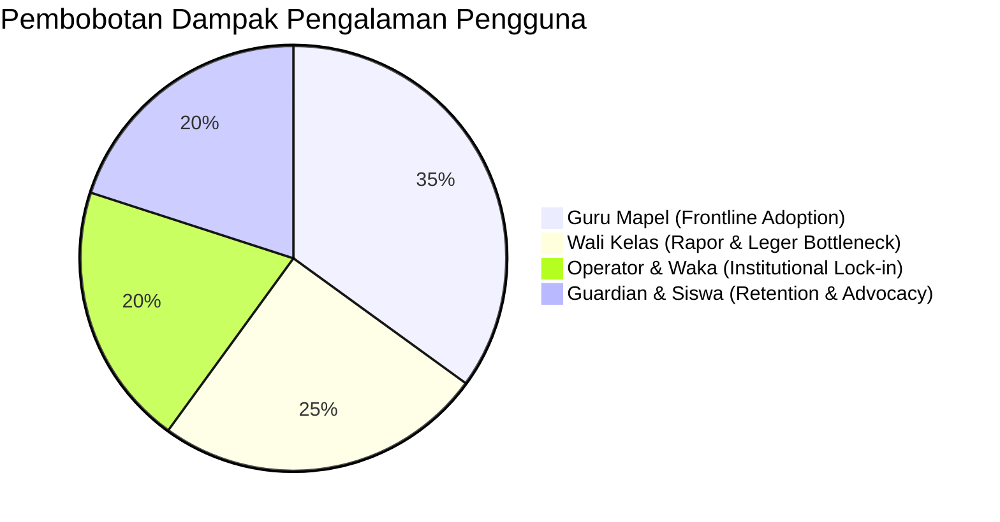

# ROLE PRIORITY MATRIX & PRODUCT ROADMAP IMPACT
## Ruang Pintar — Matriks Komparatif Seluruh Peran & Urutan Prioritas Produk

**Dokumen:** Matriks Prioritas Peran & Evaluasi Dampak Produk  
**Status:** PROPOSED — READY FOR HUMAN REVIEW  
**Tanggal:** 22 September 2026  
**Target:** Seluruh Aktor Ekosistem Sekolah (7 Peran Utama)  
**Tujuan:** Menyelaraskan seluruh peta pengalaman pengguna ke dalam satu matriks komparatif untuk memandu arsitektur navigasi, prioritas pengembangan fitur, dan konversi komersial sekolah.

---

# 1. Matriks Komparatif 7 Peran Utama Ekosistem Sekolah

```text
+----+-------------------+-----------------------+---------------------+-------------------+-------------------------------+-------------------------------+
| No | Peran Utama       | Tujuan Utama          | Aktivitas Kunci     | Frekuensi Akses   | Fitur Paling Penting          | Fitur yang Jarang Digunakan   |
+----+-------------------+-----------------------+---------------------+-------------------+-------------------------------+-------------------------------+
| 1  | GURU MAPEL        | Mengajar tuntas tanpa | Presensi, Jurnal,   | Harian            | • Presensi Kilat 15 Detik     | • Pengaturan Master Sekolah   |
|    |                   | beban administrasi.   | Nilai, Modul, Soal  | (3-5x per hari)   | • Jurnal KBM 1-Baris          | • Laporan Audit Sistem        |
|    |                   |                       |                     |                   | • AI Generator Soal/Kisi2     |                               |
+----+-------------------+-----------------------+---------------------+-------------------+-------------------------------+-------------------------------+
| 2  | WALI KELAS        | Menjaga ketertiban &  | Pantau absensi romb,| Harian s.d.       | • Radar Kesehatan Kelas       | • Pembuatan Jadwal Pelajaran  |
|    |                   | kesiapan rapor kelas. | kejar nilai guru,   | Musiman Rapor     | • Kesiapan Leger Rapor        | • Konfigurasi Server / Backup |
|    |                   |                       | catat rapor, ortu.  | (Tinggi di Rapor) | • AI Homeroom Remarks         |                               |
+----+-------------------+-----------------------+---------------------+-------------------+-------------------------------+-------------------------------+
| 3  | OPERATOR SEKOLAH  | Menjaga integritas    | Rombel, SK Guru,    | Harian (Rutin) &  | • Real-Time Conflict Guard    | • Pengerjaan Ujian CBT        |
|    |                   | master data sekolah.  | Jadwal, Siswa Baru, | Awal/Akhir Smt    | • Import Excel Siswa Preview  | • Penulisan Modul Ajar        |
|    |                   |                       | Mutasi, Kenaikan.   | (Sangat Tinggi)   | • Mass Action & Reset Pass    |                               |
+----+-------------------+-----------------------+---------------------+-------------------+-------------------------------+-------------------------------+
| 4  | WAKA KURIKULUM    | Menjamin KBM tertib & | Pantau KBM berjalan,| Harian s.d.       | • Denyut KBM Hari Ini         | • Rincian Skor Kuis Harian    |
|    |                   | rapor selesai tepat.  | rekap jam mengajar, | Mingguan          | • Kepatuhan Jurnal KBM        | • Form Biodata Pribadi Siswa  |
|    |                   |                       | supervisi perangkat |                   | • Kesiapan Leger Sekolah      |                               |
+----+-------------------+-----------------------+---------------------+-------------------+-------------------------------+-------------------------------+
| 5  | KEPALA SEKOLAH    | Mengambil keputusan   | Tinjau ringkasan    | Mingguan s.d.     | • Executive Radar KBM Live    | • Input Nilai Butir Soal      |
|    |                   | makro & legalitas.    | KBM, izin guru, SPK | Bulanan           | • Approval Queue (Izin/SPK)   | • Formulir Rombel Kelas       |
|    |                   |                       | BOS, akreditasi.    | (30 Detik Cepat)  | • Laporan Akreditasi Siap Cetak|                               |
+----+-------------------+-----------------------+---------------------+-------------------+-------------------------------+-------------------------------+
| 6  | SISWA             | Belajar, tahu tugas,  | Cek jadwal, kumpul  | Harian            | • Jadwal & Countdown Deadline | • Rekapitulasi Rapor Siswa Lain|
|    |                   | kerjakan ujian adil.  | tugas, ujian CBT,   | (Pagi & Malam)    | • CBT Player Tenang & Autosave| • Menu Pengaturan Guru        |
|    |                   |                       | lihat capaian nilai.|                   | • Radar Ketercapaian KKTP     |                               |
+----+-------------------+-----------------------+---------------------+-------------------+-------------------------------+-------------------------------+
| 7  | WALI MURID        | Kepastian keselamatan | Cek presensi pagi,  | Harian Pagi &     | • Notifikasi Masuk Sekolah    | • Modul Bahan Ajar Bacaan     |
|    | (GUARDIAN)        | & pengawasan tugas.   | pantau tugas bolong,| Musiman Rapor     | • Peringatan Tugas Bolong     | • Rincian Jam Pelajaran Rombel|
|    |                   |                       | ajukan izin sakit.  |                   | • Pengajuan Izin Sakit via HP |                               |
+----+-------------------+-----------------------+---------------------+-------------------+-------------------------------+-------------------------------+
```

---

# 2. Urutan Prioritas Pengembangan Produk (*Product Development Priority Ranking*)

Berdasarkan analisis frekuensi harian, penghematan waktu nyata, dan daya dorong keputusan pembelian lisensi sekolah tahunan:



---

## Peringkat 1: GURU MATA PELAJARAN (*The Frontline Adoption Engine*)
* **Alasan:** Guru adalah pengguna harian dengan jam interaksi tertinggi. Jika guru merasa Ruang Pintar mempermudah hidupnya (Presensi 15 Detik, Jurnal KBM otomatis, dan pembuatan soal kilat), guru akan menjadi **advokat nomor satu** yang mendesak Kepala Sekolah untuk membeli lisensi resmi institusi (*Bottom-Up PLG*).

## Peringkat 2: WALI KELAS & e-RAPOR (*The Administrative Bottleneck Breaker*)
* **Alasan:** Musim rapor adalah titik lelah terbesar sekolah. Fitur pemantauan leger nilai real-time, pengingat otomatis guru mapel yang telat, dan cetak rapor instan Kurikulum Merdeka adalah alasan paling nyata sekolah beralih dari software lama ke Ruang Pintar.

## Peringkat 3: OPERATOR SEKOLAH & WAKA KURIKULUM (*The Institutional Gatekeeper*)
* **Alasan:** Operator dan Waka Kurikulum adalah pihak yang mengevaluasi kelayakan teknis software. Fitur pencegahan jadwal bentrok (*Conflict Guard*), import Excel anti-rusak, dan executive radar membuat mereka tenang bahwa operasional sekolah berjalan tertib tanpa insiden data.

## Peringkat 4: SISWA & WALI MURID (*The Long-Term Retention & Trust Shield*)
* **Alasan:** Orang tua yang menerima notifikasi kehadiran transparan dan siswa yang menikmati ujian CBT tenang tanpa lag akan memberikan kepercayaan sosial yang masif kepada sekolah. Hal ini menjamin perpanjangan lisensi (*Renewal*) berlangsung mulus dari tahun ke tahun.
