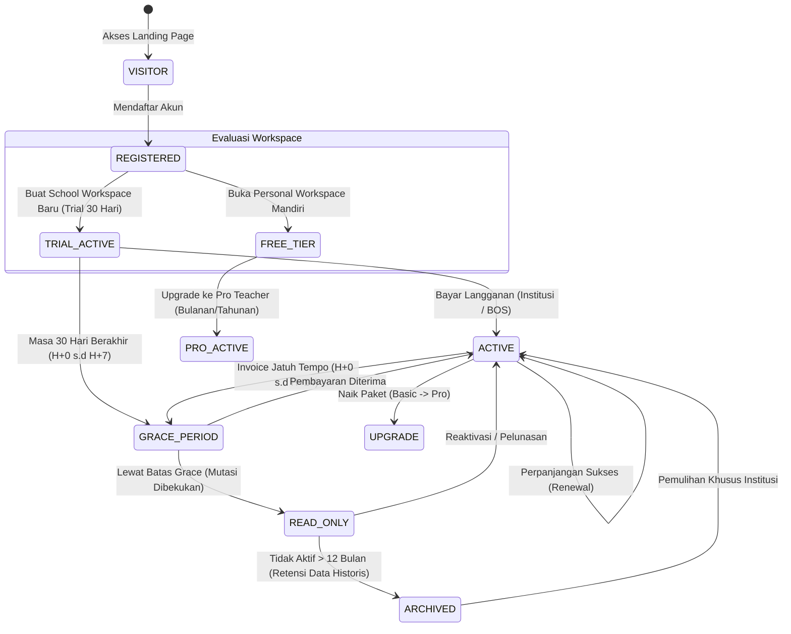
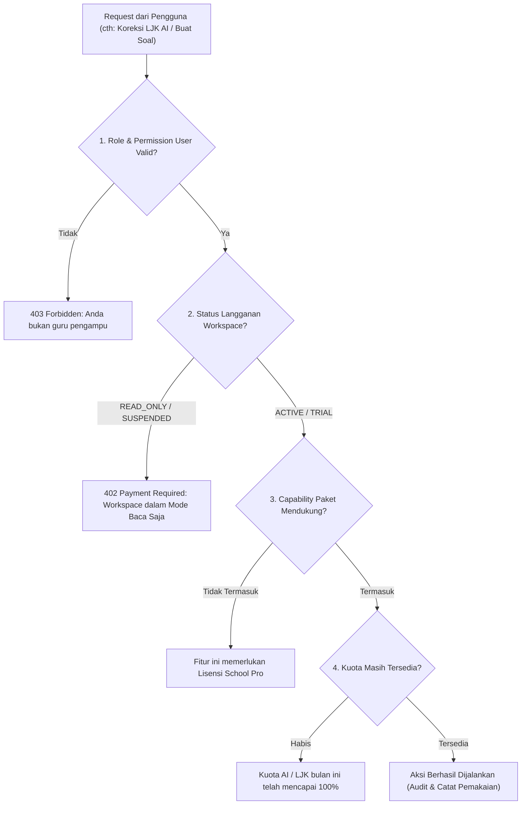

# SAAS LIFECYCLE & SUBSCRIPTION MODEL
## Ruang Pintar — State Machine, Entitlement & Monetization Engine

**Dokumen:** Desain Siklus Hidup SaaS & Model Langganan  
**Status:** PROPOSED — READY FOR HUMAN REVIEW  
**Tanggal:** 22 September 2026  
**Target Rilis:** SaaS Phase SAAS-05 / Milestone K  
**Tujuan:** Membangun fondasi monetisasi yang kokoh, terprediksi, dan terstruktur dari pengunjung (*visitor*) hingga perpanjangan tahunan institusi.

---

# 1. State Machine Siklus Hidup SaaS (End-to-End Journey)

Siklus hidup pelanggan Ruang Pintar dirancang dengan transisi status yang ketat dan deterministik:



---

# 2. Definisi & Transisi State Langganan

| State | Kondisi & Pemicu | Hak Akses Fitur | Aksi Mutasi (Tulis/Simpan) | UX & Banner Peringatan |
| :--- | :--- | :--- | :--- | :--- |
| **`VISITOR`** | Pengguna belum login di halaman publik. | Hanya Landing Page, Cek Biaya, Panduan. | Tidak ada. | CTA: *"Coba Gratis 30 Hari"*. |
| **`TRIAL_ACTIVE`** | Tenant sekolah baru didaftarkan. Berlaku 30 hari kalender. | Akses penuh seluruh fitur paket standar (*Full Access*). | Diizinkan sepenuhnya. | Tampil sisa hari trial: *"Sisa 24 hari trial sekolah Anda"*. |
| **`FREE_TIER`** | Guru mandiri di ruang personal. Tanpa batas waktu kadaluwarsa. | Presensi, Jurnal KBM, Gradebook dasar (batas 2 kelas). | Diizinkan dalam batas kuota. | Tombol ajakan: *"Upgrade Pro atau Bawa ke Sekolah"*. |
| **`ACTIVE`** | Pembayaran langganan (BOS/Midtrans/Invoice) berhasil diverifikasi. | Akses penuh sesuai paket (Pro Teacher / School Pro). | Diizinkan sepenuhnya. | Badge status hijau: *"Lisensi Aktif s.d 30 Juni 2027"*. |
| **`GRACE_PERIOD`** | Masa aktif habis, namun sistem memberikan toleransi operasional (7–14 hari). | Akses tetap normal demi mencegah KBM sekolah terganggu mendadak. | Diizinkan sepenuhnya. | Amber Warning Topbar: *"Masa aktif berakhir. Selesaikan administrasi BOS sebelum H+7"*. |
| **`READ_ONLY`** | Masa tenggang (*Grace Period*) habis tanpa ada konfirmasi pembayaran. | **Data tidak dihapus.** Semua guru/siswa tetap dapat melihat data, mencetak rapor lama. | **DIBLOKIR.** Dilarang membuat absen baru, simpan nilai baru, CBT baru, atau panggil AI. | Banner Kritis Biru/Abu: *"Mode Baca Saja. Hubungi Bendahara/Kepala Sekolah untuk reaktivasi"*. |
| **`ARCHIVED`** | Sekolah tidak aktif lebih dari 365 hari pasca read-only. | Data diarsipkan secara terenkripsi dingin (*cold storage*). | Diblokir total. | Layar konfirmasi pemulihan khusus Super Admin. |

---

# 3. Model Entitlement: Capability Gate & Usage Quota

Sistem otorisasi tidak hanya memeriksa peran pengguna (*Role Check*), tetapi memeriksa **Entitlement Tenant Aktif**. Entitlement menjawab dua pertanyaan mendasar:

```text
1. Apakah Tenant Berhak Menggunakan Fitur Ini? (Capability Gate)
2. Apakah Tenant Masih Memiliki Kuota Penggunaan? (Usage Quota)
```



### Matriks Capability Utama:
- `core.attendance`: Akses presensi kelas (Free, Pro, School).
- `core.gradebook`: Buku nilai formatif/sumatif (Free, Pro, School).
- `institutional.rapor`: e-Rapor resmi Kurikulum Merdeka (Hanya School).
- `institutional.guardian`: Akun & portal monitoring orang tua (Hanya School).
- `ai.assessment.generator`: Kisi-kisi AI & Kartu Soal AI (Pro Teacher & School).
- `ai.assessment.omr_scan`: Scan LJK kertas via HP & koreksi otomatis (Hanya School).
- `ai.assessment.handwriting`: Koreksi tulisan tangan esai siswa (School Enterprise).

---

# 4. Strategi Dual-Monetisasi: Guru Mandiri vs Sekolah

Ruang Pintar menerapkan strategi penetrasi pasar ganda yang saling memperkuat:

### 4.1 Langganan Bulanan Guru Mandiri (*Micro-Billing / Teacher Self-Funding*)
- **Sasaran:** Guru inovatif yang ingin mempermudah pekerjaannya sendiri tanpa menunggu persetujuan birokrasi sekolah.
- **Biaya:** Sangat terjangkau (Rp 15.000 – Rp 25.000 / bulan atau Rp 150.000 / tahun).
- **Metode Pembayaran:** 1-klik pembayaran instan via **QRIS, GoPay, OVO, ShopeePay, atau DANA** melalui Midtrans.
- **Fitur Dibeli:** Kelas tanpa batas, CBT Mandiri, Bank Soal tak terbatas, kuota ekstra AI RPP/Modul Ajar.

### 4.2 Langganan Tahunan Sekolah (*B2B Institutional / BOS Procurement*)
- **Sasaran:** Institusi formal (Kepala Sekolah, Bendahara Sekolah, Yayasan).
- **Siklus Anggaran Sekolah di Indonesia:**
  - Dana BOS Reguler dicairkan pemerintah dalam **2 Tahap per tahun**:
    - Tahap 1: Januari s.d. Juni
    - Tahap 2: Juli s.d. Desember
- **Biaya:** Rp 3.000.000 – Rp 9.000.000 / sekolah / tahun (setara dengan sebagian kecil alokasi komponen pemeliharaan software/administrasi BOS).
- **Metode Pembayaran:**
  - **Faktur & Invoice Formal:** Dilengkapi kuitansi bermaterai, surat penawaran resmi, NPWP perusahaan, dan Berita Acara Serah Terima (BAST) untuk audit BPK/Inspektorat.
  - **Transfer Bank Institusi:** Rekening Virtual Account BNI, Mandiri, BRI, BCA atau transfer rekening giro.

---

# 5. Mekanisme Grace Period & Jaminan Anti-Data-Loss

Prinsip terpenting dalam platform pendidikan: **"Urusan administrasi pembayaran tidak boleh mengorbankan masa depan nilai siswa."**

1. **Pencegahan Kunci Total (*Anti-Full-Lock*):**
   Platform kompetitor sering memblokir login sama sekali saat lisensi habis sehingga guru tidak bisa mencetak rapor menjelang pembagian hasil belajar. Ruang Pintar **menolak praktik ini**.
2. **Mode Baca-Saja (*Safe Read-Only*):**
   Saat lisensi habis:
   - Data siswa, catatan kehadiran semester berjalan, dan seluruh nilai tersimpan aman 100%.
   - Guru dan wali kelas tetap dapat membuka halaman, mengunduh file Excel cadangan, dan mencetak lembar rapor yang sudah difinalisasi.
   - Pintu mutasi baru (seperti menginput nilai baru atau memulai ujian baru) ditutup secara elegan dengan pesan informatif: *"Operasi ini dinonaktifkan sementara karena lisensi sekolah telah berakhir. Silakan hubungi bagian tata usaha/operator untuk perpanjangan."*
3. **Reaktivasi Instan (*1-Click Restoration*):**
   Begitu pembayaran perpanjangan diverifikasi, status workspace seketika kembali menjadi `ACTIVE` dalam hitungan detik tanpa perlu setup ulang atau migrasi database.
