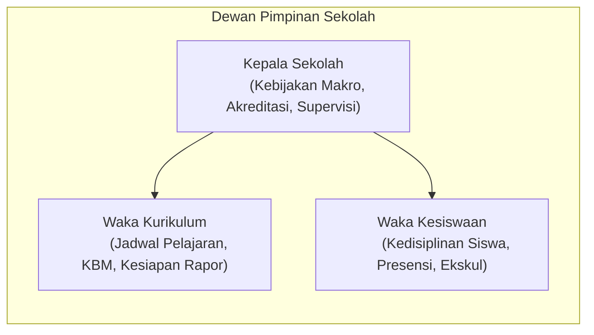

# SCHOOL LEADERSHIP EXPERIENCE (KEPALA SEKOLAH & WAKIL)
## Ruang Pintar — Pengalaman Kepemimpinan & Pengawasan Operasional Sekolah

**Dokumen:** Analisis Kebutuhan & Desain Executive Dashboard Pimpinan Sekolah  
**Status:** PROPOSED — READY FOR HUMAN REVIEW  
**Tanggal:** 22 September 2026  
**Target:** Kepala Sekolah, Waka Kurikulum, Waka Kesiswaan  
**Kenyataan Pimpinan:**  
> *"Kepala Sekolah dan Waka tidak punya waktu untuk melihat detail nilai kuis harian seorang siswa. Mereka butuh gambaran helikopter (helicopter view) dalam 30 detik: Apakah KBM hari ini berjalan tertib? Apakah ada kelas yang kosong? Guru mana yang perlu disupervisi? Dan siswa mana yang berisiko drop-out?"*

---

# 1. Analisis Kebutuhan Informasi: Nyata vs Hiasan

Pimpinan sekolah sering disajikan dashboard software yang penuh grafik hiasan tetapi tidak menghasilkan keputusan operasional apa pun:

```text
+----------------------------------------------------------------------------------------------------+
|                                    KURASI INFORMASI PIMPINAN SEKOLAH                               |
+-------------------------------------------------+--------------------------------------------------+
|      INFORMASI YANG BENAR-BENAR DIBUTUHKAN      |           INFORMASI YANG JARANG DIGUNAKAN        |
|               (SANGAT KRITIS & HARIAN)          |                 (HANYA HIASAN / SLOP)            |
+-------------------------------------------------+--------------------------------------------------+
| 1. Denyut KBM Hari Ini (Live Class Pulse):      | 1. Grafik Donat Distribusi Agama / Golongan Darah|
|    Berapa kelas yang sedang aktif belajar?      |    (Data statis yang tidak berubah tiap hari).   |
|    Apakah ada kelas KOSONG (Guru tidak hadir)?  |                                                  |
| 2. Tindak Lanjut Guru Pengganti (Guru Piket):   | 2. Rincian Skor Kuis Ulangan Harian Per Butir    |
|    Menugaskan guru piket jika guru utama izin.  |    (Terlalu mikro untuk level pimpinan).         |
| 3. Rekap Siswa Bolos Massal Hari Ini:           |                                                  |
|    Daftar siswa alpha di atas ambang batas.     | 3. Angka Total Klik Halaman Software             |
| 4. Progres Kesiapan Rapor Kurikulum Merdeka:   |    (Metrik vanitas pengembang, bukan kepala sek) |
|    Berapa persen guru yang sudah tuntas nilai?  |                                                  |
| 5. Dokumen Formal Pengesahan (1-Klik Approval): | 4. Log Aktivitas Database Mentah (Raw Logs)      |
|    Persetujuan izin guru, SK penugasan, BOS.    |    (Membingungkan pimpinan non-teknis).          |
+-------------------------------------------------+--------------------------------------------------+
```

---

# 2. Pembagian Peran Kepemimpinan Sekolah



* **Kepala Sekolah:** Membutuhkan ringkasan integritas sekolah untuk laporan pengawas dinas, akreditasi, supervisi guru, dan persetujuan pengadaan BOS.
* **Waka Kurikulum:** Memantau keterlaksanaan jam mengajar guru, kesesuaian modul ajar, dan kepatuhan pengisian nilai rapor tepat waktu.
* **Waka Kesiswaan:** Memantau tingkat kehadiran siswa harian, kasus pelanggaran tata tertib, dan surat izin/dispensasi kegiatan siswa.

---

# 3. Rekomendasi Desain Executive Leadership Dashboard

```text
+----------------------------------------------------------------------------------------------------+
|  RUANG PINTAR     [ SMK Otomindo (Kepala Sekolah) ▼ ]             (🔔) [ Foto Avatar Drs. H. Suryo ] |
+----------------------------------------------------------------------------------------------------+
|                                                                                                    |
|  Executive Radar: SMK Otomindo                                  Senin, 22 Sep 2026 | Jam 08:10 WIB |
|  Status KBM: Jam ke-2 Sedang Berlangsung                        Tahun Ajaran 2026/2027 (Ganjil)    |
|                                                                                                    |
|  +-----------------------------------------------------------------------------------------------+ |
|  | DENYUT KBM SEKOLAH HARI INI (LIVE ACADEMIC PULSE)                                             | |
|  |                                                                                               | |
|  |   [ 20 Kelas Aktif Belajar ]        [ 1 KELAS KOSONG / GURU IZIN ]      [ 96.2% Siswa Hadir ] | |
|  |                                                                                               | |
|  |   PERHATIAN KHUSUS:                                                                           | |
|  |   • Kelas XI TKJ 1 (Ruang 302): Pak Herman izin sakit. Kelas belum terisi guru piket.          | |
|  |     [ Tugaskan Guru Piket Sekarang ]                                                          | |
|  +-----------------------------------------------------------------------------------------------+ |
|                                                                                                    |
|  +---------------------------------------------+  +----------------------------------------------+ |
|  | RADAR KEDISIPLINAN SISWA (WAKA KESISWAAN)   |  | KEPATUHAN AKADEMIK GURU (WAKA KURIKULUM)     | |
|  +---------------------------------------------+  +----------------------------------------------+ |
|  | Total Siswa: 720 Orang                      |  | Kesiapan Administrasi Semester Ini:          | |
|  | • Hadir: 693 Siswa                          |  |                                              | |
|  | • Sakit: 14 Siswa                           |  | Modul Ajar Terkumpul: 34 dari 38 Guru (89%)  | |
|  | • Izin: 8 Siswa                             |  | Jurnal KBM Hari Ini:  20 dari 21 Sesi Terisi | |
|  | • Alpha: 5 Siswa (Perlu Panggilan)          |  | Kesiapan Leger SAS:   Menunggu 4 Guru Mapel  | |
|  |                                             |  |                                              | |
|  | [ Unduh Rekap Harian untuk Guru BK ]        |  | [ Lihat Daftar Guru yang Belum Menyerahkan ] | |
|  +---------------------------------------------+  +----------------------------------------------+ |
|                                                                                                    |
|  +-----------------------------------------------------------------------------------------------+ |
|  | PERSETUJUAN & DOKUMEN RESMI MENUNGGU TANDA TANGAN (APPROVAL QUEUE)                            | |
|  +-----------------------------------------------------------------------------------------------+ |
|  | [ ! ] 2 Pengajuan Izin Dinas Guru (Workshop Kurikulum)                 [ Tinjau & Setujui ]    | |
|  | [ ! ] Berkas SPK Pengadaan Lisensi Software Ruang Pintar (Dana BOS)     [ Tinjau Dokumen ]      | |
|  +-----------------------------------------------------------------------------------------------+ |
+----------------------------------------------------------------------------------------------------+
```

### Nilai Tambah Nyata bagi Pimpinan Sekolah:
1. **Pencegahan Kelas Kosong Instan:** Kepala Sekolah langsung tahu jika ada guru berhalangan dan dapat menugaskan guru piket hanya dalam 1 klik.
2. **Supervisi Transparan Tanpa Intimidasi:** Pimpinan melihat guru mana yang aktif mengisi jurnal KBM dan guru mana yang membutuhkan bimbingan teknis.
3. **Kesiapan Akreditasi 1-Klik:** Seluruh data kehadiran, keterlaksanaan kurikulum, dan leger nilai siap diekspor menjadi laporan resmi format standar Badan Akreditasi Nasional (BAN-PDM).
