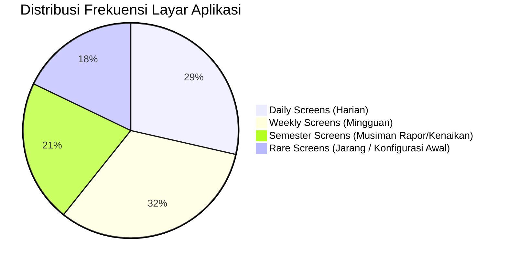

# SCREEN INVENTORY — INVENTARIS LAYAR RUANG PINTAR
## Ruang Pintar — Katalog Seluruh Layar Berbasis Peran & Frekuensi Penggunaan

**Dokumen:** Inventaris Seluruh Layar Aplikasi  
**Status:** PROPOSED — READY FOR HUMAN REVIEW  
**Tanggal:** 22 September 2026  
**Target:** Seluruh 7 Peran Pengguna  
**Tujuan:** Mengunci daftar definitif seluruh layar antarmuka sebelum perancangan visual high-fidelity.

---

# 1. Ringkasan Total Layar Aplikasi

Ruang Pintar dirancang dengan prinsip **kepadatan informasi terkurasi (*Curated Density*)**. Alih-alih membuat puluhan halaman terpisah yang membingungkan, aplikasi memiliki total **28 Layar Utama** yang dibagi ke dalam 4 tingkatan frekuensi:

---

# 2. Katalog Layar Berdasarkan Peran Pengguna

---

## 2.1 Gugus Layar Guru Mata Pelajaran (Teacher Screens)

| ID Layar | Nama Layar | Tujuan Utama Layar | Frekuensi | Prioritas |
| :--- | :--- | :--- | :---: | :---: |
| `SCR-TCH-01` | **Teacher Cockpit (Beranda Guru)** | Orientasi jam mengajar hari ini, hitung mundur bel, dan antrean perhatian. | **Harian (Daily)** | **P1 (Kritis)** |
| `SCR-TCH-02` | **Direktori Kelas Saya** | Melihat seluruh rombel kelas yang diampu dengan ringkasan progres BAB & nilai. | Mingguan | P2 |
| `SCR-TCH-03` | **Classroom Workspace Hub** | Ruang kerja terpadu satu kelas (Tab Presensi, Jurnal, Materi, Tugas, Nilai, CBT). | **Harian (Daily)** | **P1 (Kritis)** |
| `SCR-TCH-04` | **Modal Presensi Kilat 15 Detik** | Menandai kehadiran 36 siswa dalam 1 ketukan di ruang kelas. | **Harian (Daily)** | **P1 (Kritis)** |
| `SCR-TCH-05` | **Lembar Jurnal KBM & Refleksi** | Mencatat materi ajar per pertemuan dan catatan kendala kelas untuk supervisi. | **Harian (Daily)** | **P1 (Kritis)** |
| `SCR-TCH-06` | **Manajemen Tugas & Pengumpulan** | Menerbitkan penugasan siswa, memeriksa lembar jawaban, dan memberi feedback. | Mingguan | P2 |
| `SCR-TCH-07` | **Buku Nilai & Gradebook Matrix** | Input nilai formatif/sumatif, pemantauan KKTP, dan pembobotan nilai akhir. | Mingguan/Musiman | P1 |
| `SCR-TCH-08` | **Jadwal Mengajar Saya** | Kalender mingguan alokasi jam mengajar guru bebas bentrok. | Mingguan | P3 |
| `SCR-TCH-09` | **Bank Soal & Asesmen Guru** | Repositori soal latihan, kisi-kisi, kartu soal, dan paket ujian AI. | Bulanan/Musiman | P2 |
| `SCR-TCH-10` | **AI Paper Correction Scanner** | Antarmuka kamera HP untuk memotret dan mengoreksi LJK kertas fotokopi biasa. | Musiman Ujian | P1 |

---

## 2.2 Gugus Layar Wali Kelas (Homeroom Screens)

| ID Layar | Nama Layar | Tujuan Utama Layar | Frekuensi | Prioritas |
| :--- | :--- | :--- | :---: | :---: |
| `SCR-HMR-01` | **Homeroom Cockpit (Radar Rombel)** | Memantau kesehatan kehadiran 36 siswa harian dan penanganan siswa bermasalah. | **Harian (Daily)** | **P1 (Kritis)** |
| `SCR-HMR-02` | **Radar Kesiapan Leger Rapor** | Memantau progres kelengkapan nilai dari 12–16 guru mapel menjelang pembagian rapor. | Musiman Rapor | **P1 (Kritis)** |
| `SCR-HMR-03` | **Lembar Catatan Sikap & e-Rapor** | Menyusun narasi kepribadian siswa dan mencetak lembar rapor resmi A4 massal. | Musiman Rapor | **P1 (Kritis)** |

---

## 2.3 Gugus Layar Operator Sekolah (Operator Command Center)

| ID Layar | Nama Layar | Tujuan Utama Layar | Frekuensi | Prioritas |
| :--- | :--- | :--- | :---: | :---: |
| `SCR-OPS-01` | **Operator Command Center** | Status kesehatan master data sekolah, antrean perbaikan NISN, dan validitas rombel. | **Harian (Daily)** | P2 |
| `SCR-OPS-02` | **Master Rombel & Plotting Siswa** | Pembagian kelas baru, pemetaan siswa per rombel, dan penunjukan wali kelas. | Semesteran | **P1 (Kritis)** |
| `SCR-OPS-03` | **Master Guru & Penugasan SK** | Pendataan dewan guru, jabatan struktural, dan SK beban jam mengajar. | Semesteran | **P1 (Kritis)** |
| `SCR-OPS-04` | **Penyusun Jadwal Master (Anti-Bentrok)** | Papan alokasi jadwal mingguan sekolah dengan *Real-Time Conflict Guard*. | Semesteran | **P1 (Kritis)** |
| `SCR-OPS-05` | **Proses Kenaikan Kelas & Kelulusan** | Wizard promosi kenaikan tingkat dan pengarsipan ijazah siswa lulus. | Akhir Tahun | **P1 (Kritis)** |

---

## 2.4 Gugus Layar Pimpinan Sekolah (Executive Leadership Screens)

| ID Layar | Nama Layar | Tujuan Utama Layar | Frekuensi | Prioritas |
| :--- | :--- | :--- | :---: | :---: |
| `SCR-LDR-01` | **Executive KBM Pulse Radar** | Pantauan 30 detik: kelas mana yang aktif belajar dan kelas mana yang kosong/guru izin. | **Harian (Daily)** | **P1 (Kritis)** |
| `SCR-LDR-02` | **Pusat Persetujuan (Approval Queue)** | Menyetujui surat izin dinas guru, pergantian guru piket, dan berkas pengadaan BOS. | Mingguan | P2 |
| `SCR-LDR-03` | **Laporan Kepatuhan & Mutu Akreditasi** | Rekap keterlaksanaan kurikulum, jurnal KBM guru, dan profil mutu standar BAN-PDM. | Bulanan/Semesteran | P2 |

---

## 2.5 Gugus Layar Siswa (Student Screens)

| ID Layar | Nama Layar | Tujuan Utama Layar | Frekuensi | Prioritas |
| :--- | :--- | :--- | :---: | :---: |
| `SCR-STU-01` | **Student Cockpit (Beranda Siswa)** | Jadwal hari ini, pengingat ruangan, dan hitung mundur batas pengumpulan tugas. | **Harian (Daily)** | **P1 (Kritis)** |
| `SCR-STU-02` | **Portal Tugas & Lembar Kerja** | Menerima instruksi materi, mengunggah file tugas atau foto buku catatan. | **Harian (Daily)** | **P1 (Kritis)** |
| `SCR-STU-03` | **CBT Player Bebas Gangguan** | Mengerjakan ujian CBT dengan server timer, auto-save, dan mode anti-curang adil. | Musiman Ujian | **P1 (Kritis)** |
| `SCR-STU-04` | **Radar Capaian KKTP & e-Rapor Saya** | Memantau grafik ketuntasan kompetensi pribadi dan melihat transkrip resmi. | Mingguan/Musiman | P2 |

---

## 2.6 Gugus Layar Orang Tua / Guardian (Family Screens)

| ID Layar | Nama Layar | Tujuan Utama Layar | Frekuensi | Prioritas |
| :--- | :--- | :--- | :---: | :---: |
| `SCR-GRD-01` | **Guardian Home (Pantau Anak)** | Status kepastian kehadiran pagi (jam 07:15) dan pengawasan PR/tugas bolong. | **Harian (Daily)** | **P1 (Kritis)** |
| `SCR-GRD-02` | **Form Pengajuan Izin / Sakit Mandiri** | Mengunggah foto surat dokter/keterangan dari HP langsung ke wali kelas. | Bulanan | P2 |
| `SCR-GRD-03` | **Buku Perkembangan Nilai & Rapor Anak** | Transparansi nilai tugas, hasil asesmen terpublikasi resmi, dan e-Rapor anak. | Musiman Rapor | P2 |

---

## 2.7 Gugus Layar Pengaturan & Lisensi (Governance & Billing Screens)

| ID Layar | Nama Layar | Tujuan Utama Layar | Frekuensi | Prioritas |
| :--- | :--- | :--- | :---: | :---: |
| `SCR-SET-01` | **Pengaturan Workspace & Anggota** | Manajemen tata kelola sekolah, undangan guru via WA/Link, dan peran akun. | Jarang (Rare) | P3 |
| `SCR-SET-02` | **Pusat Tagihan & Lisensi Sekolah** | Unduh kuitansi bermaterai BOS, BAST, e-Faktur Pajak, dan perpanjangan lisensi. | Semesteran/Jarang | P2 |
| `SCR-SET-03` | **Profil Pribadi & Keamanan Akun** | Ganti foto avatar, nomor WhatsApp, dan kata sandi pengguna. | Jarang (Rare) | P3 |
