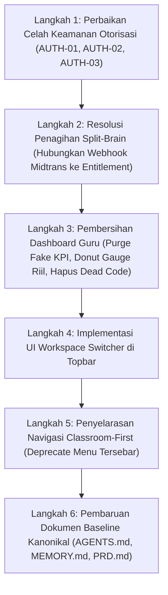

# STAGE 09 — PRODUCT BLUEPRINT VS CODE REALITY AUDIT
## Ruang Pintar — Audit Kesenjangan Dokumen Produk, Arsitektur, Implementasi Kode, dan Pengujian

**Versi Dokumen:** 1.0  
**Tanggal Audit:** 23 September 2026  
**Status Evaluasi:** READY FOR HUMAN REVIEW  
**Metodologi:** Static Code Inspection, Schema & Migration Audit, Authorization Trace, Navigation & Screen Mapping, Test Reality Verification  
**Aturan Status:** *VERIFIED | PARTIAL | MISSING | CONFLICT | UNKNOWN* (Tanpa deklarasi APPROVED / LOCKED / PRODUCTION READY)

---

# 1. Executive Summary

Audit komprehensif ini dilakukan untuk memverifikasi keselarasan antara **hasil discovery & blueprint produk Stage 01–08** (Product Strategy, SaaS Architecture, Workspace, Membership, Governance, Teacher Journey, Classroom First, Role Experience, Information Architecture, Navigation, Screen Architecture, UX Blueprint) terhadap **kondisi aktual kode, skema database, otorisasi, dan test suite** di dalam repository Ruang Pintar.

### Ringkasan Temuan Utama:

1. **Divergensi Arsitektur Tenancy (Conflict Fundamental):**  
   Dokumen baseline (`AGENTS.md`, `MEMORY.md`, `PRD.md`, `BRD.md`, `05-SYSTEM-ARCHITECTURE.md`) masih mengunci asumsi *"Single-school-per-deployment"*. Sementara itu, Stage 01–08 menetapkan arsitektur *"SaaS Multi-Tenant Shared-Schema"* dengan abstraksi **Unified Workspace** (*Personal Workspace* untuk Guru Mandiri dan *School Workspace* untuk Institusi). Di level kode, implementasi baru mencapai tahap transisi parsial (`Phase SAAS-04`): entitas `KeanggotaanSekolah` dan `LanggananTenant` telah dibuat di Prisma schema, namun **belum ada entitas `Workspace`**, **belum ada dukungan `Personal Workspace`**, dan seluruh tabel domain akademik masih mengikat langsung ke `sekolah_id`.
2. **Kesenjangan Model Subscription & Billing (Split-Brain Model):**  
   Terjadi konflik arsitektur fatal antara Phase 23 (Monetisasi Guru Pro) dan Phase SAAS-04 (Multi-Tenant Entitlement). Phase 23 menempelkan lisensi berbayar pada `Pengguna` (`Pengguna.tipe_lisensi = "PRO"`) melalui webhook Midtrans. Sebaliknya, evaluasi akses mutasi runtime (`TenantEntitlementService`) memeriksa model `LanggananTenant` yang menempel pada `Sekolah`. Akibatnya, **ketika seorang guru membayar paket Guru Pro Rp 15.000 via QRIS, `LanggananTenant` tidak pernah diperbarui**, sehingga bila masa trial sekolah berakhir, guru tersebut tetap terkunci dalam mode *READ_ONLY*.
3. **Celah Keamanan Scope Otorisasi (Cross-Tenant & Unscoped Queries):**  
   Ditemukan celah otorisasi kritis pada Server Actions. Pada `saveSessionAttendanceAction` (`src/app/actions/attendance-actions.ts`), input `sekolah_id` diterima mentah dari klien tanpa validasi bahwa actor berhak atas sekolah tersebut jika peran actor adalah `SCHOOL_STAFF`. Selain itu, pada `authz-guard.ts`, pemuatan profil `Guru` dan `PenugasanJabatan` (`findFirst({ where: { pengguna_id } })`) tidak memfilter `sekolah_id`, sehingga guru/staf yang berpindah tenant berisiko mewarisi hak akses dari sekolah sebelumnya.
4. **Teacher Cockpit vs Slogan "Anti-Fake KPI":**  
   Komponen `TeacherDashboard` telah mengadopsi layout Academic Glass UI yang rapi, namun melanggar aturan *"Dilarang Fake KPI"* dan *"0 is 0"*: terdapat nilai fallback palsu (rata-rata kelas 88.0/85.0 jika belum ada data), nilai persentase Donut Gauge di-hardcode (100% untuk Siswa Hadir dan Jurnal Diisi), antrean perhatian (`AttentionQueueCard`) dipanggil dengan data kosong `items={[]}`, dan fitur *Time-Aware Contextual Cockpit* (adaptasi pagi/siang/sore) belum diimplementasikan sama sekali.
5. **Classroom-First vs Redundansi Navigasi:**  
   Filosofi *Classroom-First* telah terimplementasi dengan sangat baik di dalam rute `/kelas-saya/[id]` melalui 9 sub-tab terpadu. Namun, navigasi global masih mempertahankan menu modul konvensional (`/presensi-kelas`, `/penilaian`, `/sesi-pembelajaran`) yang memaksa guru memilih ulang rombel. Tombol "Presensi Kilat 15 Detik" di Teacher Dashboard justru mengarahkan guru keluar ke `/presensi-kelas` alih-alih membuka modal/bottom-sheet instan.
6. **Kenyataan Pengujian (Test Suite Reality):**  
   Meskipun 99 file test (538 tes) berhasil lulus (*PASS*), cakupan pengujian untuk SaaS Multi-Tenancy sangat tipis (hanya 1 file pengujian unit dengan mock `vi.spyOn`). Belum ada pengujian integrasi database nyata untuk isolasi lintas-tenant, pergantian workspace (*workspace switching*), penegakan kuota, maupun alur Classroom-First terpadu.

---

# 2. Product vs Code Consistency (AUDIT AREA 01)

Perbandingan antara keputusan terbaru Stage 01–08 dengan dokumen kanonikal baseline repository.

| Area Kebijakan | Dokumen Baseline (`AGENTS.md`, `MEMORY.md`, `PRD.md`, `05-SYS`) | Blueprint Stage 01–08 (`WORKSPACE`, `ADR-001/002/003`, `SAAS`) | Realitas Kode Aktual (`src/`, `prisma/`) | Klasifikasi |
| :--- | :--- | :--- | :--- | :---: |
| **Model Deployment** | *Single-school-per-deployment* (satu sekolah satu instalasi server & DB). | *Multi-tenant SaaS, Shared Database Shared Schema*. | Shared SQLite Database dengan kolom `sekolah_id` di setiap tabel domain. | **CONFLICT** |
| **Batas Tenant (Boundary Root)** | Batas adalah `Sekolah` (School ID). | Batas adalah `Workspace` (*Personal* dan *School*). | Batas masih kaku pada `Sekolah` (`model Sekolah`). Model `Workspace` tidak ada. | **CONFLICT / OUTDATED** |
| **Identitas & Peran** | Role melekat pada pengguna (`Pengguna.peran_dasar`: 5 base roles). | Role melekat pada `Membership` per workspace; User adalah identitas global. | `Pengguna.peran_dasar` masih ada; `KeanggotaanSekolah.peran_dasar_di_tenant` ada di skema tapi diabaikan di sebagian UI. | **CONFLICT** |
| **Subscription & Lisensi** | Per-sekolah; asumsi on-premise / deployment mandiri. | Per-Workspace (*Personal Free/Pro*, *School Pro/Enterprise*). | `Pengguna.tipe_lisensi` + `TransaksiLangganan` vs `LanggananTenant` (Dual/Split-brain). | **CONFLICT** |
| **Pola Navigasi Guru** | *Module-First* (Menu Presensi, Menu Penilaian, Menu Jadwal). | *Classroom-First* (Masuk Kelas $\rightarrow$ seluruh aktivitas di dalam tab kelas). | Hybrid: `/kelas-saya/[id]` memiliki 9 tab lengkap, namun rute terpisah (`/presensi-kelas`, `/penilaian`) masih ada. | **PARTIAL** |
| **Sistem Desain UI** | Academic Glass UI v1.2, Tailwind CSS, Base UI/shadcn. | Academic Glass UI v1.2, Mobile-First Thumb Zone, No Fake KPI. | Academic Glass UI terpasang, namun FAB belum ada dan fake KPI masih ditemukan. | **PARTIAL** |
| **Peran & Batasan AI** | AI sebagai *scoped assistant*, server-side, verifikasi manusia. | Context-aware Classroom Copilot, Vision AI, Paper Correction Scanner. | Vision AI & CBT Studio bertenaga Gemini aktif dengan fallback simulator; Scanner LJK belum ada. | **PARTIAL** |
| **Invariant Akademik** | Invariant 6 pilar (Student $\neq$ Enrollment, Teacher $\neq$ Subject, dsb). | Tetap ditegakkan sepenuhnya dalam domain model. | Domain model di `src/modules/*` konsisten memisahkan entitas sesuai invariant. | **CONSISTENT** |

### Rangkuman Inkonsistensi Dokumen:
- **Dokumen Baseline Ketinggalan Zaman (OUTDATED):** `AGENTS.md` (bagian 3), `MEMORY.md` (bagian 1 & 4), `docs/PRD.md`, `docs/BRD.md`, `docs/FRD.md`, dan `docs/05-SYSTEM-ARCHITECTURE.md` masih mencantumkan *"Deployment: Single-school-per-deployment"* dan *"Bukan shared-schema SaaS baseline"*. Hal ini bertentangan secara langsung dengan `docs/adr/ADR-001-SAAS-MULTI-TENANT-FOUNDATION.md` dan `docs/WORKSPACE-ARCHITECTURE-RECOMMENDATION.md`.
- **Rekomendasi:** Perlu dilakukan sinkronisasi menyeluruh pada dokumen baseline setelah Stage 09 disetujui, mencabut klausa *single-school-per-deployment* dan memperbarui status kanonikal menjadi *Multi-Tenant SaaS with Unified Workspace*.

---

# 3. Workspace Architecture Audit (AUDIT AREA 02)

Verifikasi apakah implementasi kode saat ini mendukung rantai relasi:  
**`User → Membership → Workspace → Active Workspace`**

### Evaluasi 6 Pertanyaan Kritis:

#### 1. Apakah Workspace sudah benar-benar menjadi boundary data?
- **Status:** **MISSING** (Secara Abstraksi Workspace) / **PARTIAL** (Tersedia sebagai Tenant Sekolah).
- **File:** `prisma/schema.prisma` (baris 11–89, baris 314–358).
- **Evidence:** Tidak terdapat model `Workspace` di dalam skema Prisma. Seluruh tabel data akademik (`Rombel`, `Guru`, `MataPelajaran`, `JadwalPelajaran`, `SesiKelasAktual`, `PresensiSesiKelas`, `NilaiSiswa`) menggunakan kolom `sekolah_id`, bukan `workspace_id`.
- **Dampak:** Ruang kerja terikat secara eksklusif pada institusi sekolah formal. Konsep ruang kerja mandiri untuk guru freelance/les privat tidak dapat berjalan tanpa membuat data sekolah palsu.

#### 2. Apakah Personal Workspace sudah ada di kode?
- **Status:** **MISSING**.
- **File:** `src/` (seluruh repositori).
- **Evidence:** Pencarian pola string `PersonalWorkspace`, `ruang-kerja-pribadi`, maupun `tipe_workspace` menghasilkan 0 kecocokan di seluruh berkas `.ts` dan `.tsx`.
- **Dampak:** Guru mandiri yang mendaftar aplikasi tanpa terafiliasi dengan sekolah resmi tidak memiliki tempat kerja data dan dipaksa bergabung atau membuat entitas sekolah baru.

#### 3. Apakah School Workspace sudah ada di kode?
- **Status:** **PARTIAL** (Hadir sebagai entitas `Sekolah`).
- **File:** `prisma/schema.prisma` (baris 11–89), `src/modules/school/`.
- **Evidence:** Entitas `Sekolah` mewakili institusi sekolah dengan data legal (NPSN, alamat, jenjang). Namun entitas ini belum diposisikan sebagai varian dari `Workspace` generik bertipe `SCHOOL`.

#### 4. Apakah Membership benar-benar digunakan di dalam logika aplikasi?
- **Status:** **PARTIAL**.
- **File:**  
  - `src/shared/infrastructure/auth/auth-service.ts` (baris 169–175, baris 268–271)
  - `src/shared/infrastructure/tenant/tenant-context.ts` (baris 23–55)
  - `src/shared/infrastructure/tenant/tenant-membership-service.ts` (baris 13–66)
- **Evidence:**  
  Model `KeanggotaanSekolah` digunakan saat login untuk memilih sekolah aktif jika keanggotaan aktif tepat berjumlah 1 (`auth-service.ts:169`), dan untuk memvalidasi bahwa sesi browser terhubung ke membership berstatus `ACTIVE` (`tenant-context.ts:45`). Namun, di level modul domain (seperti `TeacherRepository`, `StudentRepository`, `AttendanceService`), pengecekan akses masih langsung mencocokkan `user.sekolah_id` terhadap tabel profil `Guru` atau `Siswa`, mengabaikan atribut keanggotaan seperti `is_owner` atau tanggal berlaku membership.

#### 5. Apakah Multi-Workspace / Multi-Tenant sudah benar-benar berjalan?
- **Status:** **PARTIAL** (Backend Siap, Frontend Terputus).
- **File:**  
  - `src/app/actions/tenant-actions.ts` (baris 12–29)
  - `src/shared/components/shell/topbar.tsx` (baris 33–92)
  - `src/shared/components/shell/user-menu.tsx` (baris 23–120)
- **Evidence:** Server Action `switchActiveTenantAction(sekolahId)` telah diimplementasikan secara aman dan server-authoritative (`tenant-actions.ts:12`). Namun, **tidak ada satu pun komponen UI (Dropdown, Popover, Switcher) di Topbar, Sidebar, maupun UserMenu yang memanggil action ini**. Pengguna yang memiliki 2 keanggotaan sekolah tidak memiliki cara visual untuk berpindah sekolah selain memanipulasi database secara manual.

#### 6. Apakah Active Workspace disimpan secara Server-Authoritative?
- **Status:** **VERIFIED**.
- **File:**  
  - `prisma/schema.prisma` (baris 293: `sekolah_aktif_id String?` pada `SesiPengguna`)
  - `src/shared/infrastructure/auth/auth-service.ts` (baris 268–287)
  - `src/shared/infrastructure/tenant/tenant-membership-service.ts` (baris 36–65)
- **Evidence:** State sekolah aktif disimpan langsung di tabel `sesi_pengguna` pada kolom `sekolah_aktif_id`. Setiap request browser divalidasi melalui token hash sesi yang mencocokkan membership aktif di database. Klien tidak dapat mengubah sekolah aktif dengan mengedit parameter URL atau payload cookies secara sepihak.

---

# 4. Multi Membership & Authorization Audit (AUDIT AREA 03)

Verifikasi implementasi rantai akses:  
**`User → role/position/assignment → permission → resource scope → effective access`**

### Evaluasi Keterikatan Peran (Role Binding):
- Di `schema.prisma:241`, tabel `pengguna` masih memiliki kolom `peran_dasar String`.
- Di `schema.prisma:318`, tabel `keanggotaan_sekolah` memiliki `peran_dasar_di_tenant String`.
- Di `auth-service.ts:270`, sistem menggunakan fallback:
  ```typescript
  const effectiveRole = tenantContext?.peranDasar ?? session.pengguna.peran_dasar;
  ```
  Ini menunjukkan masa transisi di mana peran belum 100% independen dari pengguna.

### Matriks Temuan Otorisasi & Klasifikasi Risiko:

| ID Temuan | Komponen / Berkas | Bukti Kode (Evidence) | Dampak & Risiko | Klasifikasi | Rekomendasi |
| :--- | :--- | :--- | :--- | :---: | :---: |
| **AUTH-01** | `src/app/actions/attendance-actions.ts`<br>`src/modules/attendance/application/attendance-service.ts` | Baris 44–74 pada `attendance-service.ts`: Pengecekan otorisasi guru memeriksa `validated.sekolah_id`, namun jika role adalah `SCHOOL_STAFF`, kode melompat langsung ke repositori tanpa memeriksa apakah staf tersebut terdaftar di `validated.sekolah_id`. | **Cross-Tenant Data Tampering:** Staf dari Sekolah A dapat mengirimkan payload presensi untuk sesi di Sekolah B jika mengetahui ID sesinya. | **CRITICAL** | Paksa `validated.sekolah_id = user.sekolah_id` di server action; jangan pernah mempercayai `sekolah_id` dari client input. |
| **AUTH-02** | `src/shared/infrastructure/authorization/authz-guard.ts` | Baris 40: `prisma.guru.findFirst({ where: { pengguna_id: user.id } })` dan Baris 101: `prisma.penugasanJabatan.findMany({ where: { personil_id: user.id } })` tidak menyertakan filter `sekolah_id`. | **Role/Assignment Leakage:** Guru/staf yang mengajar di Sekolah A dan B akan mengevaluasi hak jabatan/penugasan dari Sekolah A saat sedang aktif membuka Sekolah B. | **CRITICAL** | Tambahkan klausul `sekolah_id: user.sekolah_id` pada seluruh pencarian profil guru dan penugasan jabatan di `buildEvaluationContext`. |
| **AUTH-03** | `src/app/actions/teacher-actions.ts` | Baris 69: `const effectiveSekolahId = session.sekolah_id \|\| formData.get("sekolah_id")?.toString();` | **Client Input Privilege Escalation:** Pengguna tanpa sekolah aktif dapat menyuntikkan `sekolah_id` sembarang melalui form data. | **HIGH** | Hapus fallback ke `formData.get("sekolah_id")`. Wajibkan `session.sekolah_id` selalu ada dari sesi tervalidasi. |
| **AUTH-04** | `src/app/guru-pengajaran/page.tsx` | Baris 77–79: `const effectiveSekolahId = isSuperAdmin ? (searchParams?.sekolahId ?? user.sekolah_id) : user.sekolah_id;` | **Bypass Server-Authoritative Tenant Session:** Super Admin dapat mengakses data sekolah via URL query param tanpa tercatat dalam audit pergantian sesi tenant. | **HIGH** | Alihkan pergantian sekolah Super Admin melalui jalur sesi resmi `switchActiveTenantAction`. |
| **AUTH-05** | `src/shared/components/shell/` (`sidebar.tsx`, `topbar.tsx`, `mobile-bottom-nav.tsx`) | Komponen layout UI membaca `user.peran_dasar` secara langsung untuk menentukan menu yang tampil. | **Inconsistent UI on Multi-Role:** Pengguna yang menjadi Guru di Sekolah A dan Staf di Sekolah B berisiko melihat menu yang salah jika peran sesi aktif tidak tersinkronisasi sempurna. | **MEDIUM** | Pastikan seluruh navigasi UI merender peran dari `user.peran_dasar` yang telah dioverride oleh `tenantContext.peranDasar`. |
| **AUTH-06** | `src/app/kelas-saya/page.tsx`<br>`src/app/kelas-saya/[id]/page.tsx` | Baris 23 & 32: `await requirePermission("learning.material.view");` dipanggil tanpa menyertakan argumen `resource: { sekolah_id }`. | **Unscoped Permission Check:** Engine otorisasi hanya memvalidasi apakah peran dasar memiliki izin, tanpa memverifikasi isolasi tenant di level evaluator izin. | **LOW** | Teruskan `{ sekolah_id: user.sekolah_id }` sebagai argumen kedua pada seluruh pemanggilan `requirePermission`. |

---

# 5. Subscription & Billing Audit (AUDIT AREA 04)

Verifikasi keterikatan subscription (User vs School vs Workspace) dan audit keselarasan implementasi Phase 23 terhadap arsitektur SaaS multi-tenant.

### Analisis Keterikatan Entitas:
```text
Keputusan Blueprint Stage 01:     Subscription  ──>  Workspace
Implementasi Phase SAAS-04:       Subscription  ──>  Sekolah (LanggananTenant)
Implementasi Phase 23 (Aktual):   Subscription  ──>  Pengguna (Pengguna.tipe_lisensi)
```

### Temuan Audit Penagihan:

1. **Split-Brain Entitlement (Konflik Kritis):**
   - **File:** `src/modules/billing/application/subscription-service.ts` (baris 160–166) vs `src/shared/infrastructure/tenant/tenant-entitlement-service.ts` (baris 26–39).
   - **Evidence:**  
     Saat webhook pembayaran Midtrans sukses (`subscription-service.ts:160`), sistem mengeksekusi:
     ```typescript
     await prisma.pengguna.update({
       where: { id: order.pengguna_id },
       data: { tipe_lisensi: "PRO", trial_berakhir_pada: extendedExpiry }
     });
     ```
     Sistem **sama sekali tidak menyentuh atau memperbarui tabel `langganan_tenant`**.
     Sementara itu, gate mutasi sistem (`tenant-entitlement-service.ts:26`) mengecek:
     ```typescript
     const subscription = await prisma.langgananTenant.findFirst({
       where: { sekolah_id: sekolahId }
     });
     ```
   - **Dampak Kritis:** Guru yang telah membayar Rp 15.000 untuk lisensi Guru Pro akan mendapati akunnya tetap terkena error `TenantReadOnlyError` ("Langganan sekolah tidak aktif") saat masa trial sekolah berakhir, karena status di level tenant tetap kedaluwarsa.
2. **Pricing & Durasi Hard-Coded:**
   - **File:** `src/modules/billing/application/subscription-service.ts` (baris 30), `src/modules/billing/presentation/subscription-checkout-modal.tsx` (baris 179, 221, 307).
   - **Evidence:** Nominal harga Rp 15.000 di-hardcode di dalam service layer (`const pricePerMonth = 15000;`) dan di dalam teks komponen UI.
   - **Dampak:** Perubahan skema diskon, promo tahunan (misal: Rp 150.000/tahun), atau penyesuaian harga memerlukan rilis kode baru.
3. **Ketiadaan Jalur Penagihan Sekolah (BOS / Invoice):**
   - **File:** `src/modules/school/presentation/school-proposal-modal.tsx`.
   - **Evidence:** Fitur penagihan sekolah saat ini hanya berupa generator dokumen cetak PDF usulan ke Kepala Sekolah. Belum ada alur pemesanan lisensi institusi sekolah, penerbitan invoice resmi, BAST, maupun rekonsiliasi pembayaran transfer bank resmi sekolah.
4. **Status Komponen Siklus Langganan:**
   - *Trial:* **PARTIAL** (Tersedia kolom `trial_berakhir_pada` di `Pengguna` dan `Sekolah`, serta status `TRIAL_ACTIVE` di `LanggananTenant`).
   - *Free Tier:* **PARTIAL** (Tersedia badge FREEMIUM, namun kuota batasan free tier belum ditegakkan di level database).
   - *Pro Teacher:* **PARTIAL** (Checkout Midtrans QRIS berjalan, namun status hanya tersimpan di entitas `Pengguna`).
   - *School Subscription:* **MISSING** (Hanya draft proposal, belum ada pemrosesan transaksi).
   - *Expiry & Grace Period:* **PARTIAL** (Deteksi expiry otomatis di `getTenantEntitlement`, namun grace period 7 hari belum dihitung).
   - *Read-Only Enforcement:* **VERIFIED** (`requireTenantMutationEntitlement` memblokir mutasi secara server-side jika status `READ_ONLY`).

---

# 6. Teacher Cockpit Audit (AUDIT AREA 05)

Verifikasi implementasi aktual pada `src/shared/components/dashboard/role-views/teacher-dashboard.tsx` terhadap spesifikasi `docs/TEACHER-COCKPIT-DESIGN.md`.

| Persyaratan Desain Cockpit | Status Implementasi | Bukti Kode (Evidence) | Analisis Kesenjangan |
| :--- | :---: | :--- | :--- |
| **Hero Active Class** | **PARTIAL** | `teacher-dashboard.tsx` (baris 183–224) | Hero card hadir dengan ilustrasi maskot astronot 3D dan sapaan nama guru. Namun belum menampilkan kartu kelas aktif yang "menyala" (*glowing*) saat jam KBM berlangsung. |
| **Jadwal Hari Ini Ringkas** | **IMPLEMENTED** | `teacher-dashboard.tsx` (baris 315–320), `teaching-timeline-rail.tsx` | Jadwal dimuat melalui `scheduleService.listTeacherSchedule` dan digabung blok jamnya secara rapi via `mergeConsecutiveScheduleEntries`. |
| **Sesi Terdekat (Next Class)** | **IMPLEMENTED** | `teacher-dashboard.tsx` (baris 160, 202–204) | Menghitung sesi terdekat hari ini secara otomatis beserta jam mulai dan nama rombel. |
| **Tombol Presensi Kilat 15 Detik** | **PARTIAL** | `teacher-hero-actions.tsx` (baris 11–17) | Tombol ada di Hero, tetapi berupa tag `<Link href="/presensi-kelas">` yang mengarahkan guru ke halaman tabel terpisah. **Bukan modal pop-up 15 detik** di tempat sesuai blueprint. |
| **Tombol Buka Kelas Sekarang** | **MISSING** | `teacher-hero-actions.tsx` (baris 7–29) | Tombol sakti `[ Buka Kelas Sekarang > ]` yang seharusnya langsung membuka `/kelas-saya/[id]` untuk sesi aktif tidak ada di dalam `TeacherHeroActions`. |
| **Antrean Perhatian (Attention Queue)** | **CONFLICT** | `teacher-dashboard.tsx` (baris 310) | Komponen `<AttentionQueueCard />` dipanggil tanpa props `items` (default `items={[]}`). Akibatnya, tampilan selalu menampilkan kartu kosong ("Semua Siswa Terpantau Optimal") tanpa mengevaluasi data siswa bermasalah secara riil. |
| **Cockpit Sadar Waktu (Time-Aware)** | **MISSING** | `teacher-dashboard.tsx` (seluruh berkas) | Tidak ada logika kondisional berbasis waktu (`PAGI 06:30-07:15`, `SIANG 07:15-14:00`, `SORE 14:00-21:00`). Tampilan bersifat statis sepanjang hari. |
| **Bebas Fake KPI & Angka Riil (0 is 0)** | **CONFLICT** | `teacher-dashboard.tsx` (baris 119, 283, 298, 300) | Melanggar aturan *"Dilarang Fake KPI"*: Baris 119 memberikan fallback nilai rata-rata kelas palsu: `(o.total_published > 0 ? 88.0 : 85.0)`. Donut Gauge baris 283 & 300 di-hardcode `percentage={100}`, dan baris 298 di-hardcode `percentage={0}`. |
| **Entry Point Classroom-First** | **PARTIAL** | `teacher-hero-actions.tsx` | Aksi hero mengarahkan pengguna ke `/presensi-kelas` dan `/sesi-pembelajaran`, bukan mengarahkan pengguna ke ruang kelas aktif `/kelas-saya/[id]`. |

---

# 7. Classroom-First Audit (AUDIT AREA 06)

Verifikasi apakah implementasi menggunakan filosofi **`Kelas → Aktivitas`** atau masih terjebak pada pola lama **`Menu → Modul → Pilih Ulang Kelas`**.

### Realitas Implementasi:
1. **Keberhasilan di Rute `/kelas-saya/[id]` (VERIFIED):**  
   Halaman workspace kelas (`src/modules/learning/presentation/class-workspace-view.tsx`) telah mengimplementasikan konsep Classroom-First secara sangat komprehensif. Di dalam satu rute ini, guru dapat mengakses 9 tab operasional tanpa berpindah rute:
   - `RINGKASAN`: Identitas rombel, jam mengajar, dan progres kurikulum.
   - `JADWAL`: Jadwal spesifik untuk kelas dan mapel ini.
   - `BAB_TP`: Manajemen Capaian Pembelajaran, Lingkup Materi, dan Tujuan Pembelajaran.
   - `MATERI`: Distribusi materi bacaan dan lampiran dokumen.
   - `JURNAL`: Pencatatan jurnal harian mengajar dan refleksi guru.
   - `TUGAS`: Pembuatan tugas, deadline, dan pemeriksaan jawaban siswa.
   - `PRESENSI`: Sesi kehadiran per pertemuan dan rekapitulasi kehadiran rombel.
   - `PENILAIAN`: Matriks nilai formatif, sumatif, KKTP, dan leger sementara.
   - `CBT`: Pelaksanaan dan monitoring ujian online untuk kelas tersebut.
2. **Kelemahan & Redundansi Navigasi Global (CONFLICT):**  
   Meskipun `/kelas-saya/[id]` sudah lengkap, repositori masih menyediakan dan mempromosikan rute modul terpisah di navigasi utama:
   - `/presensi-kelas`: Menampilkan daftar seluruh rombel untuk dipilih ulang.
   - `/penilaian`: Menampilkan tabel ringkasan guru yang ujung-ujungnya hanya berisi tautan kembali ke `/kelas-saya/[id]?tab=PENILAIAN`.
   - `/sesi-pembelajaran`: Menampilkan kalender pertemuan KBM terpisah.
   - `/cbt-ujian`: Manajemen ujian daring terpisah.
3. **Analisis Context Switching:**  
   Guru yang ingin mengisi presensi dan langsung mencatat jurnal terdorong untuk membuka `/presensi-kelas` (pilih kelas $\rightarrow$ isi presensi), lalu kembali ke menu dan membuka `/sesi-pembelajaran` (pilih kelas lagi $\rightarrow$ isi jurnal). Ini menimbulkan **beban perpindahan konteks (*context switching*) yang tidak perlu**, padahal kedua fungsi tersebut sudah tersedia berdampingan di `/kelas-saya/[id]`.

---

# 8. Navigation Audit (AUDIT AREA 07)

Perbandingan antara spesifikasi dokumen navigasi (`INFORMATION-ARCHITECTURE.md`, `TEACHER-NAVIGATION-SYSTEM.md`, `ROLE-BASED-NAVIGATION.md`, `MOBILE-NAVIGATION-SYSTEM.md`) dengan kode aktual.

### Analisis Komponen Navigasi:

1. **Desktop Sidebar (`src/shared/components/shell/sidebar.tsx`):**
   - *Status:* **PARTIAL**.
   - *Evaluasi:* Desain Academic Glass UI dengan gradien biru elegan telah diterapkan. Filter berbasis peran (`getFilteredNavigation`) berjalan. Namun, daftar item menu untuk guru masih memuat rute terfragmentasi (*Presensi Kelas*, *Penilaian*, *Sesi Pembelajaran*). Belum mencerminkan simplifikasi radikal 4 menu guru sesuai blueprint: `[ Cockpit Mengajar, Kelas Saya, Jadwal Saya, Bank Soal/Asesmen ]`.
2. **Topbar (`src/shared/components/shell/topbar.tsx`):**
   - *Status:* **CONFLICT / MISSING CAPABILITY**.
   - *Evaluasi:* Topbar memuat tombol ciutkan sidebar, tombol tema, notifikasi, dan avatar profil. Namun, **komponen penanda konteks sekolah aktif dan pemilih workspace (`Workspace Switcher`) sama sekali tidak ada**.
3. **Mobile Bottom Navigation (`src/shared/components/shell/mobile-bottom-nav.tsx`):**
   - *Status:* **PARTIAL**.
   - *Evaluasi:*
     - Navigasi bawah smartphone terpasang dengan target sentuh memadai (`min-h-[48px]`) dan `safe-area-inset-bottom`.
     - Susunan tab Guru saat ini: `[ Beranda, Jadwal, Kelas, Sesi KBM, Menu ]` (Blueprint merekomendasikan: `[ Beranda, Kelas Saya, Jadwal, Profil ]` tanpa tombol menu ganda).
     - Susunan tab Siswa saat ini: `[ Beranda, Jadwal, Kalender, Menu ]` (Blueprint merekomendasikan: `[ Belajar, Tugas, CBT, e-Rapor ]`).
     - Susunan tab Wali Murid saat ini: `[ Beranda, Presensi, Nilai, Menu ]` (Blueprint merekomendasikan: `[ Kehadiran, Tugas & PR, Nilai, Izin ]`).
4. **Floating Action Button (FAB):**
   - *Status:* **MISSING**.
   - *Evaluasi:* Tombol melayang cepat `[ ⚡ Presensi Kilat / Foto Absen ]` di area jempol kanan bawah mobile belum diimplementasikan di komponen shell mana pun.
5. **Role & Workspace Switching:**
   - *Status:* **MISSING DI UI**.
   - *Evaluasi:* Backend Server Action ada di `src/app/actions/tenant-actions.ts`, namun tidak ada antarmuka pengguna untuk memicu pergantian konteks.

---

# 9. Screen Inventory Audit (AUDIT AREA 08)

Audit terhadap **28 Layar Utama** yang tercantum pada `docs/SCREEN-INVENTORY.md` dibandingkan dengan rute dan komponen aktual di `src/app/`.

| ID Layar | Nama Layar Blueprint | Rute Kode Aktual | Status | Evaluasi & Kesenjangan |
| :--- | :--- | :--- | :---: | :--- |
| `SCR-TCH-01` | Teacher Cockpit | `/dashboard` | **PARTIAL** | Hero card ada, jadwal ada; fake KPI rata-rata kelas & donut gauge perlu dibersihkan; time-aware context belum aktif. |
| `SCR-TCH-02` | Direktori Kelas Saya | `/kelas-saya` | **IMPLEMENTED** | Menampilkan daftar seluruh rombel yang diampu beserta indikator kurikulum. |
| `SCR-TCH-03` | Classroom Workspace Hub | `/kelas-saya/[id]` | **IMPLEMENTED** | Memiliki 9 tab operasional kelas terpadu. |
| `SCR-TCH-04` | Modal Presensi Kilat 15 Detik | `/presensi-kelas` (redirect) | **PARTIAL** | Hanya tersedia komponen modal terpisah; klik hero masih me-redirect ke halaman tabel penuh. |
| `SCR-TCH-05` | Lembar Jurnal KBM & Refleksi | `/kelas-saya/[id]?tab=JURNAL` | **IMPLEMENTED** | Modal dan tab pencatatan jurnal KBM berjalan lancar. |
| `SCR-TCH-06` | Manajemen Tugas & Pengumpulan | `/kelas-saya/[id]?tab=TUGAS` | **IMPLEMENTED** | Pembuatan penugasan, batas waktu, dan unduh berkas siswa berjalan. |
| `SCR-TCH-07` | Buku Nilai & Gradebook Matrix | `/kelas-saya/[id]?tab=PENILAIAN` | **IMPLEMENTED** | Matriks nilai formatif/sumatif dengan perhitungan rata-rata dan ketercapaian KKTP. |
| `SCR-TCH-08` | Jadwal Mengajar Saya | `/jadwal-saya` | **IMPLEMENTED** | Tampilan jadwal mingguan guru berbasis kartu responsif. |
| `SCR-TCH-09` | Bank Soal & Asesmen Guru | `/cbt-ujian`, `/asisten-ai` | **PARTIAL** | Fitur bank soal tersebar antara modul CBT dan Studio AI; belum ada layar repositori bank soal tunggal. |
| `SCR-TCH-10` | AI Paper Correction Scanner | *-* | **MISSING** | Antarmuka kamera pemindai LJK fisik fotokopi belum ada di kode (Document Only). |
| `SCR-HMR-01` | Homeroom Cockpit (Radar Rombel) | `/wali-kelas` | **IMPLEMENTED** | Rekap absensi harian 36 siswa rombel binaan dan catatan kasus. |
| `SCR-HMR-02` | Radar Kesiapan Leger Rapor | `/wali-kelas`, `/rapor-siswa` | **PARTIAL** | Progres kelengkapan nilai mapel dapat dilihat, namun belum berwujud radar matriks 12 mapel. |
| `SCR-HMR-03` | Lembar Catatan Sikap & e-Rapor | `/rapor-siswa` | **IMPLEMENTED** | Input narasi capaian kompetensi, catatan wali kelas, dan cetak rapor format resmi. |
| `SCR-OPS-01` | Operator Command Center | `/dashboard` (Staf/Admin) | **IMPLEMENTED** | Metrik kelengkapan data siswa, guru, rombel, dan log audit mutasi. |
| `SCR-OPS-02` | Master Rombel & Plotting Siswa | `/struktur-akademik`, `/data-siswa` | **IMPLEMENTED** | Penempatan siswa per rombel dan penugasan wali kelas. |
| `SCR-OPS-03` | Master Guru & Penugasan SK | `/guru-pengajaran` | **IMPLEMENTED** | Pendataan profil guru, mapel, penugasan mengajar, dan beban jam mingguan. |
| `SCR-OPS-04` | Penyusun Jadwal Master | `/jadwal-sekolah` | **IMPLEMENTED** | Matriks alokasi jadwal mingguan sekolah dengan deteksi bentrok jam/guru/ruangan. |
| `SCR-OPS-05` | Proses Kenaikan Kelas & Kelulusan | *-* | **MISSING** | Wizard promosi kenaikan tingkat rombel massal dan kelulusan belum memiliki layar khusus. |
| `SCR-LDR-01` | Executive KBM Pulse Radar | `/pimpinan` | **IMPLEMENTED** | Radar pemantauan sesi kelas yang sedang berlangsung, guru izin, dan tingkat kehadiran sekolah. |
| `SCR-LDR-02` | Pusat Persetujuan (Approval Queue) | *-* | **MISSING** | Layar persetujuan izin dinas guru, disposisi cuti, dan pengajuan sarana belum dibuat. |
| `SCR-LDR-03` | Laporan Kepatuhan & Mutu | `/laporan-sekolah` | **IMPLEMENTED** | Rekapitulasi keterlaksanaan KBM, statistik kehadiran, dan ekspor data audit. |
| `SCR-STU-01` | Student Cockpit (Beranda Siswa) | `/dashboard` (Siswa) | **IMPLEMENTED** | Jadwal belajar hari ini, pengumuman sekolah, dan daftar tugas aktif. |
| `SCR-STU-02` | Portal Tugas & Lembar Kerja | `/tugas-siswa` | **IMPLEMENTED** | Daftar tugas belum selesai, instruksi materi, dan formulir unggah jawaban siswa. |
| `SCR-STU-03` | CBT Player Bebas Gangguan | `/cbt/[attemptId]` | **IMPLEMENTED** | Antarmuka ujian bebas shell navigasi, timer server, auto-save, dan navigasi butir soal. |
| `SCR-STU-04` | Radar Capaian KKTP & e-Rapor | `/tugas-siswa`, `/dashboard` | **PARTIAL** | Siswa dapat melihat nilai tugas, namun transkrip e-Rapor mandiri siswa belum memiliki layar terpisah. |
| `SCR-GRD-01` | Guardian Home (Pantau Anak) | `/dashboard` (Wali Murid) | **IMPLEMENTED** | Status kehadiran anak hari ini, pengumuman sekolah, dan ringkasan nilai terbaru. |
| `SCR-GRD-02` | Form Pengajuan Izin / Sakit | `/presensi-anak` (Modal) | **IMPLEMENTED** | Formulir unggah surat keterangan dokter dan pengajuan izin ke wali kelas. |
| `SCR-GRD-03` | Buku Perkembangan Nilai Anak | `/nilai-anak` | **IMPLEMENTED** | Transparansi nilai tugas, nilai asesmen formatif/sumatif, dan cetak rapor sementara. |
| `SCR-SET-01` | Pengaturan Workspace & Anggota | `/sekolah` | **PARTIAL** | Pengaturan identitas sekolah ada, namun tata kelola keanggotaan/undangan link belum ada. |
| `SCR-SET-02` | Pusat Tagihan & Lisensi Sekolah | `/panduan` (Proposal) | **PARTIAL** | Modal usulan BOS ada, modal checkout ada di dashboard, namun belum ada billing hub terpadu. |
| `SCR-SET-03` | Profil Pribadi & Keamanan Akun | `/profil`, `/ganti-password` | **IMPLEMENTED** | Ganti foto profil avatar, nomor telepon, dan ubah kata sandi akun. |

### Rute Tambahan di Kode yang Tidak Ada di 28 Layar Blueprint:
- `/asisten-ai`: Studio pembuatan RPP & soal AI (berdiri sendiri di luar Classroom Workspace).
- `/cbt-ujian`: Rute terpisah untuk daftar ujian CBT guru (duplikasi dari `/kelas-saya/[id]?tab=CBT`).
- `/presensi-kelas`: Rute modul presensi lama (duplikasi dari `/kelas-saya/[id]?tab=PRESENSI`).
- `/penilaian`: Rute modul penilaian lama (duplikasi dari `/kelas-saya/[id]?tab=PENILAIAN`).
- `/sesi-pembelajaran`: Rute modul sesi lama (duplikasi dari `/kelas-saya/[id]?tab=JURNAL`).
- `/cbt/cetak/[ujianId]`: Halaman cetak naskah soal fisik ATS/AAS format kertas (sangat bermanfaat untuk ujian luring).
- `/integrasi`: Konfigurasi webhook eksternal untuk sinkronisasi Dapodik/sistem luar.

---

# 10. Mobile Experience Audit (AUDIT AREA 09)

Verifikasi terhadap `docs/MOBILE-SCREEN-BLUEPRINT.md` dan `docs/MOBILE-NAVIGATION-SYSTEM.md`.

### Evaluasi Teknis:
1. **Dukungan Viewport (360px, 390px, 430px):**
   - **Status:** **VERIFIED**.
   - **Evidence:** Penggunaan class utility Tailwind (`w-full`, `max-w-md`, `sm:hidden`, `px-3 sm:px-6`) menjamin antarmuka tidak mengalami horizontal scroll pada lebar layar smartphone 360px (Samsung Galaxy A-series) hingga 430px (iPhone Pro Max).
2. **Aturan Tabel vs Kartu Responsif:**
   - **Status:** **VERIFIED**.
   - **Evidence:** Pada `src/modules/learning/presentation/teacher-classes-view.tsx` dan `src/modules/student/presentation/student-directory-view.tsx`, pada layar kecil (`sm:hidden`) tabel disembunyikan dan digantikan dengan tampilan *Card List* yang lapang dan nyaman dibaca.
3. **Touch Target Size:**
   - **Status:** **PARTIAL**.
   - **Evidence:** Tombol utama pada `MobileBottomNav` memiliki tinggi minimal 48px (`min-h-[48px]`). Namun, beberapa tombol aksi kecil di dalam tabel tab kelas (`ClassWorkspaceView`) masih berukuran 28–32px yang berisiko sulit ditekan jempol di smartphone.
4. **Floating Action Button (FAB):**
   - **Status:** **MISSING**.
   - **Evidence:** Tidak ditemukan implementasi komponen FAB di pojok kanan bawah mobile untuk presensi kilat.
5. **Mobile Bottom Sheet:**
   - **Status:** **MISSING**.
   - **Evidence:** Seluruh interaksi form di mobile masih menggunakan dialog modal pop-up tengah layar (`Dialog / Modal`), belum menggunakan komponen tarikan bawah (*Slide-Up Bottom Sheet*).
6. **Distraction-Free CBT Player:**
   - **Status:** **VERIFIED**.
   - **File:** `src/app/cbt/[attemptId]/page.tsx` (baris 65–75).
   - **Evidence:** Halaman pengerjaan ujian CBT siswa secara sengaja **tidak dibungkus oleh `AcademicShell`**, sehingga bilah navigasi bawah (*Bottom Nav*) dan bilah samping (*Sidebar*) tertutup 100%, memberikan layar penuh bebas gangguan untuk ujian.
7. **Offline Behavior:**
   - **Status:** **SIMULATED** (AI) / **MISSING** (App PWA).
   - **Evidence:** Layanan AI memiliki generator offline fallback, namun aplikasi belum memiliki Service Worker atau manifest PWA untuk mencatat presensi secara offline saat koneksi internet sekolah terputus.

---

# 11. AI Reality Audit (AUDIT AREA 10)

Verifikasi apakah kemampuan AI yang ada di kode berstatus riil, mock, parsial, atau sekadar dokumen.

| Fitur AI | File / Lokasi Kode | Status Realitas | Deskripsi & Bukti Implementasi |
| :--- | :--- | :---: | :--- |
| **Photo-to-Class Vision AI** | `src/modules/ai-assistant/infrastructure/gemini-vision-service.ts`<br>`src/modules/ai-assistant/application/smart-onboarding-service.ts` | **REAL + MOCK FALLBACK** | **Riil:** Menghubungi Google Gemini 1.5 Flash API (`generativelanguage.googleapis.com`) jika `GEMINI_API_KEY` terpasang.<br>**Simulator:** Jika API key kosong atau dijalankan dalam Vitest, mengembalikan 25 data siswa cadangan terkurasi (`FALLBACK_STUDENT_NAMES`). |
| **CBT Question & RPP AI Studio** | `src/modules/cbt/infrastructure/gemini-cbt-ai-service.ts`<br>`src/app/asisten-ai/page.tsx` | **REAL + MOCK FALLBACK** | **Riil:** Menghasilkan butir soal PG, Menjodohkan, Esai, dan Modul Ajar Kurikulum Merdeka via Gemini API.<br>**Simulator:** Algoritma generator lokal berbasis template taksonomi Bloom jika jaringan terputus. |
| **AI In-App Assistant** | `src/modules/ai/presentation/ai-teacher-studio-view.tsx` | **REAL** | Antarmuka interaktif guru untuk menyusun bahan ajar, dilengkapi pratinjau kartu soal dan tombol *"Simpan ke Bank Soal"*. |
| **AI Paper Correction Scanner (SCR-TCH-10)** | `docs/AI-ASSESSMENT-SUITE-PROPOSAL.md`<br>`docs/SCREEN-INVENTORY.md` | **DOCUMENT ONLY** | Fitur koreksi LJK kertas fotokopi berbasis kamera ponsel baru sebatas proposal arsitektur; belum ada baris kode atau model OCR di repository. |
| **Context-Aware Classroom Copilot** | `docs/AI-CLASSROOM-ASSISTANT.md`<br>`docs/CLASSROOM-FIRST-DESIGN.md` | **DOCUMENT ONLY** | Asisten AI yang otomatis membaca konteks TP dan histori siswa rombel di `/kelas-saya/[id]` belum terintegrasi di dalam tab kelas. |

---

# 12. Test Reality Audit (AUDIT AREA 11)

Audit mendalam terhadap integritas dan validitas 99 berkas pengujian Vitest (`src/test/`).

### Analisis Kualitas & Kedalaman Pengujian:

1. **SaaS Multi-Tenancy Test Reality (Sangat Dangkal):**
   - **File:** `src/test/saas/tenant-entitlement-foundation.test.ts`.
   - **Evaluasi:** Hanya terdapat **1 file pengujian SaaS Multi-Tenant** dengan 6 butir uji. Seluruh pengujian menggunakan mock `vi.spyOn(prisma.keanggotaanSekolah, "findUnique")` dan `vi.spyOn(prisma.langgananTenant, "findFirst")`.
   - **Ketiadaan Uji Nyata:**
     - Tidak ada uji integrasi database SQLite yang memverifikasi bahwa query antar-tenant tidak bocor.
     - Tidak ada uji transaksi `switchActiveTenantAction`.
     - Tidak ada pengujian untuk memastikan seorang guru di Sekolah A tidak dapat membaca siswa di Sekolah B.
2. **Ketiadaan Uji Sinkronisasi Langganan:**
   - **File:** `src/test/billing/subscription-service.test.ts`.
   - **Evaluasi:** Menguji pembuatan pesanan dan verifikasi signature webhook Midtrans. Namun tidak menguji dampak webhook terhadap status `LanggananTenant` (karena memang belum dihubungkan di kode).
3. **Pengujian Otorisasi Berorientasi Fungsi Murni:**
   - **File:** `src/test/authorization/default-deny.test.ts`, `src/test/academic/academic-authz.test.ts`.
   - **Evaluasi:** Berjalan baik untuk menguji logika Boolean murni dari `accessControlEngine.evaluate`. Namun, pengujian ini tidak memverifikasi eksekusi Server Action di dunia nyata, di mana input `sekolah_id` kerap lolos tanpa sanitasi.
4. **Pengujian Komponen UI (Testing-Library):**
   - **File:** `src/test/shell/dashboard-views.test.tsx`, `src/test/teacher/teacher-today-schedule.test.tsx`.
   - **Evaluasi:** Pengujian UI berhasil memverifikasi rendering komponen tanpa crash. Namun beberapa tes menguji komponen yang sudah menjadi *dead code* (seperti `teacher-today-schedule.tsx`).

---

# 13. Repository Health Audit (AUDIT AREA 12)

Audit kebersihan basis kode, redundansi, dan kepatuhan arsitektural.

### 1. Kode Mati (Dead Code):
- **`src/shared/components/dashboard/role-views/teacher-digital-clock-calendar.tsx` (9.1 KB):** Komponen kalender & jam digital lama yang tidak lagi diimpor atau digunakan oleh `TeacherDashboard` mana pun.
- **`src/shared/components/dashboard/role-views/teacher-today-schedule.tsx` (18.4 KB):** Komponen kartu jadwal lama yang fungsinya telah sepenuhnya digantikan oleh `TeachingTimelineRail`. Hanya tersisa impor di file test `teacher-today-schedule.test.tsx`.

### 2. Rute Terduplikasi (Duplicate Routes & Competing Entry Points):
- `/presensi-kelas` menduplikasi fungsi dari `/kelas-saya/[id]?tab=PRESENSI`.
- `/penilaian` menduplikasi fungsi dari `/kelas-saya/[id]?tab=PENILAIAN`.
- `/sesi-pembelajaran` menduplikasi fungsi dari `/kelas-saya/[id]?tab=JURNAL`.
- `/cbt-ujian` menduplikasi fungsi dari `/kelas-saya/[id]?tab=CBT`.

### 3. Komponen Presentasi Terduplikasi (Component Duplication):
- `src/modules/teacher/presentation/super-admin-teacher-directory-view.tsx` (38 KB) dan `src/modules/teacher/presentation/teachers-view.tsx` (86 KB): Keduanya menangani tabel daftar guru dengan fitur pencarian dan filter yang hampir identik.

### 4. Nilai-Nilai Hard-Coded (Hardcoded Literals):
- **Harga Lisensi Pro:** Rp 15.000 di-hardcode di `subscription-service.ts:30`, `subscription-checkout-modal.tsx:179, 221, 307`, dan `modern-landing-view.tsx:1600`.
- **Nama Sekolah Fallback:** String `"SMK OTOMINDO"` di-hardcode sebagai fallback nama sekolah resmi pada:
  - `src/modules/reporting/infrastructure/reporting-repository.ts` (baris 941: `nama: school?.nama ?? "SMK OTOMINDO"`)
  - `src/modules/student/infrastructure/student-experience-repository.ts` (baris 866: `sekolahNama: school?.nama || "SMK OTOMINDO"`)
  - `src/modules/guardian/presentation/guardian-report-print-modal.tsx` (baris 76 & 112)
- **Metrik Dashboard Palsu (Fake Metrics):**
  - Fallback skor 88.0/85.0 di `teacher-dashboard.tsx:119`.
  - Persentase 100% dan 0% di Donut Gauge `teacher-dashboard.tsx:283, 298, 300`.

---

# 14. Critical Findings (Harus Diperbaiki Segera)

1. **`CRIT-01` — Celah Kebocoran Data Lintas Tenant pada Presensi Sesi Kelas:**  
   - **Path:** `src/app/actions/attendance-actions.ts` (baris 54–66) & `src/modules/attendance/application/attendance-service.ts` (baris 44–74).  
   - **Bukti:** Server action menerima `input.sekolah_id` dari klien. Jika peran actor adalah `SCHOOL_STAFF`, sistem tidak memverifikasi apakah staf tersebut adalah anggota dari sekolah target.  
   - **Dampak:** Potensi perubahan data presensi kelas sekolah lain secara ilegal.  
   - **Rekomendasi:** Kunci `validated.sekolah_id = user.sekolah_id` secara server-authoritative di action handler.
2. **`CRIT-02` — Kebocoran Lingkup Akses Profil Guru & Penugasan Jabatan pada Multi-Membership:**  
   - **Path:** `src/shared/infrastructure/authorization/authz-guard.ts` (baris 40 & 101).  
   - **Bukti:** Query `prisma.guru.findFirst` dan `prisma.penugasanJabatan.findMany` hanya memfilter `pengguna_id`, tanpa menyertakan `sekolah_id`.  
   - **Dampak:** Pengguna yang mengajar atau memegang jabatan di 2 sekolah berbeda akan membawa hak akses sekolah sebelumnya ke sesi sekolah yang sedang aktif.  
   - **Rekomendasi:** Wajibkan parameter `sekolah_id: user.sekolah_id` pada seluruh pembentukan evaluation context.
3. **`CRIT-03` — Putusnya Sinkronisasi Webhook Midtrans terhadap Entitlement Tenant (Split-Brain):**  
   - **Path:** `src/modules/billing/application/subscription-service.ts` (baris 160–166) vs `src/shared/infrastructure/tenant/tenant-entitlement-service.ts` (baris 26–39).  
   - **Bukti:** Pembayaran sukses mengupdate `Pengguna`, tetapi otorisasi mutasi sistem membaca `LanggananTenant` per sekolah.  
   - **Dampak:** Guru yang telah membayar Pro tetap terblokir dalam mode Read-Only saat masa trial sekolah berakhir.  
   - **Rekomendasi:** Sinkronkan update webhook pembayaran agar memperbarui `LanggananTenant` (atau `KeanggotaanSekolah` jika lisensi bersifat personal guru).

---

# 15. High Priority Findings

1. **`HIGH-01` — Ketiadaan Antarmuka Pemilih / Pengganti Sekolah Aktif (Workspace Switcher):**  
   - **Path:** `src/shared/components/shell/topbar.tsx`.  
   - **Bukti:** `switchActiveTenantAction` telah siap di backend, namun tidak ada dropdown di Topbar/Header untuk pengguna berpindah sekolah.  
   - **Dampak:** Fitur multi-sekolah tidak dapat digunakan oleh pengguna di antarmuka nyata.
2. **`HIGH-02` — Pelanggaran Aturan Anti-Fake KPI pada Teacher Dashboard:**  
   - **Path:** `src/shared/components/dashboard/role-views/teacher-dashboard.tsx` (baris 119, 283, 298, 300, 310).  
   - **Bukti:** Fallback nilai rata-rata 88.0/85.0, hardcoded Donut Gauge 100%, dan Attention Queue dipanggil kosong.  
   - **Dampak:** Merusak kredibilitas sistem di depan guru; bertentangan dengan prinsip craftsmanship platform.
3. **`HIGH-03` — Redundansi Rute Modul Lama yang Merusak Filosofi Classroom-First:**  
   - **Path:** `/presensi-kelas`, `/penilaian`, `/sesi-pembelajaran`, `/cbt-ujian`.  
   - **Bukti:** Rute modul lama tetap dipertahankan dan ditautkan dari Hero Action dashboard, menimbulkan duplikasi maintenance dan kebingungan navigasi.  
   - **Dampak:** Guru mengalami context switching berulang alih-alih berfokus di `/kelas-saya/[id]`.

---

# 16. Medium Priority Findings

1. **`MED-01` — Hardcoded Harga Lisensi Rp 15.000 dan Identitas Sekolah "SMK OTOMINDO":**  
   - **Path:** `subscription-service.ts`, `subscription-checkout-modal.tsx`, `reporting-repository.ts`, `student-experience-repository.ts`.  
   - **Bukti:** Teks harga dan nama sekolah tersurat langsung dalam string statis tanpa konfigurasi fleksibel.
2. **`MED-02` — Ketiadaan Komponen FAB (Floating Action Button) pada Antarmuka Mobile:**  
   - **Path:** `src/shared/components/shell/mobile-bottom-nav.tsx`.  
   - **Bukti:** Guru di smartphone tidak memiliki tombol mengambang jempol untuk presensi kilat 15 detik.
3. **`MED-03` — Inkonsistensi Dokumen Baseline terhadap Multi-Tenancy:**  
   - **Path:** `AGENTS.md`, `MEMORY.md`, `PRD.md`, `05-SYSTEM-ARCHITECTURE.md`.  
   - **Bukti:** Dokumen kanonikal masih melarang shared-schema SaaS baseline, menimbulkan konflik interpretasi bagi developer.

---

# 17. Quick Fixes (Perbaikan Cepat & Berdampak Tinggi)

1. **Bersihkan Fallback Nilai Palsu di `teacher-dashboard.tsx`:**  
   Ganti `o.rata_rata_kelas ?? (o.total_published > 0 ? 88.0 : 85.0)` dengan `o.rata_rata_kelas ?? 0`. Jika 0, tampilkan status wajar: *"Belum ada asesmen dinilai"*.
2. **Hitung Donut Gauge Secara Riil di `teacher-dashboard.tsx`:**  
   Gunakan perbandingan riil: `(jumlahSiswaHadir / totalSiswaKeseluruhan) * 100` atau tampilkan 0% jika sesi KBM belum dimulai hari ini.
3. **Perbaiki Tautan Hero Action Guru (`teacher-hero-actions.tsx`):**  
   Ubah tautan "Presensi Kilat" agar membuka modal presensi sesi terdekat di tempat atau mengarahkan langsung ke `/kelas-saya/[sesiTerdekat.penugasanId]?tab=PRESENSI`.
4. **Hapus Berkas Kode Mati:**  
   Hapus `teacher-digital-clock-calendar.tsx` dan `teacher-today-schedule.tsx` dari `src/shared/components/dashboard/role-views/`.

---

# 18. Refactor Candidates

1. **Konsolidasi Rute Modul Terfragmentasi ke dalam Classroom Workspace:**  
   Rampingkan menu sidebar dewan guru menjadi 4 pilar definitif. Rute `/presensi-kelas`, `/penilaian`, dan `/sesi-pembelajaran` dapat diubah menjadi redirect cerdas ke `/kelas-saya` atau `/kelas-saya/[id]`.
2. **Unifikasi Komponen Direktori Guru:**  
   Satukan `super-admin-teacher-directory-view.tsx` dan `teachers-view.tsx` menjadi satu komponen direktori terpadu yang adaptif terhadap parameter scope sekolah.
3. **Sentralisasi Penanganan Harga & Paket Langganan:**  
   Pindahkan konfigurasi harga Rp 15.000 dan paket langganan ke dalam konstanta terpusat atau tabel konfigurasi sistem agar mudah dikelola dan siap mendukung promo.

---

# 19. Missing Capabilities (Fitur Blueprint yang Belum Ada di Kode)

1. **Komponen Header Workspace Switcher di UI:**  
   Dropdown pemilih sekolah/workspace aktif di sisi kiri atas topbar.
2. **Abstraksi Personal Workspace Guru:**  
   Kemampuan bagi guru non-sekolah untuk langsung membuat rombel dan bank soal tanpa kewajiban terafiliasi dengan entitas `Sekolah`.
3. **Time-Aware Contextual Cockpit Engine:**  
   Logika adaptasi tampilan beranda guru berdasarkan jam dinding sekolah (Pagi, Siang, Sore).
4. **Mobile Floating Action Button & Slide-Up Bottom Sheet:**  
   Komponen FAB presensi kilat dan tarikan laci bawah ramah jempol untuk smartphone.
5. **AI Paper Correction Scanner (LJK Scanner):**  
   Antarmuka kamera OCR untuk koreksi lembar jawaban kertas fisik.
6. **Layar Wizard Kenaikan Kelas & Kelulusan (SCR-OPS-05):**  
   Alur migrasi kenaikan tingkat rombel dan kelulusan siswa akhir tahun.
7. **Pusat Persetujuan Pimpinan (SCR-LDR-02):**  
   Antrean disposisi izin dinas dan persetujuan berkas pimpinan sekolah.

---

# 20. Recommended Next Sequence (Urutan Langkah Remediasi)

Berdasarkan temuan audit di atas, urutan langkah perbaikan yang direkomendasikan sebelum melanjutkan perancangan UI baru atau ekspansi fitur adalah sebagai berikut:



1. **Langkah 1 (Keamanan Data Kritis):**  
   Perbaiki celah otorisasi pada `attendance-actions.ts` (kunci `sekolah_id` server-side) dan `authz-guard.ts` (batasi pencarian profil guru & jabatan pada `sekolah_id` aktif).
2. **Langkah 2 (Integritas Lisensi & Billing):**  
   Harmonisasi webhook pembayaran Midtrans agar mengaktifkan status pada `LanggananTenant` sehingga guru berbayar tidak terblokir mode read-only.
3. **Langkah 3 (Kerapian Visual & Kejujuran Data Cockpit):**  
   Bersihkan seluruh fallback nilai dummy (88.0/85.0), hitung donut gauge secara presisi, dan hapus berkas komponen mati (`teacher-today-schedule.tsx`).
4. **Langkah 4 (Fungsionalitas Multi-Tenant di Frontend):**  
   Pasang komponen visual *Workspace Switcher* pada Topbar desktop dan drawer mobile yang terhubung dengan `switchActiveTenantAction`.
5. **Langkah 5 (Konsolidasi Navigasi):**  
   Rampingkan navigasi sidebar guru mengikuti kontrak *Classroom-First*, menjadikan `/kelas-saya/[id]` sebagai satu-satunya pusat kerja harian guru.
6. **Langkah 6 (Sinkronisasi Dokumentasi):**  
   Perbarui `AGENTS.md`, `MEMORY.md`, dan dokumen 00–08 agar selaras dengan arsitektur SaaS Multi-Tenant resmi.

---

**LAPORAN SELESAI.**  
Dokumen audit ini menyajikan evaluasi objektif dan berbasis bukti kode riil.  
Status: **READY FOR HUMAN REVIEW**
