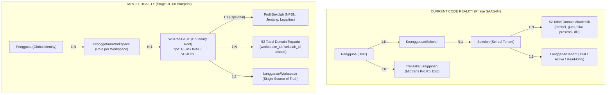
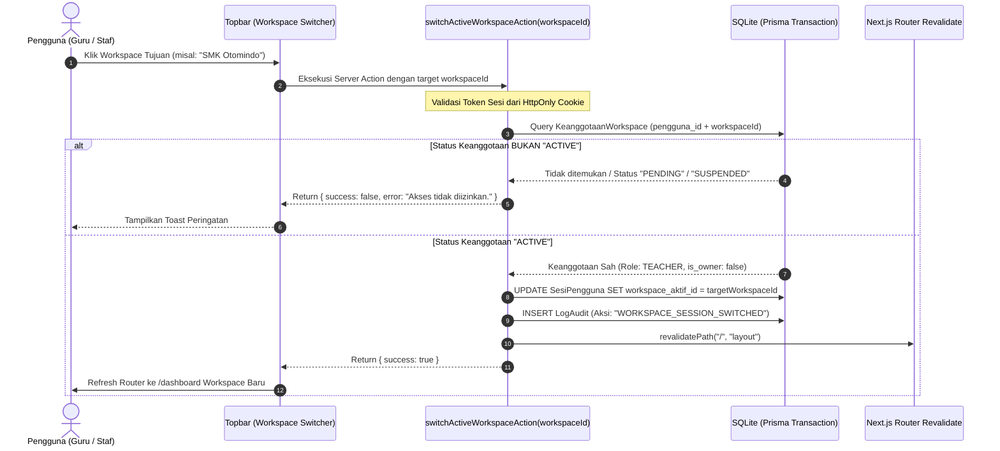
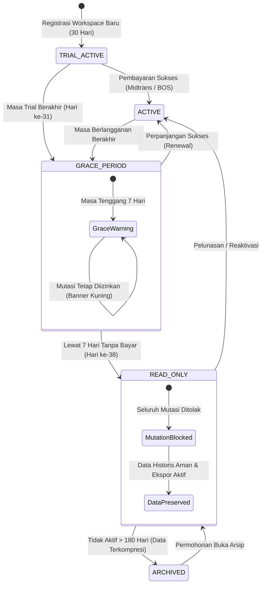
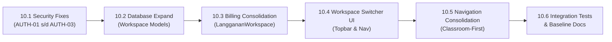

# STAGE 10 — SAAS FOUNDATION REMEDIATION PLAN
## Ruang Pintar — Blueprint Remediasi Arsitektur SaaS, Workspace Foundation, Otorisasi, dan Konsolidasi Langganan

**Versi Dokumen:** 1.0  
**Tanggal:** 23 September 2026  
**Status Evaluasi:** READY FOR HUMAN REVIEW  
**Fokus:** Analisis, Remediasi Arsitektur, Desain Teknis, dan Perencanaan Eksekusi Bertahap (Non-Destruktif)  
**Aturan Status:** *VERIFIED | PARTIAL | MISSING | CONFLICT | UNKNOWN* (Tanpa deklarasi APPROVED / LOCKED / PRODUCTION READY)

---

# 1. Executive Summary

Berdasarkan audit menyeluruh pada **STAGE 09: PRODUCT BLUEPRINT VS CODE REALITY AUDIT**, ditemukan kesenjangan arsitektural fundamental antara keputusan produk Stage 01–08 dengan basis kode aktual:
1. **Divergensi Tenancy & Batas Ruang Kerja:** Dokumen kanonikal baseline masih mengunci *"Single-school-per-deployment"*, sementara kode berada di transisi parsial (`Phase SAAS-04`) dengan entitas `KeanggotaanSekolah`, dan blueprint Stage 01–08 telah menetapkan **Unified Workspace Architecture** (*Personal Workspace* & *School Workspace*).
2. **Split-Brain Subscription:** Webhook Midtrans mengupdate lisensi Pro pada `Pengguna`, namun runtime authorization gate mengecek `LanggananTenant` pada `Sekolah`. Hal ini menyebabkan guru yang telah membayar Pro tetap terancam terkunci dalam mode *READ_ONLY* saat trial sekolah berakhir.
3. **Celah Otorisasi Scope (Cross-Tenant Vulnerability):** Server Action menerima `sekolah_id` dari client input tanpa validasi ketat terhadap keanggotaan aktif actor, dan evaluasi profil guru/jabatan pada `authz-guard.ts` tidak memfilter `sekolah_id`.
4. **Ketiadaan Antarmuka Workspace Switcher:** Server Action pergantian tenant sudah ada di backend, namun tidak ada komponen visual di Topbar maupun Sidebar untuk berpindah konteks kerja.

**STAGE 10: SAAS FOUNDATION REMEDIATION PLAN** dirancang untuk menyelesaikan seluruh kesenjangan di atas secara sistematis dan bertahap melalui metodologi **Expand and Contract (Non-Breaking Migration)**, sehingga seluruh 538 pengujian yang ada saat ini tetap *PASS* dan fitur akademik yang sudah berjalan tidak mengalami regresi.

---

# 2. Workspace Foundation Gap (Prioritas 01)

### 2.1 Perbandingan Realitas: Current vs Target



---

### 2.2 Analisis Dampak Menyeluruh (Exhaustive Impact Analysis)

#### 1. Tabel Basis Data yang Terdampak (Database Models)
* **Tabel Tenancy Inti (Core Tenancy):**
  - `model Workspace` (Baru): ULID `id`, `nama`, `slug` (unique), `tipe` (`PERSONAL` | `SCHOOL`), `paket_aktif`, `status_langganan`, `owner_id`, `created_at`, `updated_at`.
  - `model KeanggotaanWorkspace` (Evolusi dari `KeanggotaanSekolah`): Menghubungkan `pengguna_id` ke `workspace_id`.
  - `model ProfilSekolah` (Refaktor dari `Sekolah`): Menjadi entitas profil metadata yang memiliki relasi 1:1 ke `Workspace` bertipe `SCHOOL`.
  - `model LanggananWorkspace` (Konsolidasi dari `LanggananTenant` & `Pengguna.tipe_lisensi`).
  - `model SesiPengguna`: Menambahkan `workspace_aktif_id` (FK ke `Workspace`).
* **52 Tabel Domain Akademik & Operasional:**  
  Seluruh tabel yang saat ini memiliki kolom `sekolah_id`:
  `unit_organisasi`, `jabatan`, `penugasan_jabatan`, `konfigurasi_sistem`, `metadata_berkas`, `log_audit`, `tahun_ajaran`, `semester`, `fase`, `tingkat_kelas`, `program_keahlian`, `rombel`, `siswa`, `keikutsertaan_siswa`, `penempatan_rombel`, `guru`, `mata_pelajaran`, `penugasan_mengajar`, `penugasan_wali_kelas`, `kalender_akademik`, `slot_waktu`, `versi_jadwal`, `jadwal_pelajaran`, `sesi_kelas_aktual`, `lingkup_materi`, `tujuan_pembelajaran`, `materi_pembelajaran`, `publikasi_materi`, `definisi_tugas`, `publikasi_tugas`, `pengumpulan_tugas`, `administrasi_pembelajaran`, `presensi_sesi_kelas`, `definisi_asesmen`, `nilai_siswa`, `publikasi_nilai_asesmen`, `bank_soal`, `versi_soal`, `ujian_cbt`, `snapshot_ujian`, `sesi_ujian_siswa`, `jawaban_siswa`, `hasil_ujian_cbt`, `event_integritas_ujian`, `wali_murid`, `hubungan_wali_siswa`, `pengajuan_wali`, `pengumuman`, `notifikasi_pengguna`, `catatan_monitoring`, `riwayat_ekspor_laporan`, `konfigurasi_integrasi`, `endpoint_webhook`, `log_pengiriman_integrasi`, `permintaan_setup_ai`.

#### 2. Service & Application Layer yang Terdampak
* **Pondasi Tenancy:**
  - `src/shared/infrastructure/tenant/tenant-context.ts` $\rightarrow$ Ditransformasikan menjadi `workspace-context.ts` (`WorkspaceContext`).
  - `src/shared/infrastructure/tenant/tenant-membership-service.ts` $\rightarrow$ Menjadi `workspace-membership-service.ts`.
  - `src/shared/infrastructure/tenant/tenant-entitlement-service.ts` $\rightarrow$ Menjadi `workspace-entitlement-service.ts`.
* **Autentikasi & Sesi:**
  - `src/shared/infrastructure/auth/auth-service.ts`: Resolusi `workspace_aktif_id` saat login dan sliding session update.
  - `src/shared/infrastructure/auth/auth-guard.ts`: `getCurrentUser()` dan `requireAuth()` memuat metadata `active_workspace`.
* **17 Domain Repositories & Facades:**
  - Seluruh repositori yang menerima parameter `sekolah_id` (seperti `TeacherRepository.findTeachers(sekolah_id, ...)`) diabstraksikan menerima `workspace_id`.
* **Billing & Subscription:**
  - `src/modules/billing/application/subscription-service.ts`: Order checkout Midtrans ditautkan ke `workspace_id`.

#### 3. State Sesi Pengguna (Session State)
* Objek `AuthenticatedUser` diubah dari:
  ```typescript
  // SEBELUMNYA (Kaku pada Sekolah)
  export interface AuthenticatedUser {
    id: string;
    sekolah_id: string | null;
    peran_dasar: string;
    // ...
  }
  ```
  Menjadi:
  ```typescript
  // TARGET (Unified Workspace Context)
  export interface AuthenticatedUser {
    id: string;
    username: string;
    nama_lengkap: string;
    email: string | null;
    status_akun: string;
    // Workspace Server-Authoritative Context
    active_workspace_id: string | null;
    active_workspace_type: "PERSONAL" | "SCHOOL" | null;
    active_workspace_name: string | null;
    effective_role: string; // Peran khusus pada workspace aktif
    is_workspace_owner: boolean;
    // Kompatibilitas Legacy Transisi (Aliased)
    sekolah_id: string | null; // Selalu bernilai sama dengan active_workspace_id
    peran_dasar: string;       // Selalu bernilai sama dengan effective_role
  }
  ```

#### 4. Rute Aplikasi yang Terdampak (Routing Matrix)
Aplikasi memiliki 36 rute. Dengan konsep Personal vs School Workspace, rute dibagi ke dalam 3 kategori akses:

| Kategori Rute | Daftar Rute | Perilaku pada Personal Workspace | Perilaku pada School Workspace |
| :--- | :--- | :--- | :--- |
| **Personal & Core** | `/dashboard`, `/kelas-saya`, `/kelas-saya/[id]`, `/asisten-ai`, `/cbt-ujian`, `/cbt/[attemptId]`, `/jadwal-saya`, `/profil`, `/ganti-password` | **Aktif Penuh** (Guru mengelola kelas dan materi mandiri). | **Aktif Penuh** (Sesuai penugasan guru di sekolah). |
| **School Institutional Only** | `/sekolah`, `/struktur-akademik`, `/guru-pengajaran`, `/jadwal-sekolah`, `/kalender-akademik`, `/data-siswa`, `/pimpinan`, `/laporan-sekolah`, `/integrasi` | **Dinonaktifkan / Dialihkan** ke `/dashboard` dengan notifikasi: *"Fitur ini memerlukan ruang kerja sekolah"*. | **Aktif** untuk Staf, Guru berjabatan, atau Super Admin. |
| **Parent & Homeroom** | `/wali-kelas`, `/rapor-siswa`, `/presensi-anak`, `/nilai-anak` | **Disembunyikan** (Tidak relevan untuk ruang les/mandiri). | **Aktif** jika memiliki penugasan wali kelas / hubungan keluarga. |

#### 5. Antarmuka Pengguna yang Terdampak (UI Components)
* `src/shared/components/shell/topbar.tsx`: Pemasangan komponen `WorkspaceSwitcher` di samping logo/judul aplikasi.
* `src/shared/components/shell/sidebar.tsx`: Pemfilteran dinamis kelompok menu navigasi berdasarkan `active_workspace_type`.
* `src/shared/components/shell/mobile-drawer.tsx`: Penempatan header pemilih workspace aktif di laci navigasi smartphone.
* `src/shared/components/shell/user-menu.tsx`: Integrasi menu pintas *"Beralih ke Ruang Kerja Pribadi"* dan *"Tambah / Gabung Sekolah"*.

---

### 2.3 Strategi Migrasi Bertahap (The "Expand and Contract" Pattern)

Untuk menghindari kerusakan pada 538 unit & component tests yang saat ini berjalan, migrasi basis data dan kode dilakukan dalam 4 fase non-destruktif:

```text
+----------------------------------------------------------------------------------------------------+
|                                    EXPAND AND CONTRACT SEQUENCE                                    |
+------------------------------------+----------------------------------+-----------------------------+
| FASE 1: EXPAND (Database Level)    | FASE 2: BRIDGE (Service Layer)   | FASE 3: CONTRACT (Cleanup)  |
+------------------------------------+----------------------------------+-----------------------------+
| • Buat model Workspace & Profil    | • WorkspaceContext membungkus    | • Hapus kolom redundan      |
| • Backfill 1:1 Sekolah -> Workspace|   sekolah_id secara transparan   |   Pengguna.sekolah_id       |
| • workspace_id == sekolah_id       | • Repository menerima workspace_id| • Kunci seluruh query pada  |
| • 100% backward compatible         | • Pasang Workspace Switcher UI   |   active_workspace_id       |
+------------------------------------+----------------------------------+-----------------------------+
```

1. **Fase Expand (Backfill Identik):**
   - Setiap baris pada tabel `sekolah` yang ada saat ini secara otomatis dibuatkan baris padanannya di tabel `workspace` dengan `id` yang **sama persis** (`workspace.id = sekolah.id`), dengan `tipe = "SCHOOL"`.
   - Untuk setiap pengguna bertipe `TEACHER`, sistem menyiapkan baris `workspace` bertipe `PERSONAL` dengan format nama *"Ruang Kerja Pribadi [Nama Guru]"*.
   - Tabel pivot `keanggotaan_sekolah` dialiaskan ke `keanggotaan_workspace`.
   - **Hasil:** Seluruh foreign key `sekolah_id` yang ada pada 52 tabel domain secara otomatis valid menunjuk ke `workspace.id` tanpa perlu mengubah nama kolom fisik di database secara tergesa-gesa!

2. **Fase Bridge (Application Layer Translation):**
   - Di lapisan TypeScript, `sekolah_id` dan `workspace_id` diperlakukan sebagai sinonim melalui type alias:
     ```typescript
     export type WorkspaceId = string;
     export type SekolahId = WorkspaceId; // Backward-compatible alias
     ```
   - Semua modul akademik yang membutuhkan `sekolah_id` menerima nilai dari `user.active_workspace_id`.

3. **Fase Contract (Final Consolidation):**
   - Menghapus kolom warisan `Pengguna.sekolah_id` dan `Pengguna.tipe_lisensi`.
   - Mengunci seluruh otorisasi secara murni pada `active_workspace_id`.

---

# 3. Active Workspace Design (Prioritas 02)

### 3.1 Perbandingan Industri: Slack, Notion, Canva vs Ruang Pintar

| Karakteristik | Slack | Notion | Canva | **Ruang Pintar (Target)** |
| :--- | :--- | :--- | :--- | :--- |
| **Model Akun** | 1 Akun = 1 Workspace (Auth terpisah per subdomain). | 1 Akun Global = Banyak Workspace (Pribadi & Tim). | 1 Akun Global = Beralih antar Tim / Pribadi. | **1 Identitas Global Unik** (1 Username/Email). |
| **Batas Ruang Kerja** | Keras per subdomain (*acme.slack.com*). | Lembut di UI (*Dropdown Switcher*), data terisolasi di DB. | Lembut di UI (*Team Switcher*), aset terisolasi. | **Batas Server-Authoritative** berbasis `active_workspace_id` di sesi DB. |
| **Peran per Workspace** | Berbeda di tiap workspace. | Berbeda di tiap workspace. | Berbeda di tiap tim. | **Dinamis:** Guru di Sekolah A, Staf di Sekolah B, Owner di Personal Workspace. |
| **UX Perpindahan** | Membuka tab browser baru atau reload aplikasi. | Transisi instan tanpa reload halaman penuh. | Transisi cepat dengan refresh konteks dashboard. | **Instant Server Action Switch** dengan revalidasi router Next.js halus (*Zero Friction*). |

---

### 3.2 Desain Teknis Komponen Active Workspace

#### 1. Penyimpanan State Sesi Server-Authoritative
```text
Browser Cookie: session_token (HttpOnly, Secure, SameSite=Lax)
                       │
                       ▼
Database SesiPengguna (Validated via SHA-256 Token Hash)
       ├── id: ULID
       ├── pengguna_id: ULID
       ├── workspace_aktif_id: ULID (Sumber Kebenaran Tunggal Server)
       ├── berlaku_sampai: DateTime
       └── dicabut: Boolean
```

#### 2. Strategi Evaluasi: Edge Middleware vs Server Component Guard
* **Keputusan Arsitektur:** Evaluasi otorisasi dan validasi keanggotaan aktif dilakukan di level **Server Component / Server Guard (`auth-guard.ts` & `authz-guard.ts`)**, bukan di Edge Middleware.
* **Alasan Teknis:** Database Ruang Pintar menggunakan **SQLite**, yang berjalan di Node.js runtime lokal dan tidak dapat di-query secara langsung dari Next.js Edge Runtime tanpa overhead RPC terpisah. Middleware Next.js hanya bertugas memeriksa keberadaan cookie sesi (`session_token`). Pengecekan status keanggotaan `ACTIVE` dan hak akses dilakukan secara server-side pada Node.js runtime di setiap RSC render dan Server Action.

#### 3. Alur Pergantian Workspace (Workspace Switching Sequence)



---

### 3.3 Desain Antarmuka: Workspace Switcher di Topbar

Antarmuka pemilih ruang kerja diletakkan di sisi kiri atas Topbar aplikasi, tepat di samping logo Ruang Pintar:

```text
+----------------------------------------------------------------------------------------------------+
|  RUANG PINTAR    [ 🏫 SMK Otomindo Jakarta  (Guru)  ▼ ]               (🌓)  (🔔)  [ Avatar Bu Siti ] |
|                  +----------------------------------------------+                                  |
|                  | RUANG KERJA AKTIF                            |                                  |
|                  | [x] 🏫 SMK Otomindo Jakarta                  |                                  |
|                  |     Peran: Guru Pengampu & Wali Kelas        |                                  |
|                  |----------------------------------------------|                                  |
|                  | RUANG KERJA LAINNYA                          |                                  |
|                  | [ ] 🏫 SMK Teratai Putih                     |                                  |
|                  |     Peran: Guru Pengampu                     |                                  |
|                  | [ ] 👤 Ruang Kerja Pribadi (Siti Nurhaliza)  |                                  |
|                  |     Paket: Guru Pro (Pribadi)                |                                  |
|                  |----------------------------------------------|                                  |
|                  | + Daftarkan / Gabung Sekolah Baru            |                                  |
|                  +----------------------------------------------+                                  |
+----------------------------------------------------------------------------------------------------+
```

---

# 4. Authorization Hardening Plan (Prioritas 03)

Berdasarkan temuan audit Stage 09, berikut adalah rencana pengerasan keamanan (*security hardening*) untuk setiap temuan berisiko tinggi.

### Matriks Remediasi Keamanan Otorisasi

| ID Temuan | Klasifikasi | File & Lokasi | Skenario Serangan (Attack Scenario) | Solusi Remediasi Definitif (Recommended Fix) |
| :--- | :---: | :--- | :--- | :--- |
| **AUTH-01** | **CRITICAL** | `src/app/actions/attendance-actions.ts`<br>`src/modules/attendance/application/attendance-service.ts` | **Manipulasi Presensi Lintas Tenant:** Pengguna dengan peran `SCHOOL_STAFF` di Sekolah A memanggil Server Action `saveSessionAttendanceAction` dengan payload buatan `{ sesi_kelas_id: "SESI_B", sekolah_id: "SCH_B" }`. Karena kode `attendance-service.ts:60` hanya memeriksa validasi profil untuk `TEACHER`, request staf dieksekusi langsung ke database Sekolah B. | **Paksa Kunci Sesi Server-Side:**<br>1. Di `attendance-actions.ts`, timpa nilai input secara mutlak: `input.sekolah_id = user.active_workspace_id`.<br>2. Di `attendance-service.ts`, tambahkan verifikasi bahwa actor memiliki keanggotaan `ACTIVE` pada `validated.sekolah_id`. |
| **AUTH-02** | **CRITICAL** | `src/shared/infrastructure/authorization/authz-guard.ts` (baris 40 & 101) | **Kebocoran Hak Akses Antar-Sekolah:** Pak Budi menjabat sebagai Kepala Program di Sekolah A, dan hanya menjadi Guru biasa di Sekolah B. Saat Pak Budi membuka sesi Sekolah B, fungsi `buildEvaluationContext` memanggil `prisma.penugasanJabatan.findMany({ where: { personil_id } })` tanpa filter sekolah. Sistem memberikan hak akses Kepala Program Sekolah A saat Pak Budi berada di Sekolah B. | **Filter Berbasis Active Workspace:**<br>Ubah query menjadi:<br>`prisma.guru.findFirst({ where: { pengguna_id: user.id, sekolah_id: user.active_workspace_id } })`<br>dan<br>`prisma.penugasanJabatan.findMany({ where: { personil_id: user.id, sekolah_id: user.active_workspace_id, status: "AKTIF" } })`. |
| **AUTH-03** | **HIGH** | `src/app/actions/teacher-actions.ts` (baris 69) | **Injeksi Tenant via Form Data:** Penyerang mengirimkan mutasi pendaftaran guru dengan mengosongkan sesi aktif dan menyuntikkan input form data `sekolah_id = "TARGET_SCH"`. Fallback `session.sekolah_id \|\| formData.get("sekolah_id")` mengeksekusi mutasi pada sekolah target. | **Hapus Fallback Client Form Data:**<br>Hapus total pembacaan `formData.get("sekolah_id")`. Wajibkan mutasi hanya berjalan jika `session.active_workspace_id` valid dan aktif. |
| **AUTH-04** | **HIGH** | `src/app/guru-pengajaran/page.tsx` (baris 77–79) | **Bypass Otorisasi via URL Query:** Super Admin mengakses `/guru-pengajaran?sekolahId=SCH_X` secara langsung tanpa mencatat perpindahan sesi tenant resmi di log audit. | **Tegakkan Audit Context Switching:**<br>Jika Super Admin ingin menginspeksi Sekolah X, alur antarmuka wajib mengeksekusi `switchActiveWorkspaceAction("SCH_X")` sehingga sesi aktif diperbarui dan tercatat di `log_audit`. |
| **AUTH-05** | **MEDIUM** | `src/shared/components/shell/` (`sidebar.tsx`, `topbar.tsx`, `mobile-bottom-nav.tsx`) | **Desinkronisasi Peran UI vs Server:** Pengguna memiliki peran `TEACHER` di Sekolah A dan `SCHOOL_STAFF` di Sekolah B. Jika UI membaca `Pengguna.peran_dasar` global, menu navigasi akan menampilkan tampilan Guru saat pengguna sedang aktif membuka Sekolah B. | **Gunakan `effective_role` Sesi:**<br>Seluruh komponen shell navigasi wajib membaca peran aktif dari `user.effective_role` yang dihasilkan oleh resolver sesi tenant. |
| **AUTH-06** | **MEDIUM** | `src/app/kelas-saya/page.tsx`<br>`src/app/kelas-saya/[id]/page.tsx` | **Unscoped Permission Evaluation:** Pengecekan `requirePermission("learning.material.view")` tidak menyertakan argumen scope `{ sekolah_id }`, sehingga evaluator izin hanya memeriksa nama peran secara generik tanpa mengonfirmasi kepemilikan resource sekolah. | **Sertakan Resource Scope:**<br>Panggil selalu pengawal izin dengan parameter eksplisit: `await requirePermission("learning.material.view", { sekolah_id: user.active_workspace_id });`. |

---

# 5. Subscription Consolidation Plan (Prioritas 04)

### 5.1 Resolusi Split-Brain: Menetapkan Sumber Kebenaran Tunggal

Audit Stage 09 membuktikan adanya konflik fundamental antara implementasi Phase 23 dan Phase SAAS-04:
- **Phase 23:** Menyimpan status pembayaran pada `Pengguna.tipe_lisensi = "PRO"` (User-Centric).
- **Phase SAAS-04:** Mengecek mode baca pada `LanggananTenant.status` (School-Centric).

**KEPUTUSAN ARSITEKTUR FINAL:**  
Sumber kebenaran tunggal (*Single Source of Truth*) untuk seluruh paket, masa aktif, dan entitlement langganan adalah **`LanggananWorkspace` yang terikat pada entitas `Workspace`**.

```text
               +----------------------------------------------------+
               |                LANGGANAN_WORKSPACE                 |
               +----------------------------------------------------+
               | id: ULID                                           |
               | workspace_id: ULID (FK 1:1 ke Workspace)           |
               | paket: FREE | PRO_TEACHER | SCHOOL_PRO | ENTERPRISE|
               | status: TRIAL_ACTIVE | ACTIVE | GRACE_PERIOD |     |
               |         READ_ONLY | ARCHIVED                       |
               | mulai_pada: DateTime                               |
               | berakhir_pada: DateTime?                           |
               | grace_period_berakhir_pada: DateTime?              |
               | entitlement_snapshot_json: String?                 |
               +----------------------------------------------------+
```

---

### 5.2 Model Langganan 3 Segmen Pengguna

#### A. Segmen Guru Mandiri (Personal Workspace)
* **Konteks:** Guru privat, guru honorer, atau guru yang mencoba aplikasi secara independen tanpa campur tangan operator sekolah.
* **Wadah:** `Workspace` dengan `tipe = "PERSONAL"`.
* **Pilihan Paket:**
  1. `FREE` (Gratis Selamanya):
     - Maksimal **2 Rombel Kelas** (maksimal 70 siswa total).
     - Presensi Kilat, Modul Ajar manual, Tugas siswa.
     - Asisten AI: Terbatas 5 prompt generate soal per bulan.
  2. `PRO_TEACHER` (Rp 15.000 / bulan atau Rp 150.000 / tahun):
     - Unlimited Rombel & Siswa mandiri.
     - Akses tak terbatas Studio AI Guru (Gemini 2.0 Flash) untuk butir soal dan modul RPP.
     - Cetak naskah soal ATS/AAS format kertas resmi.
* **Alur Pembayaran:** Midtrans QRIS Checkout instan. Saat lunas, webhook memperbarui `LanggananWorkspace` milik *Personal Workspace* guru tersebut.

#### B. Segmen Sekolah (School Workspace)
* **Konteks:** Institusi pendidikan formal (SD, SMP, SMA, SMK) yang menggunakan platform untuk seluruh aktivitas sekolah.
* **Wadah:** `Workspace` dengan `tipe = "SCHOOL"` (terhubung ke `ProfilSekolah` ber-NPSN).
* **Pilihan Paket:**
  1. `TRIAL` (30 Hari Full-Access):
     - Diberikan otomatis saat sekolah pertama kali didaftarkan.
     - Seluruh guru dan staf di sekolah tersebut otomatis menikmati fitur Pro.
  2. `SCHOOL_PRO` (Lisensi Resmi Sekolah / Dana BOS):
     - Penagihan resmi institusi (Rp 1.500 – Rp 3.000 per siswa per bulan, ditagih semesteran/tahunan).
     - Seluruh dewan guru aktif otomatis berstatus Pro tanpa perlu membayar mandiri.
     - Generator Leger Rapor Kurikulum Merdeka otomatis.
     - Dokumen legal pengadaan: Kuitansi bermaterai, BAST, e-Faktur Pajak, dan Surat Penawaran resmi.

#### C. Segmen Enterprise / Multi-Sekolah
* **Konteks:** Yayasan pendidikan besar yang menaungi 5–20 sekolah, atau Dinas Pendidikan Kabupaten/Kota.
* **Wadah:** Konsorsium Multi-Workspace dengan dashboard pengawasan terpadu (*Leadership Analytics* lintas cabang).
* **Pilihan Paket:** `ENTERPRISE` (Custom SLA, dedicated server, webhook integrasi Dapodik/HRIS, training offline).

---

### 5.3 Siklus Hidup & Status Lisensi (Lifecycle Matrix)



| Status | Hak Mutasi Data | Hak Baca & Ekspor | Indikator Antarmuka (UI Banner) |
| :--- | :---: | :---: | :--- |
| **`TRIAL_ACTIVE`** | **Diizinkan Penuh** | Diizinkan | Pill biru: *"Masa Uji Coba (Sisa X Hari)"* + Tombol Upgrade. |
| **`ACTIVE`** | **Diizinkan Penuh** | Diizinkan | Badge hijau: *"Paket Aktif (Pro / Sekolah)"*. |
| **`GRACE_PERIOD`** | **Diizinkan (7 Hari)** | Diizinkan | Banner kuning: *"Masa aktif berakhir. Segera lakukan pembayaran sebelum layanan terkunci (Sisa Y Hari)"*. |
| **`READ_ONLY`** | **DIBLOKIR TOTAL** | **Diizinkan Penuh** | Banner merah persisten: *"Mode Baca Saja. Data Anda tersimpan aman dan tidak dihapus. Silakan lakukan pembayaran untuk mengaktifkan kembali fitur pengisian nilai & presensi"*. |
| **`ARCHIVED`** | Diblokir | Terbatas | Tampilan arsip pasif; tombol reaktivasi via admin. |

---

# 6. Critical Test Gap Analysis (Prioritas 05)

Meskipun 99 file test saat ini lulus, pengujian SaaS multi-tenancy dan workspace isolation di dunia nyata belum memadai. Berikut daftar pengujian kritis yang wajib dibangun pada fase implementasi:

| Kategori Pengujian | Target Cakupan & Skenario Uji | Berkas Rencana Pengujian |
| :--- | :--- | :--- |
| **1. Workspace Isolation Integration** | Memverifikasi dengan database SQLite nyata bahwa Guru di Workspace A tidak dapat membaca/mengubah Rombel, Siswa, atau Nilai di Workspace B. | `src/test/integration/workspace-isolation.test.ts` |
| **2. Multi-Membership Switching** | Memverifikasi alur Server Action `switchActiveWorkspaceAction`: pergantian token sesi, pencatatan log audit, penolakan jika membership non-aktif. | `src/test/integration/workspace-switching.test.ts` |
| **3. Server Action Scope Tampering** | Menguji skenario injeksi ID: memastikan Server Actions menolak `sekolah_id` atau `workspace_id` yang diselundupkan lewat client payload/form data. | `src/test/security/server-action-scope-guard.test.ts` |
| **4. Entitlement Transition Lifecycle** | Menguji transisi otomatis status: `TRIAL_ACTIVE` $\rightarrow$ `GRACE_PERIOD` $\rightarrow$ `READ_ONLY`, serta penegakan `TenantReadOnlyError` pada operasi mutasi. | `src/test/billing/entitlement-lifecycle.test.ts` |
| **5. Webhook Entitlement Synchronization** | Menguji bahwa notifikasi pembayaran sukses dari Midtrans secara atomik memperbarui `LanggananWorkspace` dan langsung membuka kembali akses mutasi. | `src/test/billing/midtrans-webhook-fulfillment.test.ts` |
| **6. Multi-Role Permission Evaluation** | Menguji pengguna yang memiliki 2 peran berbeda (misal: Guru di Sekolah A, Staf di Sekolah B) agar hak aksesnya terisolasi sempurna saat berpindah konteks. | `src/test/authorization/multi-role-context.test.ts` |
| **7. Classroom-First End-to-End Flow** | Menguji alur kerja guru: masuk `/kelas-saya/[id]`, melakukan presensi 15 detik, mencatat jurnal, dan menginput nilai dalam satu sesi kerja terpadu. | `src/test/e2e/classroom-first-workflow.test.ts` |

---

# 7. Documentation Consolidation Plan (Prioritas 06)

Untuk mengakhiri kebingungan developer dan agen AI mengenai arsitektur resmi Ruang Pintar, berikut adalah daftar klasifikasi konsolidasi seluruh dokumentasi di repository:

| Nama Berkas Dokumen | Status Tindakan | Alasan & Rekomendasi Konsolidasi |
| :--- | :---: | :--- |
| `AGENTS.md` | **UPDATE** | Hapus klausul *"Single-school-per-deployment"*. Perbarui baseline teknis menjadi *"Modular Monolith SaaS Multi-Tenant with Unified Workspace Architecture"*. |
| `MEMORY.md` | **UPDATE** | Hapus larangan *"Bukan shared-schema SaaS baseline"*. Sinkronkan current implementation phase ke Stage 10 Remediation. |
| `TASKS.md` | **UPDATE** | Catat Milestone K (SaaS Remediation) sebagai active phase setelah Stage 10 disetujui. |
| `docs/PRD.md`, `BRD.md`, `FRD.md` | **UPDATE** | Perbarui bab arsitektur tenancy dari single-tenant menjadi unified workspace multi-tenant. |
| `docs/00-PROJECT-BRIEF.md` | **UPDATE** | Perbarui bagian model produk multi-sekolah agar mencakup guru mandiri dan institusi. |
| `docs/05-SYSTEM-ARCHITECTURE.md` | **UPDATE** | Revisi tabel baris 68: ganti *Single-school-per-deployment* dengan *Shared Database, Shared Schema Multi-Tenant with Server-Authoritative Active Workspace*. |
| `docs/06-DATA-ARCHITECTURE.md` | **UPDATE** | Tambahkan diagram ERD resmi `Workspace`, `KeanggotaanWorkspace`, dan `LanggananWorkspace`. |
| `docs/07-UI-UX-DESIGN-SYSTEM.md` | **UPDATE** | Tambahkan spesifikasi baku *Workspace Switcher*, *Floating Action Button*, dan *Classroom-First Tab Navigation*. |
| `docs/adr/ADR-001/002/003` | **KEEP** | Pertahankan sebagai catatan sejarah arsitektur (*Architecture Decision Records*). |
| `docs/WORKSPACE-ARCHITECTURE-RECOMMENDATION.md` | **KEEP** | Sumber acuan blueprint utama model workspace. |
| `docs/CLASSROOM-FIRST-DESIGN.md` | **KEEP** | Dokumen filosofi baku antarmuka guru. |
| `docs/TEACHER-COCKPIT-DESIGN.md` | **KEEP** | Spesifikasi kontrak desain dashboard guru tanpa fake KPI. |
| `docs/SCREEN-INVENTORY.md` | **UPDATE** | Rampingkan 28 layar untuk mengintegrasikan layar modul lama ke dalam tab Classroom Workspace. |
| Dokumen Rute Modul Lama (`presensi-kelas`, `penilaian`, `sesi-pembelajaran`) | **MERGE / DEPRECATE** | Gabungkan dokumentasinya ke dalam spesifikasi `CLASSROOM-WORKSPACE-BLUEPRINT.md`. |

---

# 8. Migration Risk Assessment

| Kategori Risiko | Deskripsi Potensi Masalah | Tingkat Risiko | Strategi Mitigasi (Mitigation Strategy) |
| :--- | :--- | :---: | :--- |
| **Regresi Pengujian (Regression Risk)** | Penambahan entitas `Workspace` berisiko mematahkan 538 unit test yang mengasumsikan keberadaan `sekolah_id`. | **HIGH** | Terapkan pola *Expand and Contract*: buat `workspace.id` identik dengan `sekolah.id`, pertahankan kolom `sekolah_id` sebagai alias transisi pada DTO dan service. |
| **Kunci Asing SQLite (FK Constraints)** | SQLite memiliki batasan ketat saat melakukan `ALTER TABLE` pada tabel yang memiliki foreign key aktif. | **HIGH** | Jalankan migrasi Prisma via script SQL aman dengan `PRAGMA foreign_keys=OFF;` saat transisi backfill, lalu nyalakan kembali setelah verifikasi integritas data. |
| **Kebocoran Data (Data Bleed Risk)** | Risiko terbukanya data sekolah lain saat pengguna berpindah workspace secara cepat di browser. | **CRITICAL** | Gunakan transaksi atomik pada pergantian sesi database, dan bersihkan cache router Next.js secara menyeluruh melalui `revalidatePath("/", "layout")`. |
| **Disrupsi Sesi Pengguna (Session Invalidation)** | Pengguna yang sedang login tiba-tiba terlempar keluar (*logged out*) saat migrasi skema diterapkan. | **MEDIUM** | Buat skrip migrasi backfill yang otomatis mengisi `workspace_aktif_id = sekolah_aktif_id` pada seluruh baris `sesi_pengguna` yang masih aktif. |

---

# 9. Recommended Remediation Sequence (Roadmap 6 Langkah)

Pelaksanaan remediasi direkomendasikan berjalan dalam urutan berurutan (*strictly sequential*):



1. **Langkah 10.1 — Perbaikan Celah Keamanan Otorisasi Kritis (Hotfix):**
   - Kunci `input.sekolah_id = user.active_workspace_id` di `attendance-actions.ts`.
   - Tambahkan filter `sekolah_id` pada query `authz-guard.ts` untuk profil guru dan jabatan.
   - Hapus fallback client `formData.get("sekolah_id")` pada `teacher-actions.ts`.
2. **Langkah 10.2 — Perluasan Skema Basis Data (Database Expand & Backfill):**
   - Buat model `Workspace` dan migrasikan relasi `KeanggotaanSekolah` $\rightarrow$ `KeanggotaanWorkspace`.
   - Jalankan backfill otomatis 1:1 dari `Sekolah` ke `Workspace` (`workspace.id = sekolah.id`).
   - Buat *Personal Workspace* awal untuk guru terdaftar.
3. **Langkah 10.3 — Konsolidasi Model Langganan (Resolusi Split-Brain):**
   - Satukan status langganan ke `LanggananWorkspace`.
   - Hubungkan webhook Midtrans agar mengaktifkan masa berlaku pada workspace pembeli.
   - Perbaiki `WorkspaceEntitlementService` untuk mengevaluasi status trial/grace period/read-only secara konsisten.
4. **Langkah 10.4 — Implementasi Antarmuka Pemilih Workspace (UI Switcher):**
   - Pasang komponen visual `WorkspaceSwitcher` di Topbar desktop dan drawer mobile.
   - Hubungkan komponen switcher dengan `switchActiveWorkspaceAction`.
5. **Langkah 10.5 — Konsolidasi Navigasi & Pembersihan Cockpit Guru:**
   - Hapus fake KPI (fallback 88.0/85.0 dan hardcoded donut gauge) di `teacher-dashboard.tsx`.
   - Ubah tombol aksi hero agar langsung membuka `/kelas-saya/[id]`.
   - Alihkan rute lama (`/presensi-kelas`, `/penilaian`) ke rute terpadu `/kelas-saya`.
6. **Langkah 10.6 — Pengujian Integrasi Multi-Tenant & Pembaruan Dokumen Baseline:**
   - Tulis rangkaian pengujian integrasi database SQLite untuk isolasi lintas-tenant dan perpindahan sesi.
   - Perbarui teks kanonikal pada `AGENTS.md`, `MEMORY.md`, `PRD.md`, dan `05-SYSTEM-ARCHITECTURE.md`.

---

# 10. Definition of Done (DoD)

Fase remediasi SaaS Foundation dinyatakan **SELESAI (DONE)** jika seluruh kriteria berikut terpenuhi secara objektif:

1. **Skema & Tenancy:**
   - [ ] Model `Workspace` dan `KeanggotaanWorkspace` aktif dan terindeks di `schema.prisma`.
   - [ ] Seluruh sekolah existing memiliki pasangan data `Workspace` bertipe `SCHOOL`.
   - [ ] Guru dapat memiliki `Personal Workspace` tanpa keharusan membuat profil sekolah palsu.
2. **Sesi & Konteks:**
   - [ ] Kolom `workspace_aktif_id` pada `SesiPengguna` menjadi satu-satunya sumber kebenaran sesi aktif.
   - [ ] Komponen `WorkspaceSwitcher` terpasang di Topbar dan berfungsi mulus tanpa reload halaman.
3. **Otorisasi & Keamanan:**
   - [ ] Seluruh Server Action menolak mutasi data yang tidak sesuai dengan `session.workspace_aktif_id`.
   - [ ] Guru atau staf yang berpindah sekolah tidak membawa hak akses atau jabatan dari sekolah sebelumnya.
4. **Langganan & Penagihan:**
   - [ ] Webhook pembayaran Midtrans memperbarui `LanggananWorkspace` secara atomik.
   - [ ] Pengguna berbayar tidak terblokir dalam mode *READ_ONLY*.
   - [ ] Masa tenggang (*Grace Period*) 7 hari ditegakkan dengan peringatan visual banner sebelum status berubah menjadi *READ_ONLY*.
5. **Craftsmanship & Navigasi:**
   - [ ] Seluruh fake KPI, angka dummy, dan persentase hardcode pada Teacher Cockpit telah dibersihkan (prinsip *0 is 0*).
   - [ ] Kode mati (`teacher-digital-clock-calendar.tsx`, `teacher-today-schedule.tsx`) telah dihapus.
   - [ ] Filosofi *Classroom-First* ditegakkan: navigasi utama guru terpusat pada `/kelas-saya/[id]`.
6. **Kualitas & Verifikasi:**
   - [ ] TypeScript `tsc --noEmit` menghasilkan 0 error.
   - [ ] ESLint menghasilkan 0 error.
   - [ ] Prettier 100% compliant.
   - [ ] Seluruh pengujian regresi (538 tes lama + rangkaian tes integrasi multi-tenant baru) lulus 100% (*PASS*).
   - [ ] Next.js production build (`pnpm build` atau `npm run build`) berhasil mengompilasi seluruh rute.
   - [ ] Dokumen `AGENTS.md`, `MEMORY.md`, dan dokumen baseline 00–08 telah diselaraskan.

---

**RENCANA REMEDIASI SELESAI.**  
Dokumen ini menjadi cetak biru operasional untuk menyelaraskan fondasi SaaS Ruang Pintar sebelum implementasi fitur lanjutan.  
Status: **READY FOR HUMAN REVIEW**
