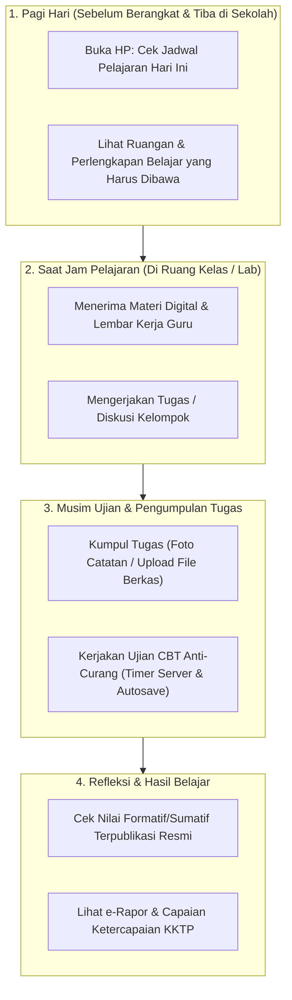

# STUDENT EXPERIENCE (SISWA)
## Ruang Pintar — Pengalaman Belajar Digital yang Jernih, Adil, dan Memotivasi

**Dokumen:** Analisis Pengalaman Pengguna Siswa (*Student Experience*)  
**Status:** PROPOSED — READY FOR HUMAN REVIEW  
**Tanggal:** 22 September 2026  
**Target:** Portal Siswa (Smartphone Viewport & CBT Player)  
**Karakteristik Siswa Indonesia:**  
> *"Siswa Gen-Z dan Gen-Alpha tidak membaca manual panduan. Mereka terbiasa dengan aplikasi modern yang cepat, estetis, dan intuitif. Bagi siswa, aplikasi sekolah harus memberi kepastian jadwal, mengingatkan deadline tugas sebelum terlambat, dan menyajikan ujian CBT yang adil tanpa rasa panik koneksi putus."*

---

# 1. Peta Perjalanan Siswa (*Student Journey*)



---

# 2. Fitur-Fitur Kunci Pengalaman Siswa

### 2.1 Jadwal & Countdown Deadline Tugas
* **Pemberitahuan Tugas yang Jelas:**  
  Kartu tugas menyajikan indikator waktu mundur yang tegas:  
  `[ Tugas 2: Algoritma Pencarian • Tenggat: Malam Ini, 23:59 (Sisa 6 Jam) ]`.
* **Pengumpulan Tugas Fleksibel:**  
  Siswa dapat mengumpulkan tugas dalam format teks langsung, tautan GitHub/Google Drive, atau foto lembar tulisan tangan di buku tulis.

### 2.2 Ujian CBT yang Tenang & Bebas Panik (*Calm CBT Player*)
* **Server-Authoritative Timer:** Waktu ujian dihitung dari server. Jika ponsel siswa mati atau Wi-Fi terputus sesaat, sisa waktu tidak ter-reset dan jawaban yang sudah dipilih tetap tersimpan aman (*Autosave berkala*).
* **Anti-Curang yang Edukatif (Bukan Tuduhan Sepihak):** Sistem mendeteksi jika siswa meminimalkan jendela ujian. Sistem memberikan peringatan santun terlebih dahulu sebelum mengunci sesi, melindungi siswa dari kecurangan rekan sekelasnya secara adil.
* **Kerahasiaan Kunci Jawaban Mutlak:** Kunci jawaban tidak pernah dikirim ke browser siswa, mencegah pembobolan melalui fitur *Inspect Element*.

### 2.3 Motivasi Belajar: Progress Bar Ketercapaian KKTP (Bukan Perang Ranking Toxic)
* Sesuai prinsip **Kurikulum Merdeka**, sistem **tidak menampilkan papan peringkat umum (*Leaderboard*) yang mempermalukan siswa lemah**.
* Siswa disajikan **Radar Capaian Kompetensi Pribadi**:
  * Menampilkan seberapa dekat siswa dengan target KKTP (misal: *Matematika 85% Tuntas, Bahasa Inggris 100% Tuntas*).
  * Siswa yang belum tuntas diberikan panduan sub-materi mana yang perlu dipelajari kembali.

---

# 3. Rekomendasi Antarmuka Mobile Siswa (*Student Cockpit*)

```text
+-----------------------------------+
| RUANG PINTAR     (🔔) [ Foto Arya ]|
| Halo, Arya Pratama (XII RPL 1)    |
|-----------------------------------|
|                                   |
| JADWAL HARI INI (SENIN)           |
| • 07:15 - 08:35 : PBO (Lab RPL 2) |
| • 08:35 - 09:55 : Matematika (204)|
|                                   |
| TUGAS MENDATANG                   |
| +-------------------------------+ |
| | [!] Tugas PBO: Interface OOP  | |
| |     Batas: Hari ini 23:59     | |
| |     [ Kerjakan & Kumpul > ]   | |
| +-------------------------------+ |
|                                   |
| HASIL BELAJAR TERAKHIR            |
| • Sumatif BAB 1 PBO : Nilai 88    |
|   Catatan: "Logika OOP sangat baik|
| • Kuis Matematika   : Nilai 78    |
|                                   |
| [ e-Rapor Saya ]   [ Jadwal Full ]|
+-----------------------------------+
```
