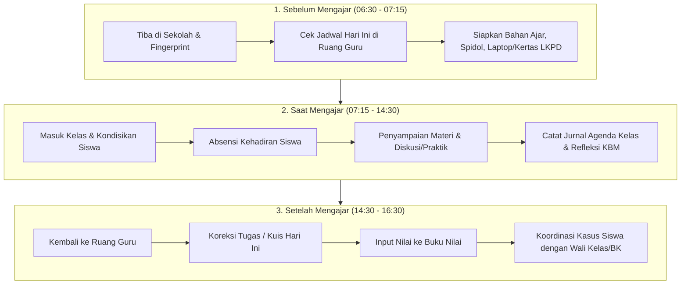
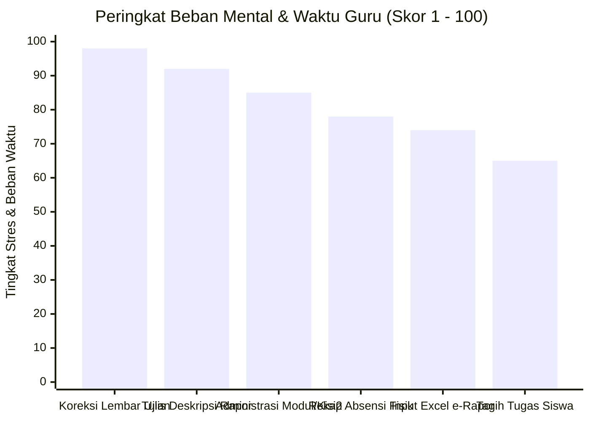

# TEACHER DAILY WORKFLOW & PAIN POINT ANALYSIS
## Ruang Pintar — Anatomi Hari-Hari Guru Indonesia & Analisis Titik Lelah

**Dokumen:** Alur Kerja Harian & Analisis Titik Masalah Guru  
**Status:** PROPOSED — READY FOR HUMAN REVIEW  
**Tanggal:** 22 September 2026  
**Fokus:** Dinamika sebelum, saat, dan setelah mengajar, serta peringkat pekerjaan guru yang paling melelahkan dan menyita waktu.

---

# 1. Anatomi Alur Kerja Harian Guru (*Daily Workflow*)

Guru mengajar rata-rata 3 hingga 5 rombel kelas per hari (antara 4 s.d. 8 Jam Pelajaran / JP). Hari-hari guru terbagi menjadi 3 babak kritis:

---

## 1.1 Rincian Analisis Tiap Babak Harian

| Fase | Aktivitas Nyata Guru | Tujuan Utama | Hambatan & Frustrasi Lapangan | Peluang Digitalisasi & Otomatisasi |
| :--- | :--- | :--- | :--- | :--- |
| **SEBELUM MENGAJAR** *(Pagi)* | • Cek ruangan dan rombel mana yang diajar jam ke-1. • Mengingat materi pertemuan terakhir. • Fotokopi lembar kerja di kantor tata usaha. | Masuk kelas tepat waktu dengan bahan ajar yang siap. | • Antre mesin fotokopi sekolah yang sering macet. • Lupa sampai sub-bab mana di kelas tertentu (karena mengajar 6 kelas paralel). | • **Morning Pulse Dashboard:** Pengingat otomatis di HP: *"Jam ke-1: X RPL 2 di Lab Komputer 1. Materi: Bab 3 Percabangan If-Else"*. |
| **SAAT MENGAJAR** *(Di Kelas)* | • Membuka pembelajaran & berdoa. • Memanggil absensi siswa 36 orang. • Menjelaskan materi/bimbingan lab. • Mengisi buku agenda kelas fisik yang ada di meja guru. | Menjaga ketertiban kelas, mentransfer ilmu, dan mencatat kehadiran resmi. | • Memanggil nama 36 siswa satu per satu memakan 10–15 menit JP berharga. • Buku agenda kelas sering hilang atau dibawa kelas lain. | • **Presensi Kilat 15 Detik:** Fitur *"Tandai Semua Hadir"* $\rightarrow$ guru hanya mengklik 1–2 siswa yang alpha/sakit. • Jurnal KBM digital otomatis terisi materi pokok. |
| **SETELAH MENGAJAR** *(Sore)* | • Mengoreksi tumpukan buku latihan / kertas kuis. • Merekap absensi bulanan. • Menghubungi orang tua siswa yang tidak masuk berturut-turut. | Menyelesaikan penilaian tugas dan pemantauan perkembangan siswa. | • Kelelahan fisik pasca mengajar 8 JP, mata perih mengoreksi tumpukan buku. • Format excel e-rapor rumit dan kaku. • Pesan WA orang tua tercecer di chat pribadi guru. | • **AI Paper Correction:** Foto lembar tugas/LJK langsung ternilai otomatis. • Buku nilai tersinkronisasi tanpa hitung manual. • Portal orang tua terintegrasi. |

---

# 2. Analisis Titik Lelah Guru (*Teacher Pain Point Ranking*)

Berdasarkan studi operasional sekolah di Indonesia, berikut adalah **peringkat pekerjaan guru dari yang paling menguras energi, membosankan, rawan salah, dan paling sering dikeluhkan**:

---

## Peringkat 1: Koreksi Lembar Jawaban Ujian & Ulangan Massal (Skor Stres: 98/100)
* **Karakteristik:** Sangat memakan waktu, membosankan, melelahkan mata, dan rawan salah hitung.
* **Kondisi Nyata:** Mengoreksi 150–250 lembar ujian pilihan ganda dan esai dengan kunci jawaban kertas di sampingnya. Sering kali guru membawa tumpukan kertas ini pulang ke rumah dan begadang hingga larut malam.
* **Penyelamat Ruang Pintar:** **AI Paper Correction via Kamera HP**. Memotret LJK kertas fotokopi biasa $\rightarrow$ nilai Pilihan Ganda keluar dalam 1 detik per lembar, rekomendasi nilai esai disajikan cerdas.

---

## Peringkat 2: Merangkai Narasi Deskripsi Capaian Siswa di e-Rapor (Skor Stres: 92/100)
* **Karakteristik:** Sangat melelahkan pikiran, repetitive, dan dikejar tenggat waktu ketat.
* **Kondisi Nyata:** Dalam Kurikulum Merdeka, rapor tidak lagi hanya angka, melainkan narasi kalimat: *"Ananda A menunjukkan penguasaan sangat baik dalam memahami struktur data larik, namun perlu bimbingan dalam operasi matriks"*. Guru harus mengetik variasi narasi ini untuk **150–200 siswa** satu per satu!
* **Penyelamat Ruang Pintar:** **AI Report Narrative Generator**. Sistem otomatis mengolah capaian nilai per TP siswa dan merangkai narasi deskripsi baku Kurikulum Merdeka yang humanis dan unik untuk setiap siswa dalam 1 klik.

---

## Peringkat 3: Penyusunan Dokumen Administrasi Perencanaan (Modul Ajar, Kisi-kisi, Kartu Soal) (Skor Stres: 85/100)
* **Karakteristik:** Birokratis, tebal, dan menyita puluhan jam kerja.
* **Kondisi Nyata:** Menyusun dokumen Modul Ajar (RPP), program tahunan, program semester, kisi-kisi soal, dan kartu soal untuk akreditasi atau supervisi pengawas sekolah. Sering kali terjadi praktik *copy-paste* dokumen lama yang tidak sesuai konteks kelas.
* **Penyelamat Ruang Pintar:** **AI Assessment & Curriculum Assistant**. Generator Kisi-kisi, Kartu Soal, dan Modul Ajar otomatis selaras Capaian Pembelajaran Kemdikbud.

---

## Peringkat 4: Rekapitulasi Manual Presensi & Jurnal KBM (Skor Stres: 78/100)
* **Karakteristik:** Berulang setiap hari, rawan tercecer.
* **Kondisi Nyata:** Menulis di buku agenda kelas kertas, lalu di akhir bulan harus menyalin kembali rekapitulasi jumlah Hadir, Izin, Sakit, Alpha (H/I/S/A) ke lembar laporan wakil kepala sekolah.
* **Penyelamat Ruang Pintar:** **Presensi Kilat 15 Detik & Rekapitulasi Otomatis**. Sekali klik di kelas, rekapitulasi semester, grafik kehadiran, dan laporan bulanan otomatis terbentuk secara instan.

---

## Peringkat 5: Input Nilai ke Template Excel / e-Rapor Konvensional (Skor Stres: 74/100)
* **Karakteristik:** Rawan error teknis, macro rusak, formula terhapus.
* **Kondisi Nyata:** Mengisi file template spreadsheet e-rapor kementerian yang kaku. Salah geser satu baris nama siswa menyebabkan nilai tertukar ke siswa lain.
* **Penyelamat Ruang Pintar:** **Smart Gradebook Matrix**. Matriks nilai dinamis berbasis web yang terlindungi dari salah ketik, validasi batas nilai 0–100, dan terintegrasi langsung ke cetak e-Rapor resmi tanpa perlu ekspor-impor file perantara yang rawan rusak.
