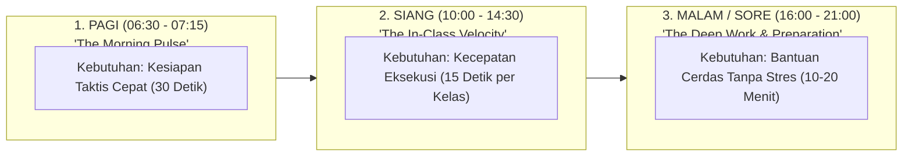

# TEACHER EXPERIENCE (TX) DESIGN RECOMMENDATION
## Ruang Pintar — Paradigma Tiga Momen Harian & Cockpit Guru Minimalis

**Dokumen:** Rekomendasi Desain Pengalaman Pengguna Guru (*Teacher Experience*)  
**Status:** PROPOSED — READY FOR HUMAN REVIEW  
**Tanggal:** 22 September 2026  
**Filosofi Inti:**  
> *"Guru yang lelah tidak butuh grafik rumit atau dashboard penuh tombol. Guru butuh kepastian apa yang harus dilakukan berikutnya dalam 3 detik."*

---

# 1. Paradigma "Tiga Momen Harian" Guru (*The 3-Moments Day*)

Jika seorang guru hanya membuka Ruang Pintar sebanyak **3 kali dalam sehari** (Pagi, Siang, dan Malam), antarmuka harus mampu beradaptasi secara kontekstual sesuai kebutuhan psikologis momen tersebut:



---

## 1.1 Momen 1: PAGI (*The Morning Pulse — Orientasi Cepat 30 Detik*)
* **Kondisi Guru:** Baru tiba di sekolah, memegang cangkir teh/kopi di ruang guru, waktu tersisa 10 menit sebelum bel berbunyi.
* **Pertanyaan Utama di Kepala Guru:**
  1. *"Hari ini saya mengajar di kelas mana saja dan jam berapa?"*
  2. *"Kelas jam ke-1 saya ada di ruangan mana?"*
  3. *"Sampai materi mana di kelas itu?"*
* **Apa yang Harus Langsung Terlihat di Layar Utama:**
  * **Kartu Sesi Terdekat (Hero Card Pagi):**  
    `[ 07:15 - 08:35 • Jam ke 1–2 • X RPL 1 di Lab RPL 2 ]`
  * **Status Pertemuan:** `Pertemuan ke-8 • Lingkup Materi: Percabangan Logika (BAB 2)`.
  * **Catatan Khusus Siswa:** *"2 Siswa perlu perhatian (Rizky kemarin Alpha, Siti tugas belum selesai)"*.
* **Tombol Aksi Tunggal:** `[ Buka Kelas Sekarang > ]`.

---

## 1.2 Momen 2: SIANG (*The In-Class Velocity — Eksekusi Cepat 15 Detik*)
* **Kondisi Guru:** Berdiri di depan kelas atau di lab komputer, menghadapi 36 siswa yang ramai. Guru membuka aplikasi dari HP atau laptop yang terhubung ke proyektor.
* **Kebutuhan:** Tidak boleh ada lag, tidak boleh ada form rumit. Kecepatan adalah segalanya.
* **Apa yang Harus Langsung Terlihat:**
  * **Panel Presensi Kilat (1-Click Presence):**
    * Tombol hijau menyala: **[ Tandai Semua Hadir ]**.
    * Bila ada 1 siswa tidak hadir, guru cukup mengetuk nama siswa tersebut $\rightarrow$ ubah jadi *Sakit* atau *Alpha*.
    * Durasi total presensi: **15 detik selesai!**
  * **Catatan Agenda KBM (Jurnal Ringkas):**
    * Input satu baris: *"Praktek penulisan switch-case selesai sampai studi kasus 2. Refleksi: 3 siswa masih bingung sintaks default"*.
* **Keamanan Proyektor (*Projector-Safe View*):**
  Tersedia tombol satu-klik *"Sembunyikan Catatan Pribadi / Nilai Sensitif"* agar layar proyektor kelas aman dilihat siswa.

---

## 1.3 Momen 3: MALAM / SORE (*The Deep Work — Persiapan Santai di Rumah*)
* **Kondisi Guru:** Duduk santai di rumah dengan laptop. Mengoreksi tugas, membuat soal untuk ulangan besok lusa, atau menyusun bahan ajar.
* **Kebutuhan:** Antarmuka yang tenang, nyaman untuk mata (*Academic Glass Dark Mode*), dan alat bantu AI yang mengurangi beban mengetik.
* **Apa yang Harus Langsung Terlihat:**
  * **Antrean Penilaian (*Attention Queue*):**  
    *"Ada 1 tugas di X RPL 1 yang belum dinilai (32/36 siswa sudah mengumpulkan)"*.
  * **Studio Kreatif AI (*AI Assistant Hub*):**  
    * Buat naskah latihan soal pilihan ganda 10 butir dengan 1 prompt.
    * Ekspor naskah soal ke format CBT atau lembar kerja siap print.
  * **Ringkasan Kemajuan Materi Mingguan.**

---

# 2. Matriks Kurasi Antarmuka: Apa yang Ditampilkan vs Apa yang Disembunyikan

Dashboard guru yang hebat diukur dari **apa yang berani TIDAK ditampilkan**:

```text
+----------------------------------------------------------------------------------------------------+
|                                  ARSITEKTUR COCKPIT GURU RUANG PINTAR                              |
+-------------------------------------------------+--------------------------------------------------+
|           TAMPILKAN SECARA PRIORITAS            |               SEMBUNYIKAN / SIMPAN               |
+-------------------------------------------------+--------------------------------------------------+
| 1. Kartu Kelas Berikutnya / Sesi Hari Ini       | 1. ID Database (ULID, UUID, Kode Teknis)         |
| 2. Tombol Presensi Kilat 15 Detik               | 2. Grafik / Diagram Statistik Palsu (Fake KPI)   |
| 3. Daftar Siswa Perlu Perhatian Khusus          | 3. Form Konfigurasi Operator / Dapodik           |
| 4. Antrean Tugas & Penilaian yang Tertunda      | 4. Riwayat Kelas Tahun Ajaran Lalu yang Selesai  |
| 5. Akses 1-Klik Bantuan AI (Modul Ajar / Soal)  | 5. Menu-menu birokrasi yang jarang diakses       |
+-------------------------------------------------+--------------------------------------------------+
```

---

# 3. Apa yang Harus 100% Otomatis (*Zero Cognitive Load Automation*)?

Ruang Pintar mengambil alih seluruh pekerjaan kalkulasi dan administrasi rutin:

1. **Penggabungan Jam Pelajaran Berurutan (*Consecutive Slot Merging*):**
   Jika guru mengajar Matematika jam ke-1, 2, dan 3 berturut-turut di kelas yang sama, sistem otomatis menggabungkannya menjadi **1 Sesi Terpadu (07:15 – 09:15 • 3 JP)**, bukan 3 kartu terpisah yang membingungkan.
2. **Kalkulasi Rata-Rata Nilai & Status KKTP Real-time:**
   Guru tidak perlu menghitung bobot nilai secara manual. Nilai terbobot dan persentase ketuntasan KKTP terhitung otomatis seketika nilai diinput.
3. **Penyusunan Rekapitulasi Presensi Bulanan:**
   Rekap persentase kehadiran semester dan data siswa yang sering absen otomatis terkompilasi untuk diserahkan ke wali kelas atau guru BK.
4. **Penyusunan Kalimat Deskripsi Rapor Kurikulum Merdeka:**
   Berdasarkan data capaian nilai tertinggi dan terendah siswa pada masing-masing Tujuan Pembelajaran (TP), sistem otomatis menghasilkan narasi capaian rapor yang sudah baku sesuai standar Kemdikbud.
