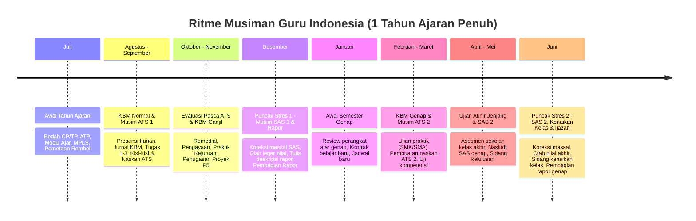

# TEACHER JOURNEY MAP — SIKLUS SATU TAHUN AJARAN
## Ruang Pintar — Memahami Kehidupan Nyata Guru Indonesia

**Dokumen:** Pemetaan Perjalanan Guru Satu Tahun Ajaran Penuh  
**Status:** PROPOSED — READY FOR HUMAN REVIEW  
**Tanggal:** 22 September 2026  
**Fokus:** Aktivitas pedagogis, beban administratif, musim stres, dan titik lelah guru dari Juli hingga Juni.

---

# 1. Peta Kronologis Satu Tahun Ajaran (Juli – Juni)

Kehidupan guru di Indonesia tidak bergerak secara statis dari hari ke hari, melainkan mengikuti **ritme gelombang musiman** yang memiliki puncak beban kerja dan stres yang sangat khas:

---

# 2. Rincian Fase Perjalanan Guru

---

## 2.1 Fase 1: Awal Tahun Ajaran Baru (Bulan Juli)
* **Kondisi Psikologis Guru:** Semangat baru, namun dibebani tumpukan dokumen administrasi perencanaan kurikulum.
* **Aktivitas Nyata Guru:**
  1. Menerima Surat Keputusan (SK) Pembagian Jam Mengajar dan Penugasan Wali Kelas dari Kepala Sekolah.
  2. Menganalisis Capaian Pembelajaran (CP) terbaru dari Kemdikbud.
  3. Menyusun Tujuan Pembelajaran (TP) dan Alur Tujuan Pembelajaran (ATP).
  4. Membuat Program Tahunan (Prota), Program Semester (Promes), dan Modul Ajar (RPP).
  5. Menghadiri Masa Pengenalan Lingkungan Sekolah (MPLS) dan memetakan karakteristik awal siswa.
* **Titik Stres Paling Tinggi:** Menyusun dokumen Modul Ajar berpuluh-puluh halaman yang sering kali hanya menjadi formalitas arsip supervisi kurikulum.

---

## 2.2 Fase 2: Awal Semester & Kontrak Belajar (Juli – Agustus)
* **Aktivitas Nyata Guru:**
  1. Menetapkan Kriteria Ketercapaian Tujuan Pembelajaran (KKTP) per Lingkup Materi / BAB.
  2. Menyampaikan kontrak belajar, silabus materi, dan aturan penilaian kepada siswa di pertemuan pertama.
  3. Membentuk kelompok belajar di kelas dan memilih ketua kelas / pengurus rombel.
  4. Menyiapkan buku catatan presensi dan buku agenda mengajar fisik (jika sekolah masih manual).

---

## 2.3 Fase 3: Rutinitas KBM Mingguan (Agustus – November & Januari – April)
* **Aktivitas Harian/Mingguan yang Berulang:**
  1. Mengajar tatap muka 24 s.d. 36 Jam Pelajaran (JP) per minggu.
  2. Membuka sesi kelas, memanggil absensi kehadiran 30–36 siswa per rombel.
  3. Mencatat jurnal agenda mengajar (materi apa yang selesai, kendala kelas, catatan refleksi).
  4. Memberikan tugas/kuis formatif, menagih tugas siswa yang belum mengumpulkan.
  5. Melakukan bimbingan atau teguran bagi siswa yang sering membolos atau tertidur di kelas.
* **Beban Tersembunyi:** Mengetik ulang jurnal KBM dan rekap absensi dari buku kertas ke format spreadsheet laporan bulanan kurikulum.

---

## 2.4 Fase 4: Musim Asesmen Tengah Semester (ATS / PTS) (September & Maret)
* **Kondisi Psikologis Guru:** Mulai kewalahan membagi waktu antara mengajar tatap muka dan membuat soal ujian.
* **Aktivitas Nyata Guru:**
  1. Membuat **Kisi-Kisi Soal ATS** sesuai format standar kurikulum.
  2. Menulis **Kartu Soal** (indikator, stimulus soal, kunci jawaban, dan pedoman penskoran).
  3. Menyusun Naskah Ujian (Paket A dan Paket B) untuk diserahkan ke panitia ujian sekolah.
  4. Menjadi pengawas ruang ujian.
  5. **Mengkoreksi tumpukan kertas jawaban ratusan siswa** (misal 5 kelas $\times$ 36 siswa = 180 lembar).
  6. Mengadakan remedial bagi siswa yang belum tuntas KKTP.
  7. Menerbitkan Laporan Capaian Tengah Semester (Rapor Sisipan).

---

## 2.5 Fase 5: Musim Sumatif Akhir Semester (SAS / PAS) — *PUNCAK STRES TERTINGGI* (Desember & Mei-Juni)
* **Kondisi Psikologis Guru:** Sangat lelah, begadang berhari-hari, beban emosional tinggi karena tenggat waktu cetak rapor.
* **Aktivitas Nyata Guru:**
  1. Mengulang pembuatan Kisi-Kisi, Kartu Soal, dan Naskah SAS semester penuh.
  2. Mengoreksi ujian akhir secara maraton.
  3. **Mengolah Nilai Akhir Rapor:**
     - Menggabungkan nilai formatif (tugas-tugas harian).
     - Menggabungkan nilai sumatif per BAB (ulangan harian).
     - Menggabungkan nilai sumatif non-tes (proyek/praktik).
     - Menghitung nilai sumatif akhir semester (SAS).
  4. **Menulis Narasi Deskripsi Capaian Pembelajaran:** Mengetik kalimat narasi rapor Kurikulum Merdeka untuk setiap siswa: *"Ananda menunjukkan penguasaan sangat baik dalam... namun perlu bimbingan dalam..."*.
  5. Menginput seluruh nilai dan narasi ke dalam sistem aplikasi e-Rapor sekolah sebelum batas waktu (*deadline*).

---

## 2.6 Fase 6: Akhir Semester, Sidang Kenaikan Kelas & Pembagian Rapor
* **Aktivitas Nyata Guru:**
  1. **Rapat Pleno Dewan Guru:** Sidang tertutup penentuan kenaikan kelas / kelulusan siswa, membahas siswa-siswa bermasalah (nilai di bawah KKTP atau presensi minim).
  2. **Tugas Wali Kelas:** Mencetak lembar rapor fisik puluhan rangkap, meminta tanda tangan Kepala Sekolah, dan menyusun arsip buku induk.
  3. **Hari Pembagian Rapor:** Bertatap muka langsung dengan orang tua murid, menjelaskan perkembangan belajar siswa, dan mendengarkan keluh kesah wali murid.
  4. **Fase Libur Guru:** Menyusun laporan pertanggungjawaban mengajar semesteran dan persiapan tahun ajaran berikutnya.

---

# 3. Kesimpulan Penting untuk Desain Ruang Pintar

Ruang Pintar **bukan sekadar software pencatat data**, melainkan **alat penyelamat kesehatan mental guru (*Stress-Relief Engine*)**:
* Di bulan **Juli**: Bantu guru selesaikan Modul Ajar dan pemetaan TP dalam hitungan menit.
* Di bulan **Agustus–November**: Buat presensi dan jurnal mengajar selesai dalam 15 detik di ruang kelas.
* Di bulan **September & Desember**: Hilangkan mimpi buruk koreksi ratusan lembar kertas ujian dan hilangkan beban mengetik narasi deskripsi e-Rapor satu per satu.
