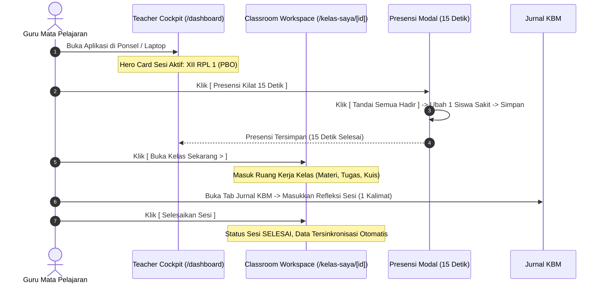
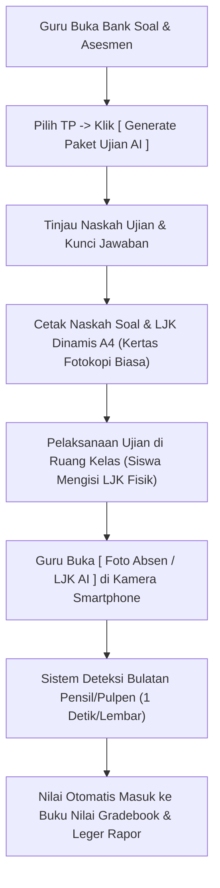
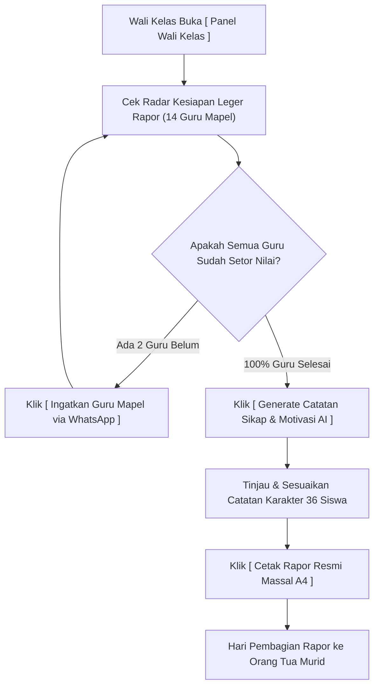
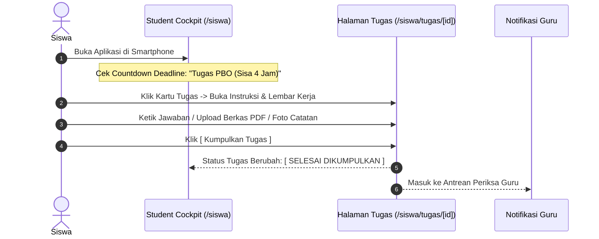
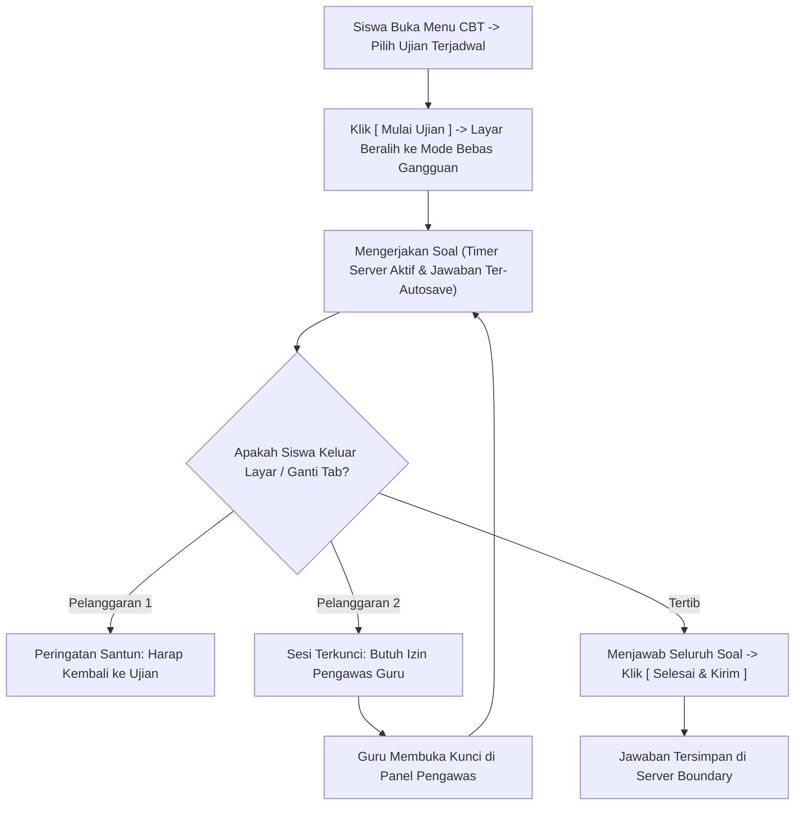
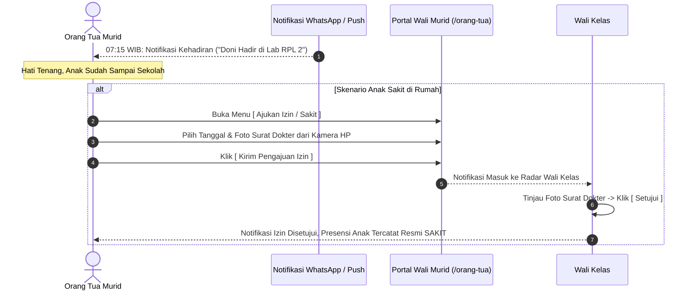
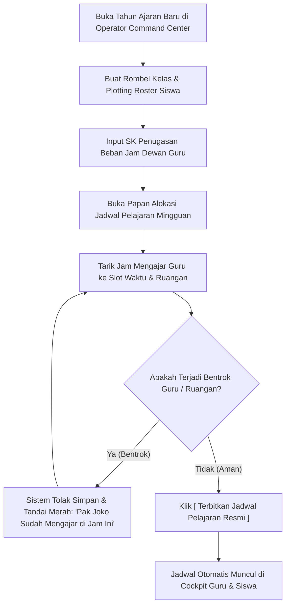

# USER FLOW MAP — PETA ALUR PENGGUNA UTAMA
## Ruang Pintar — Diagram Alur Perjalanan Pengguna Langkah demi Langkah

**Dokumen:** Peta Alur Pengguna (*User Flow Map*)  
**Status:** PROPOSED — READY FOR HUMAN REVIEW  
**Tanggal:** 22 September 2026  
**Target:** Seluruh Alur Kerja Kritis Lintas Peran  
**Tujuan:** Menjadi rujukan baku perancangan interaksi antarmuka dan navigasi halaman.

---

# 1. Tujuh Alur Pengguna Utama (*Core User Flows*)

---

## 1. Flow Guru: Sesi Pembelajaran Harian (Routine Class Session)

---

## 2. Flow Guru: Pembuatan Ujian & Koreksi Cerdas (AI Exam & Paper Correction)

---

## 3. Flow Wali Kelas: Monitoring Leger & Pembagian Rapor (Semester Wrap-Up)

---

## 4. Flow Siswa: Pembelajaran & Pengumpulan Tugas (Assignment Submission)

---

## 5. Flow Siswa: Ujian CBT Tenang & Adil (Calm CBT Attempt)

---

## 6. Flow Orang Tua (Guardian): Pengawasan Kehadiran & Pengajuan Izin

---

## 7. Flow Operator: Konfigurasi Semester Baru & Jadwal Anti-Bentrok

