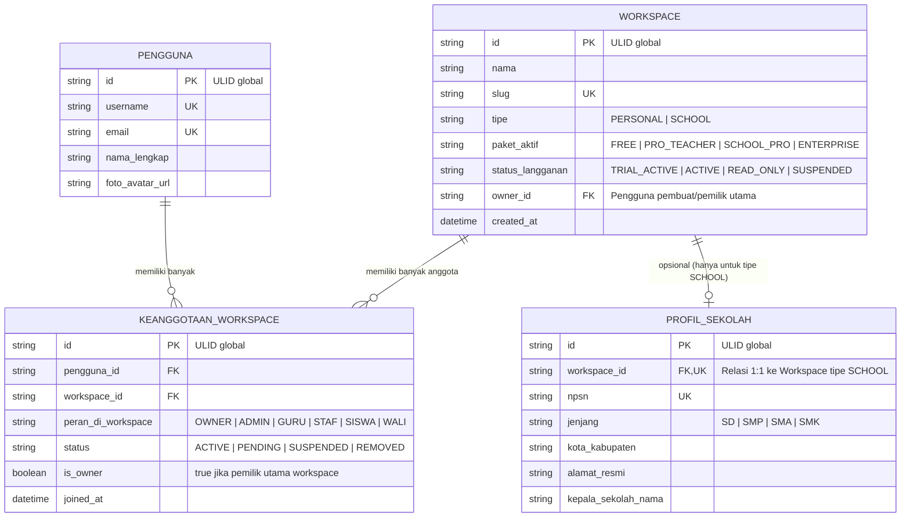
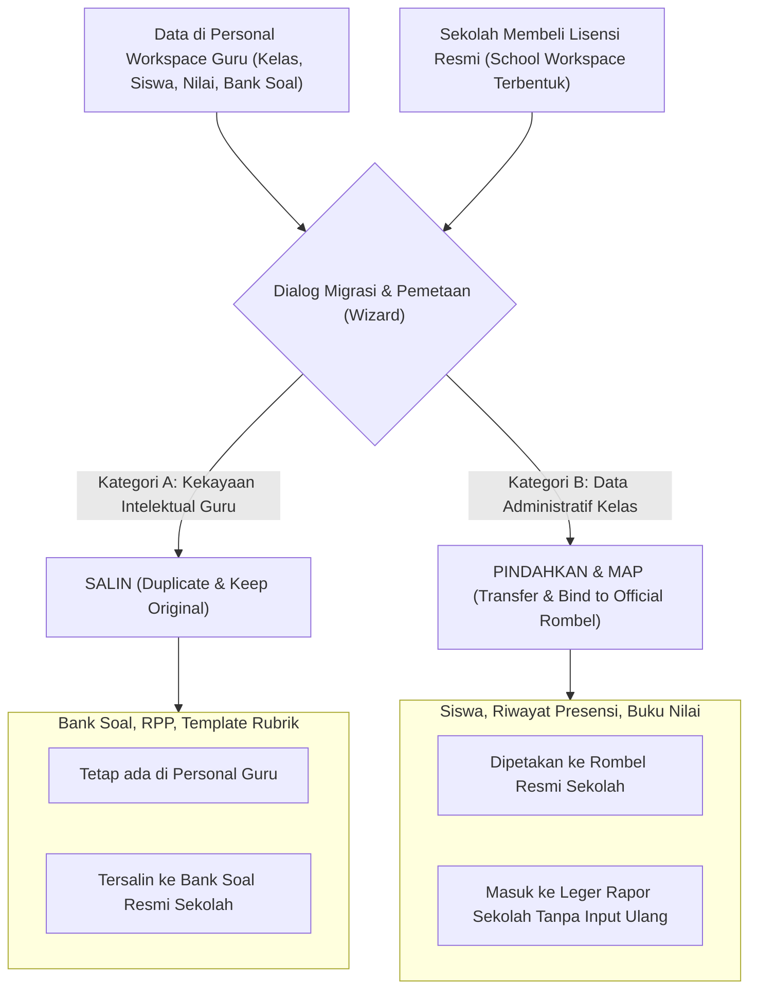

# WORKSPACE ARCHITECTURE & MULTI-MEMBERSHIP RECOMMENDATION
## Ruang Pintar — Unified Tenancy, Workspace & Context Switching

**Dokumen:** Analisis & Rekomendasi Arsitektur Workspace  
**Status:** PROPOSED — READY FOR HUMAN REVIEW  
**Tanggal:** 22 September 2026  
**Target Rilis:** SaaS Phase SAAS-05 / Milestone K  
**Lingkup:** Desain arsitektur produk, domain model, manajemen konteks sesi, otorisasi multi-membership, dan strategi migrasi data mandiri ke sekolah.

---

# 1. Executive Summary: Perlunya Konsep "Workspace"

Sebagaimana produk produktivitas dan SaaS modern kelas dunia (Notion, Slack, Canva, ClickUp, Linear), Ruang Pintar membutuhkan lapisan abstraksi bernama **Workspace** sebagai *lingkungan kerja aktif* pengguna.

### Mengapa Konsep "Sekolah Saja" Tidak Cukup?
1. **Dilema Guru Mandiri:** Jika batas unit kerja di aplikasi selalu diasumsikan adalah `Sekolah`, maka seorang guru honorer atau guru yang ingin mencoba aplikasi secara mandiri dipaksa menciptakan "Sekolah Dummy" atau menunggu persetujuan operator sekolah.
2. **Kenyataan Guru Multi-Sekolah di Indonesia:** Banyak guru (terutama di tingkat SMK/SMA swasta) mengajar di lebih dari satu yayasan/sekolah secara bersamaan (misal: Senin–Rabu di SMK Otomindo, Kamis–Jumat di SMK Teratai).
3. **Pemisahan Kepemilikan Data:** Rencana Pembelajaran (RPP/Modul Ajar) dan Bank Soal adalah kekayaan intelektual personal sang guru, sedangkan Absensi Resmi, Leger Nilai, dan e-Rapor adalah dokumen legal milik sekolah.

Oleh karena itu, Ruang Pintar mengadopsi konsep **Unified Workspace Architecture**:
* **Personal Workspace** (Ruang Mandiri Guru);
* **School Workspace** (Ruang Kerja Institusi Sekolah).

---

# 2. Domain & Entity Relationship: User, Workspace, Membership, School



### Jawaban terhadap Pertanyaan Arsitektur Kritis:

#### 1. Apakah Workspace harus menjadi entitas utama di atas tenant?
**YA.** `Workspace` adalah representasi nyata dari **Tenant**. Dalam arsitektur database, `Workspace` bertindak sebagai *boundary root* untuk seluruh data operasional (kelas, rombel, nilai, jadwal). 

#### 2. Apakah Tenant Sekolah identik dengan Workspace Sekolah?
**YA.** Sebuah `School Tenant` secara struktural adalah sebuah `Workspace` yang memiliki atribut khusus `tipe = SCHOOL` dan memiliki profil metadata formal sekolah (`PROFIL_SEKOLAH` / `Sekolah` dengan NPSN, jenjang, dan legalitas). Sementara `Personal Workspace` adalah workspace yang memiliki `tipe = PERSONAL`, dimiliki tunggal oleh sang guru, dan tidak memiliki profil NPSN sekolah.

#### 3. Bagaimana hubungan antara User, Workspace, Membership, dan School?
- **User (Pengguna):** Satu identitas global unik (1 username, 1 email, 1 kredensial auth).
- **Workspace:** Wadah terisolasi yang menampung seluruh aktivitas digital.
- **Membership (Keanggotaan):** Tabel pivot penghubung banyak-ke-banyak (*many-to-many*) antara User dan Workspace. Status keanggotaan dan hak akses (*role*) ditentukan di sini.
- **School (Sekolah):** Entitas profil organisasi yang menempel pada Workspace bertipe `SCHOOL`.

#### 4. Model Data Jangka Panjang yang Paling Fleksibel:
Mempertahankan *Shared Database, Shared Schema* di mana setiap tabel domain (seperti `rombel`, `mata_pelajaran`, `penugasan_mengajar`, `presensi_sesi`, `nilai_siswa`) memiliki kolom `workspace_id` (atau memanfaatkan kolom `sekolah_id` yang diabstraksikan sebagai workspace boundary). Hal ini menjamin bahwa seluruh fitur yang sudah dibangun untuk sekolah dapat langsung digunakan oleh Guru Mandiri tanpa duplikasi kode!

---

# 3. Active Workspace & Workspace Switcher

```text
+--------------------------------------------------------------------------+
|  RUANG PINTAR      [ SMK Otomindo (Aktif) ▼ ]         (🔔) [ Avatar ]    |
|                    +------------------------------------+                |
|                    | RUANG KERJA SAYA                   |                |
|                    |                                    |                |
|                    | [x] SMK Otomindo (Guru & Wali)     |                |
|                    | [ ] SMK Teratai (Guru)             |                |
|                    | [ ] Ruang Kerja Pribadi (Chandra)  |                |
|                    |------------------------------------|                |
|                    | + Tambah / Gabung Sekolah Baru     |                |
|                    +------------------------------------+                |
+--------------------------------------------------------------------------+
```

### 3.1 UX Perpindahan Workspace (*Zero Friction Switching*)
1. **Komponen Header Terpadu:**
   Di sisi kiri atas / topbar shell aplikasi terdapat tombol pemilih konteks aktif dengan format:  
   `[ Nama Workspace Aktif ▼ ]` dengan indikator badge perannya (misal: *Guru* atau *Personal*).
2. **Perpindahan Instan Tanpa Logout-Login:**
   Saat pengguna mengklik workspace lain:
   - Terjadi eksekusi *Server Action* ringan: `switchActiveWorkspaceAction(workspaceId)`.
   - Server memvalidasi bahwa `pengguna_id` memiliki keanggotaan berstatus `ACTIVE` di workspace tujuan.
   - Sesi token diperbarui secara atomik.
   - Halaman me-refresh / revalidate router secara halus ke root dashboard workspace tersebut.

### 3.2 Penyimpanan Konteks di Sesi (*Server-Authoritative*)
- **Wajib Server-Side:** Active workspace **wajib disimpan di sisi server** pada cookie sesi terenkripsi (`SesiPengguna.workspace_aktif_id`).
- **Dilarang Mengandalkan Klien:** URL path (seperti `?workspace=xyz`), `localStorage`, atau header buatan klien dilarang menjadi sumber kebenaran otorisasi. Ini mencegah *tampering* atau manipulasi ID sekolah di browser.

### 3.3 Dampak terhadap Navigation & Dashboard
Navigasi bilah samping (*Sidebar Shell*) bersifat dinamis beradaptasi terhadap tipe workspace aktif:

| Elemen Antarmuka | Saat di **Personal Workspace** | Saat di **School Workspace** |
| :--- | :--- | :--- |
| **Top Heading** | *"Ruang Mengajar Mandiri"* | *"SMK Otomindo"* |
| **Menu Akademik** | Kelas Saya, Presensi, Penilaian, CBT Dasar | Kelas Saya, Jadwal Mengajar, Presensi Sesi, Penilaian |
| **Menu Institusi** | *Disembunyikan* | Rekap Wali Kelas, Agenda Sekolah, Pengumuman Resmi |
| **Menu Tata Kelola**| *Disembunyikan* | Manajemen Guru, Struktur Rombel, Kurikulum (Khusus Operator/Kepsek) |
| **Monetization CTA**| Tombol elegan: *"Bawa ke Sekolah / Cetak Usulan"* | Banner Status Lisensi Sekolah (Trial / Pro / BOS) |

---

# 4. Multi-Membership & Otorisasi Anti-Kebocoran (*Strict Tenant Isolation*)

Kasus nyata pengguna:
```text
Chandra:
- Owner pada "Ruang Kerja Pribadi Chandra" (Personal Workspace)
- Guru Pengampu Matematika pada "SMK Otomindo" (School Workspace)
- Wali Kelas & Guru Kejuruan pada "SMK Teratai" (School Workspace)
```

### 4.1 Prinsip Desain Otorisasi
1. **Peran Melekat pada Membership, BUKAN pada User:**
   Di tabel `Pengguna`, tidak ada lagi kolom `role` tunggal yang mengunci akun selamanya. Kolom peran (`peran_di_workspace`) berada di dalam `KeanggotaanWorkspace`.
2. **Zero Role Leakage:**
   Jika Chandra adalah `ADMIN` atau `OWNER` di ruang pribadinya, hak tersebut **sama sekali tidak terbawa** ketika ia berpindah konteks ke `SMK Otomindo` (di mana ia hanya berstatus `GURU`).
3. **Penyusunan Konteks Otorisasi (*Effective Access Engine*):**
   ```text
   Setiap Request Masuk
   ↓
   Sesi Terverifikasi (UserId, ActiveWorkspaceId)
   ↓
   Lookup Keanggotaan Aktif pada Workspace Tersebut
   ↓
   Ambil: [Peran, Penugasan Spesifik di Workspace, Entitlement Workspace]
   ↓
   Bentuk Effective Permissions
   ↓
   Default Deny jika Resource Bukan Milik ActiveWorkspaceId
   ```

---

# 5. Migrasi Guru Mandiri ke Sekolah (*Personal to School Migration*)

Skenario nyata yang sering terjadi di lapangan:
> Seorang guru menggunakan Ruang Pintar secara mandiri selama 2 bulan (telah membuat 3 kelas, 108 siswa, 400 catatan absensi, 15 daftar nilai, dan 5 bank soal). Kemudian, Kepala Sekolah terkesan dan memutuskan sekolah resmi membeli lisensi tahunan Ruang Pintar.

Bagaimana nasib data yang telah dibuat oleh guru tersebut?



### 5.1 Analisis Tiga Pendekatan: Pindahkan vs Salin vs Bagikan

| Karakteristik | Pindahkan (*Move*) | Salin (*Copy*) | Bagikan (*Share/Link*) | Rekomendasi Terpilih |
| :--- | :--- | :--- | :--- | :--- |
| **Kelebihan** | Bersih, data langsung menjadi aset resmi sekolah. | Guru tidak kehilangan arsip pribadinya. | Tidak ada duplikasi baris database. | **Model Hibrida Cerdas (*Smart Hybrid*)** |
| **Risiko** | Personal workspace guru menjadi kosong melompong. | Jika guru mengoreksi nilai di personal, sekolah tidak terupdate. | Kompleksitas query lintas tenant dan risiko kebocoran data. | Tergantung jenis datanya (lihat aturan di bawah). |

### 5.2 Keputusan Kepemilikan Data (*Ownership & Intellectual Property*):

1. **Bank Soal, Modul Ajar, dan Rubrik (Kekayaan Intelektual Guru):**
   * **Mekanisme: DISALIN (*Copy / Fork*).**
   * Bank soal personal tetap menjadi hak milik guru di ruang pribadinya. Salinannya diimpor ke Bank Soal Sekolah sehingga rekan guru lain dapat menggunakannya.
2. **Daftar Siswa, Riwayat Presensi, dan Lembar Nilai (Data Administratif Sekolah):**
   * **Mekanisme: DIPINDAHKAN & DIPETAKAN (*Transfer & Map*).**
   * Mengapa dipindahkan? Karena data nilai dan presensi adalah dokumen resmi legalitas akademik siswa di sekolah tersebut.
   * *Wizard Pemetaan Cerdas:* Sistem mencocokkan: *"Kelas X RPL 1 di ruang mandiri Anda cocok dengan Rombel X RPL 1 resmi di Dapodik sekolah. Gabungkan riwayat nilai?"* $\rightarrow$ Guru konfirmasi 1-klik $\rightarrow$ Nilai langsung mengisi leger sekolah tanpa input ulang!

### 5.3 Audit Trail & Keamanan Migrasi
- Setiap proses transfer dicatat pada log audit dengan status:  
  `DATA_MIGRATION_PERSONAL_TO_TENANT`.
- Rekam jejak mencatat ID aktor yang menyetujui, tanggal transfer, jumlah baris data yang dialihkan, dan snapshot integritas data lama.
- Hasil: **Nol kehilangan data (*Zero Data Loss*)**, guru merasa sangat dihargai karena kerja kerasnya selama masa uji coba tidak sia-sia.
