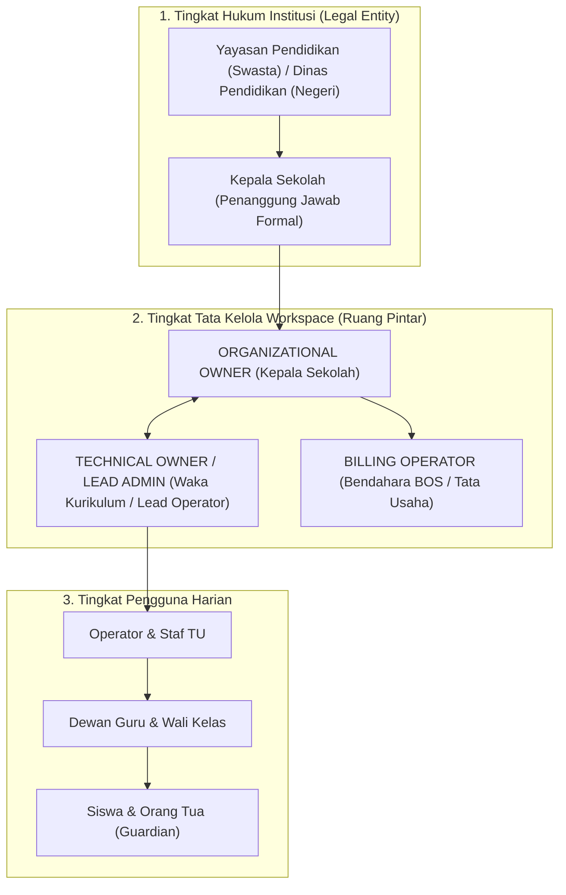

# WORKSPACE GOVERNANCE & OWNERSHIP MODEL
## Ruang Pintar — Institutional Governance, Roles, Succession & Continuity

**Dokumen:** Model Tata Kelola, Kepemilikan, dan Suksesi Workspace  
**Status:** PROPOSED — READY FOR HUMAN REVIEW  
**Tanggal:** 22 September 2026  
**Target:** SaaS Phase SAAS-05 / Milestone K  
**Tujuan:** Menjamin kepemilikan hukum institusi, kontinuitas operasional sekolah saat terjadi rotasi pejabat, dan suksesi akun tanpa risiko pengambilalihan ilegal atau terhentinya layanan.

---

# 1. Masalah Tata Kelola Sekolah di Indonesia

Dalam operasional pendidikan di Indonesia, rotasi sumber daya manusia adalah peristiwa rutin yang sering kali melumpuhkan sistem software konvensional:
1. **Kepala Sekolah ASN Berpindah Tugas:** Kepala sekolah negeri mengalami rotasi/mutasi jabatan setiap 3–4 tahun sekali.
2. **Turnover Operator Sekolah Tinggi:** Posisi operator sekolah sering kali dipegang oleh staf tata usaha atau guru honorer muda yang memiliki mobilitas kerja tinggi. Jika software didaftarkan atas nama email pribadi operator yang resign, sekolah sering kehilangan akses administratif.
3. **Dualisme Sekolah Swasta:** Di sekolah swasta, aset dan legalitas berada di bawah **Yayasan Pendidikan**, sedangkan manajemen harian dijalankan oleh Kepala Sekolah.
4. **Risiko Kehilangan Akses:** Kematian pemegang akun utama, pemutusan kerja sepihak, atau sengketa internal tidak boleh menyebabkan database akademik ribuan siswa terkunci.

Oleh karena itu, Ruang Pintar menerapkan **Hierarki Kepemilikan Berbasis Institusi (*Institutional Multi-Tier Governance*)**, bukan kepemilikan akun perseorangan.

---

# 2. Model Kepemilikan Workspace (*Workspace Ownership Hierarchy*)

Ruang Pintar memisahkan secara tegas antara **Kepemilikan Hukum Institusi (*Legal Entity*)** dan **Pengelola Teknis Harian (*Technical Administrator*)**.



---

## 2.1 Peran Tata Kelola (*Governance Roles*)

| Peran Tata Kelola | Profil Pejabat Riil | Tanggung Jawab & Hak Akses | Batasan Ketat |
| :--- | :--- | :--- | :--- |
| **`ORGANIZATIONAL_OWNER`** | Kepala Sekolah / Ketua Yayasan | Penanggung jawab tertinggi. Berhak mentransfer kepemilikan, menyetujui pemulihan darurat, melihat audit seluruh aktivitas, dan menandatangani dokumen lisensi BOS. | Tidak mengurusi teknis input data harian. Memerlukan konfirmasi 2FA/email formal institusi. |
| **`TECHNICAL_OWNER`** | Wakil Kepala Bidang Kurikulum / Kepala Tata Usaha | Mengatur kebijakan internal sekolah, menyetujui akun guru baru, mengonfigurasi struktur rombel, dan mengelola integrasi Dapodik. | Tidak dapat mencabut atau menurunkan status `ORGANIZATIONAL_OWNER`. |
| **`BILLING_ADMIN`** | Bendahara Sekolah / Pengelola Dana BOS | Melihat faktur tagihan, status langganan, mengunduh BAST, kuitansi BOS, dan melakukan pembayaran perpanjangan lisensi. | Tidak memiliki hak mengubah data akademik, nilai, atau susunan dewan guru. |
| **`OPERATOR_AKADEMIK`** | Staf Tata Usaha / Operator Sekolah | Mengelola master data siswa, plotting rombel, penugasan mengajar, dan inventaris mata pelajaran. | Beroperasi dalam kewenangan yang didelegasikan oleh Technical Owner. |

---

# 3. Rencana Suksesi & Penanganan Kasus Darurat (*Succession Planning*)

```text
+-------------------------------------------------------------------------------+
|                      PROTOKOL SUKSESI WORKSPACE SEKOLAH                       |
+--------------------------+----------------------------------------------------+
| Skenario Insiden         | Solusi & Prosedur Sistem                           |
+--------------------------+----------------------------------------------------+
| 1. Operator Resign       | Pencabutan instan oleh Kepala Sekolah/Waka.        |
| 2. Kepala Sekolah Mutasi | Transfer Kepemilikan Formal (SK Pengangkatan Baru) |
| 3. Akun Owner Tidak Aktif| Multi-Owner Fallback (Minimal 2 Owner Aktif)       |
| 4. Insiden Kematian/Sengk| Break-Glass Protocol via Verifikasi Legal Platform |
+--------------------------+----------------------------------------------------+
```

### Skenario 1: Operator Sekolah Mengundurkan Diri (*Resign*)
* **Masalah:** Operator lama memegang password master atau tidak menyerahkan akun.
* **Solusi:** Karena kepemilikan workspace berada di tangan `ORGANIZATIONAL_OWNER` (Kepala Sekolah) dan `TECHNICAL_OWNER` (Waka Kurikulum), Kepala Sekolah dapat langsung:
  1. Menyetop keanggotaan operator lama menjadi `SUSPENDED` atau `REMOVED`.
  2. Mengundang email operator baru dan memberikan peran `OPERATOR_AKADEMIK`.
  3. Seluruh sesi login operator lama di semua perangkat dicabut seketika (*instant session revocation*).

### Skenario 2: Pergantian / Mutasi Kepala Sekolah
* **Prosedur Suksesi Normal:**
  1. Kepala Sekolah lama login ke dashboard menu *Pengaturan Workspace $\rightarrow$ Tata Kelola*.
  2. Memilih anggota penerus (Kepala Sekolah baru) yang telah bergabung di workspace.
  3. Memasukkan nomor SK Mutasi/Pengangkatan dan mengklik **[ Transfer Kepemilikan ]**.
  4. Kepala Sekolah baru menerima notifikasi konfirmasi dan resmi menjadi `ORGANIZATIONAL_OWNER`.
* **Prosedur Jika Kepala Sekolah Lama Sudah Tidak Berada di Tempat:**
  Wakil Kepala Sekolah atau Yayasan mengajukan mutasi administratif melalui verifikasi dokumen resmi ke Tim Dukungan Resmi Ruang Pintar.

### Skenario 3: Pemilik Akun Utama Berhalangan Tetap / Meninggal Dunia (*Break-Glass Protocol*)
Untuk mencegah pengambilalihan workspace secara ilegal (*hostile takeover*), sistem menerapkan **Protokol Verifikasi Institusi**:
1. Pemohon mengajukan klaim kepemilikan darurat dengan mengunggah:
   * Surat Keterangan Kematian / Berhalangan Tetap resmi;
   * Surat Keputusan (SK) Pengangkatan Pejabat Pelaksana Tugas (Plt.) dari Dinas Pendidikan atau Akta Notaris Yayasan;
   * Surat Permohonan resmi berkop surat sekolah dengan stempel basah.
2. Tim Verifikasi Platform Ruang Pintar memverifikasi keabsahan dokumen ke instansi terkait (Dinas Pendidikan setempat).
3. Setelah lolos verifikasi berlapis (*dual-review verification*), sistem menetapkan akun pejabat baru sebagai `ORGANIZATIONAL_OWNER`.
4. Seluruh proses dicatat dalam log audit tingkat platform yang tidak dapat dimanipulasi (*immutable system audit log*).

---

# 4. Kontinuitas Kontrak & Kepemilikan Langganan (*Billing Continuity*)

Pertanyaan Mendasar: **Apakah paket langganan melekat pada akun orang atau pada sekolah?**

### Prinsip Mutlak: Langganan Melekat 100% pada Workspace Sekolah
* Pembelian paket **SCHOOL PRO** dibiayai menggunakan anggaran institusi (Dana BOS / Dana Yayasan).
* **Fakta Hukum:** Pemilik kontrak adalah **Sekolah (Institusi Pendidikan)**, bukan akun perseorangan guru atau operator yang melakukan klik pembayaran.
* **Dampak Positif:**
  * Pergantian operator, bendahara, atau kepala sekolah **sama sekali tidak membatalkan atau memengaruhi masa aktif langganan**.
  * Seluruh riwayat pembayaran, faktur pajak elektronik, kuitansi BOS, dan Berita Acara Serah Terima (BAST) tetap tersimpan rapi di tab *Keuangan & Billing Workspace* dan dapat diakses oleh bendahara baru kapan saja saat pemeriksaan inspektorat / BPK.
